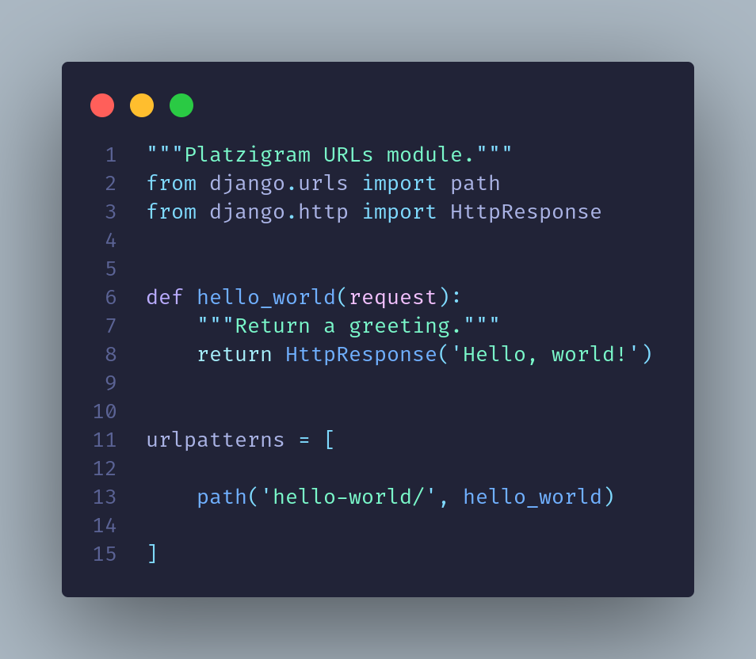
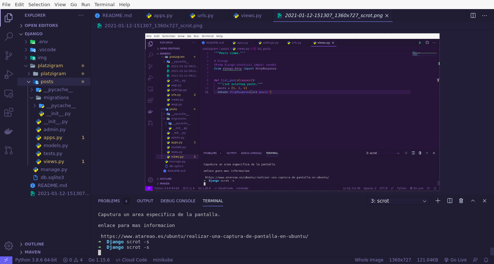

# Django
**Pablo Angel Trinidad**


# Tabla de contenido
- [1. Introducción](#1.-Introducción)
  - [Introducción al curso](#Introducción-al-curso)
  - [Historia de web development](#Historia-de-web-development)
  - [Preparación del entorno de trabajo en Mac](#Preparación-del-entorno-de-trabajo-en-Mac)
  - [Preparación del entorno de trabajo en Windows y Linux](#Preparación-del-entorno-de-trabajo-en-Windows-y-Linux)
  - [Creación del proyecto Platzigram / Tu primer Hola, mundo! en Django](#Creación-del-proyecto-Platzigram-Tu-primer-Hol-mundo-en-Django)
- [2. Vistas](#2.-Vistas)
  - [El objeto Request](#El-objeto-Request)
  - [Solución al reto - Pasando argumentos en la URL](#Solución-al-reto---Pasando-argumentos-en-la-URL)
  - [Creación de la primera app](#Creación-de-la-primera-app)
  - [Introducción al template system](#Introducción-al-template-system)
  - [Patrones de diseño y Django](#Patrones-de-diseño-y-Django)
- [3. Models](#3.-Models)
  - [La M en el MTV](#La-M-en-el-MTV)
  - [El ORM de Django](#El-ORM-de-Django)
  - [Glosario](#Glosario)
  - [Extendiendo el modelo de usuario](#Extendiendo-el-modelo-de-usuario)
  - [Implementación del modelo de usuarios de Platzigram](#Implementación-del-modelo-de-usuarios-de-Platzigram)
  - [Explorando el dashboard de administración](#Explorando-el-dashboard-de-administración)
  - [Dashboard de Administración](#Dashboard-de-Administración)
  - [Creación del modelo de posts](#Creación-del-modelo-de-posts)
- [4. Templates, auth y middlewares](#4.-Templates-auth-y-middlewares)
  - [Templates y archivos estáticos](#Templates-y-archivos-estáticos)
  - [Login](#Login)
  - [Logout](#Logout)
  - [Signup](#Signup)
  - [Middlewares](#Middlewares)
- [5. Forms](#5.-Forms)
  - [Formularios en Django](#Formularios-en-Django)
  - [Mostrando el form en el template](#Mostrando-el-form-en-el-template)
  - [Model forms](#Model-forms)
  - [Validación de formularios](#Validación-de-formularios)
- [6. Class-based views](#6.-Class-based-views)
  - [Class-based views](#Class-based-views)
  - [Protegiendo la vista de perfil, Detail View y List View](#Protegiendo-la-vista-de-perfil-Detail-View-y-List-View)
  - [CreateView, FormView y UpdateView](#CreateView-FormView-y-UpdateView)
  - [Generic auth views](#Generic-auth-views)
- [7. Deployment](#7.-Deployment)
  - [Arquirectura / Conceptos / Componentes](#Arquirectura-Conceptos-Componentes)
  - [¿Cómo conectar Django a una base de datos?](#¿Cómo-conectar-Django-a-una-base-de-datos?)
  - [Configurar el servidor](#Configurar-el-servidor)
  - [Preparación del VPS (en AWS)](#Preparación-del-VPS-en-AWS)
  - [Conclusiones del curso](#Conclusiones-del-curso)
- [8. Bonus](#8.-Bonus)
  - [¿Cómo usar los templates en Django?](#¿Cómo-usar-los-templates-en-Django?)

# 1. Introducción

## Introducción al curso

## Historia de web development

Al inicio de la web todos los sitios eran construidos en texto plano. Conforme las necesidades hay ido cambiando la web tambien lo ha hecho.

Django nace en 2004 para crear y mantener sitios muy grandes. Generar un ORM, es decir que e permite conectarte a la base de datos a traves del framework. Django se toma la seguridad de las aplicaciones con mucha seriedad. Django es un framework muy escalable. Django es muy versatil, ha sido usado para todo tipo de proyectos, desde redes sociales hasta proyectos cientificos.

Django es open source.

#### framework

  * HTTP
  * Database connection
  * HTML interaction (templates)
  * Fancy stuff

Al inicio de la web todo era texto plano (HTML), al transcurrir del tiempo se necesitaban cosas más complejas como conexión a BD’s y de ahi nace CGIscript
Nace con el objetivo de que a través de un request, se ejecute un script dentro del esrvidor, pero esto fue generando problemas con la escabilidad.y por ende difícil de mantener, de esta necesidad nace PHP.
Luego nacen los frameworks para poder resolver tareas comunes, como:

**Protocolos HTTP.**
Conexiones a bases de datos.
Interacciones con el HTML(templates).
Django
Nace en 2003, con la necesidad de hacer web’s con la filosofía de hacer las cosas de manera agíl.

  - Poder hacer sitios escalables.
  - URLs bien diseñadas.
  - HTTP request y responses.
  - ORM, que es conectar a na DB a traves de una interfaz python.
  - Características.

  -  Rápido desarrollo.
  -  Listo para todo.
  -  Seguro contra ataques.
  -  Versátil.
  -  Ventajas

**Es desarrollado en Python.**
-DRY(Don’t repeat yourself).

**Comunidad Open Source.**

  - **Request :** Un request es un requerimiento, petición o solicitud que le hace un cliente a un servidor.

  - **CGI Script:** Tambien llamado Interfaz de entrada común, es una tecnología que permite solicitar datos a través de un request a un programa que se esté ejecutando en un servidor web. (Obsoleto)

  - **Framework:** Un Framework (marco de trabajo) es el esquema o estructura que se establece y que se aprovecha para desarrollar y organizar un software determinado. es decir es una herramienta que al iniciar un proyecto ya tiene todo lo básico listo para ser aplicado.

  - **ORM:** Es un modelo de programación que consiste en la transformación de las tablas de una base de datos, en una serie de entidades que simplifiquen el acceso a los datos.

## Preparación del entorno de trabajo en Mac

Vamos a [python.org](https://www.python.org), en la sección de descargas, descargamos la última versión y hacemos el proceso de instalación.

* Verificar que todo se ha instaldo bien.

```python
Python 3.8.5 (default, Sep  4 2020, 07:30:14) 
[GCC 7.3.0] :: Anaconda, Inc. on linux
Type "help", "copyright", "credits" or "license" for more information.
>>> 

pip3
pip3

Usage:   
  pip3 <command> [options]

Commands:
  install                     Install packages.
  download                    Download packages.
  uninstall                   Uninstall packages.
  freeze                      Output installed packages in requirements format.
  list                        List installed packages.
  show                        Show information about installed packages.
  check                       Verify installed packages have compatible dependencies.
  config                      Manage local and global configuration.
  search                      Search PyPI for packages.
  cache                       Inspect and manage pip's wheel cache.
  wheel                       Build wheels from your requirements.
  hash                        Compute hashes of package archives.
  completion                  A helper command used for command completion.
  debug                       Show information useful for debugging.
  help                        Show help for commands.
..............
```

El proceso de instalación, esta completa.

Los entornos virtuales nos permiten isolar multiples dependencias para el desarrollo de proyecto, puede pasar por ejemplo cuando trabajas con diferentes versiones de python o de django.

**Python 3** trae la creación y manejo de [entornos virtuales](https://virtualenvwrapper.readthedocs.io/en/latest/) como parte del modulo central.

`python3 -m venv` [.env](https://platzi.com/tutoriales/1937-python/2292-pipenv-virtualenv-y-pip-en-un-solo-comando/)

## Preparación del entorno de trabajo en Windows y Linux

Ejecutamos los siguientes comandos:

```python

~/Desktop python -m venv .env

~/Desktop ls -la

drwxrwxr-x  3 game game 4096 ene 11 22:26 .
drwxrwxr-x 15 game game 4096 ene 11 21:57 ..
drwxrwxr-x  5 game game 4096 ene 11 22:26 .env
-rw-rw-r--  1 game game 4370 ene 11 22:25 README.md

~/Desktop cd .env

~/Desktop  ls 
bin  include  lib  lib64  pyvenv.cfg

~/Desktop source .env/bin/activate      # Activamos entorno virtual

(.env) ~/Desktop 
```

**Desactivar el entono**

```python
(.env) ~/Desktop                  # entorno activado
(.env) ~/Desktop deactivate
~/Desktop
```

En situacions de que nuestro proyecto este en otro directorio, ejecutamos: `source ../.env/bin/activate`

**Intalar Django**

Estando dentro del entorno virtual `(.env)` ejecutamos los siguientes comandos:

```python
pip install django -U

pip freeze   # en listamos las librerias intaladas
Django==2.0.7
pytz==2018.5

deactivate      # Salimos del entorno virtual
```

> pip freeze lista los paquetes que están instalados en el entorno virtual o en el sistema en el caso de hacerlo fuera de un entorno virtual.

**Entorno virtual**

  * [pipenv](https://pypi.org/project/pipenv/)
  * [venv](https://docs.python.org/3/tutorial/venv.html)
  * [Documentation django](https://docs.djangoproject.com/en/2.0/ref/settings/)

  ## Creación del proyecto Platzigram | Tu primer Hola, mundo! en Django

  pip freeze --> para validar las extensiones instaladas.
Django-admin startproject Platzigram . --> para la creación del proyecto.

Reto de la clase:

Crea tu primer Hola mundo en Django.

```python
pip freeze

django-admin

django-admin startproject <nombre-del-proyecto> . 

ls -al 
drwxrwxr-x 3 game game 4096 ene 11 23:19 .
drwxrwxr-x 4 game game 4096 ene 11 22:38 ..
-rwxrwxr-x 1 game game  666 ene 11 23:19 manage.py
drwxrwxr-x 2 game game 4096 ene 11 23:19 platzigram

python manage.py
Available subcommands:
.......

[staticfiles]
    collectstatic
    findstatic
    runserver

# Correr el servidor

python3 manage.py runserver
```

> Si al ejecutar `python3 manage.py runserver`, en terminal muestra error con el siguiente mensaje 

```bash
console ImportError: Couldn't import Django. Are you sure it's installed and available on your PYTHONPATH environment variable? Did you forget to activate a virtual environment?
```

* La manera correcta de solucionar este error, es activar el entorno virtual y volver a instalar Django `pip install django`. Luego ejecutar el comando.

Para Nuestro **`archivo url.py`** contrendra los siguientes parametros para nuestro primer hello-word.



```bash
# Vamos a localhost

localhost:80000/<nombre-url>

http://localhost:8000/hello-world/
```


**Estructura de Archivos:**

El archivo vacío `init.py` indica que la carpeta es un módulo de python.

El archivo `settings.py` define todas las configuraciones del proyecto.

**BASE_DIR:** Define la ubicación donde se está corriendo el proyecto.

**SECRET_KEY:** Es usado para el hashing de las contraseñas y las sesiones que se almacenan en la BD.

**DEBUG:** Define si el proyecto está en desarrollo para realizar debugging.

**ALLOWED_HOSTS:** Define que hosts están permitidos para que interactuen en nuestro proyecto.

**INSTALLED_APPS:** Aplicaciones ligadas al proyecto. Por defecto agrega la app de administrador, autenticación, contentypes (conexión a la BD), sesiones, mensajes y archivos estáticos.

**MIDDLEWARE:**

**ROOT_URLCONF:** Ubicación del principal de urls.

**TEMPLATES:**

**WSGI_APPLICATION:** Ubicación del principal de deployment.

**DATABASES:** Configuración y conexión a la BD.

**AUTH_PASSWORD_VALIDATORS:** Validadores de contraseñas. Si se está usando la app de autenticación, que la contraseña pase por las validaciones definidas:

  * Los valores de la contraseña no sean similares a los valores del usuario.
  * Que tenga una mínima longitud.
  * Validar la contraseña con un diccionario de contraseñas comunes.

**Que la contraseña no sea numérica.**

**LANGUAGE_CODE:** Lenguaje o idioma que está utilizando la aplicación.

**TIME_ZONE:** Se define el sistema horario en donde está corriendo la aplicación.

**USE_I18N:** Librería para traducción de textos.

**USE_L10N:** Librería para traducción de textos.

**USE_TZ:** Librería de timezone.

**STATIC_URL:** Define la ubicación de los archivos estáticos como css, js, img.

El archivo `urls.py` define el punto de entrada para todas las peticiones que lleguen al proyecto.

El archivo `wsgi.py` es utilizado para el deployment a producción.

El archivo `manage.py` es uno que no se debe tocar y permite ejecutar todos los comandos que se hayan definido en las applicaciones instaladas del proyecto (entre ellas las del comando django-admin).

Cuando se ejecuta `python3 manage.py` por cada `[nombre_app]` se visualizarán los diferentes comandos que se pueden ejecutar por cada aplicación instalada del proyecto `(auth, contenttypes, django, sessions, staticfiles)`.

# 2. Vistas

  ## El objeto Request

En esta clase crearemos mas vistas, jugaremos con los diferentes patrones de urls que django nos permite tener, revisaremos cómo django procesa las peticiones.

**Reto de la clase**: Crea una vista y su respectiva URL en la que recibas números y hagas operaciones con ellos. En la siguiente clase te voy a enseñar a resolverlo.

Regresa la lista ordenada de números en formato json.


## Solución al reto - Pasando argumentos en la URL

Vamos a resolver el reto de ordenar los números pasados desde la URL, responder a la petición en formato Json y veremos otras formas de pasar argumentos a través de la URL.

[Django Documentation](https://docs.djangoproject.com/en/2.0/ref/request-response/)

  ## Creación de la primera app

Vamos a explorar el concepto de Apps en Django y crearemos nuestra primera app.

Una app dentro de Django es un modulo de python que provee un conjunto de funcionalidades relacionadas entre sí.
Las apps son una combinación de models, vistas, urls, archivos estaticos.

Muchas apps en django estan hechas para ser reutilizadas.

[Django | Documentation | Applications](https://docs.djangoproject.com/en/2.0/ref/applications/)

**Crear aplicacion**

```python
python manage.py startapp posts
```



**Django Folder Structure**


  ## Introducción al template system

Template system de Django es una manera de presentar los datos usando HTML, está inspirado en Jinja2 y su sintaxis, por lo cual comparte muchas similitudes. Permite incluir alguna lógica de programación.

[Built-in template tags and filters](https://docs.djangoproject.com/en/2.0/ref/templates/builtins/)

  ## Introducción al template system

  ## Patrones de diseño y Django

# 3. Models

  La M en el MTV
  El ORM de Django
  Glosario
  Extendiendo el modelo de usuario
  Implementación del modelo de usuarios de Platzigram
  Explorando el dashboard de administración
  Dashboard de Administración
  Creación del modelo de posts
4. Templates, auth y middlewares
  Templates y archivos estáticos
  Login
  Logout
  Signup
  Middlewares
5. Forms
  Formularios en Django
  Mostrando el form en el template
  Model forms
  Validación de formularios
6. Class-based views
  Class-based views
  Protegiendo la vista de perfil, Detail View y List View
  CreateView, FormView y UpdateView
  Generic auth views
7. Deployment
  Arquirectura / Conceptos / Componentes
  ¿Cómo conectar Django a una base de datos?
  Configurar el servidor
  Preparación del VPS (en AWS)
  Conclusiones del curso
8. Bonus
  ¿Cómo usar los templates en Django?