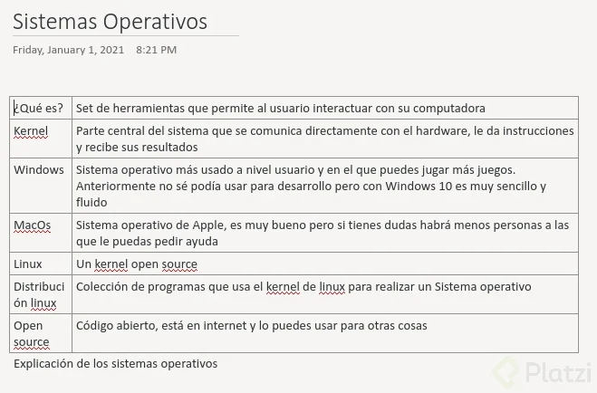
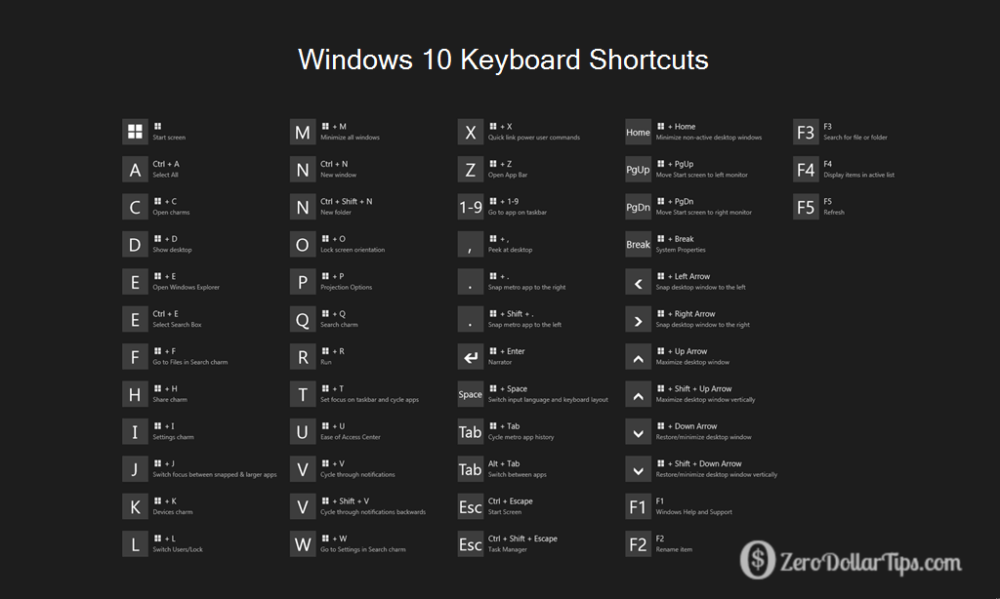
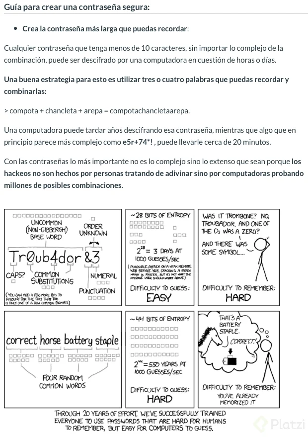

#  Computación Básica
#### Ricardo Docelis

  ## 1. Conocer tu computadora

  ### ¿Qué entiende una computadora?

• En las computadoras se encuentran millones de dispositivos electrónicos llamados transistores, estos se encargan de almacenar los 1 y 0 o bits, un bit es la unidad mínima de información que se puede manejar, los cables dentro de un circuito se encargan de llevar la información de un lado a otro.

• Las computadoras utilizan transistores en diferentes ubicaciones para poder realizar todas las funcionalidades que necesitan.

• El sistema binario está conformado por 0s y 1s, en el sistema binario la primera posición vale 1 y se van multiplicando por 2 cada vez, ejemplo 1 1 1 1 este número seria 1+2+4+8 =15.

• Las letras en el sistema binario están determinadas por las convenciones del código ASCII

• Un documento de texto son las colecciones de caracteres de 0 y 1 que la computadora puede entender.

• Una imagen va a ser la representación de muchos pixeles juntos y cada uno de ellos tiene una característica, de igual modo hay estándares para las imágenes, de igual modo para los videos.

• El software es el conjunto de instrucciones que se le va a dar a la computadora, para que esta pueda llevar acabo los procesos, los flujos que deben tener es un INPUT= ENTRADA, un CPU y una memoria los cuales se comunican para realizar todo el trabajo de procesar la información, guardar variables, mantener la información correcta y procesar un resultado final.

### Elementos importantes de una computadora

**CPU:** Unidad central de procesamiento y es la encarga de procesar todas las operaciones que pasan en la computadora.

**GPU:** Graphic prosecing Unyt y trae de dos tipos:

**Intregrado:** pequeño procesador de graficos y se encarga de todo lo relacionado al tema de graficos (dibujar, procesar videos etc).

**GPU discretas:** Tarjetas de video grandes para computadoras gaming o de edicion de videos, permite acelerar flujo de video etc.

**Almacenamiento:** SSD (Solid staque drivers) solo son disco duros de accesos digitales.

**Memoria RAM:** Almacenamiento temporal de la computadora, tambien se conoce como memoria volatil (Random acces memori).

**Tipo de pantalla:** tenemos que tomar en cuenta la resolucion de pantallas tales como buena resolucion o las pantallas tactiles.

**nota:** break es una pequeña actualizacion para mejorar el rendimiento en el hadware.
Muy buena clase.

**Tipo de pantalla:** tenemos que tomar en cuenta la resolución de las pantallas tales como “alta definición 1080” o táctiles.

Upgrade es una actualización para mejorar el rendimiento en el hardware.

  ### Cómo elegir una computadora

  o 150 dolares más que una con i5. 

  El i7 venia a una frecuencia máxima de 3.6 Ghz mientras que el i5 venia con una frecuencia máxima de 3.4 Ghz. 
  
  Sólo 200 Mhz me parecía muy poca diferencia por tanto precio. Ambos procesadores vienen con 4 núcleos y 8 hilos. 
  
  Me puse a investigar y me di cuanta que básicamente es el mismo procesador pero con overclock y para efectos prácticos ninguno alcanza la frecuencia máxima. En pruebas ambos topan cerca de los 3.34 Ghz y luego comienzan a bajar hasta quedarse estables a los 2.97 Ghz cuando la carga es constante como al editar vídeo. Esto lo hacen por cuestiones de calor y para mantener el sistema estable. 
  
  Los supuestos tests de velocidad del i7 solo se alcanzan por unos segundos y solamente en un núcleo. Eso me parece una muy mala practica de vender algo tan caro sólo por que tiene la etiqueta de i7 cuando en realidad funciona igual que el i5.
  
  Por eso mejor me compré La laptop con i5 y con lo que me ahorré me compré un SSD de 960 GB y un gabinete USB para poner el disco duro original de la laptop como almacenamiento externo y el SSD como el almacenamiento primario. Invalidé la garantía desde el día 1, pero valió la pena. La laptop va como una bala.

  ### Tipos de puertos

  **Tipos de Puertos**

**Lector de tarjetas tipo sd:** Se usa para introducir tarjetas como las que utilizamos en el celular.

**Puertos USB (Universal Serial Bus):** Con este puerto podemos conectar todo tipo de dispositivos a nuestra computadora.

**Kensington Lock:** Es un agujero pequeño presente en casi todo equipo informático pequeño o portable, se utiliza para asegurar el equipo a nuestro escritorio mediante un clave de acero para evitar que la computadora sea removida del sitio donde la dejamos.

**Puerto Ethernet:** También se conoce como puerto de red, porque permite las conexiones de red/Internet.

Puerto para audífonos y micrófono

**Puerto de Carga:** Hay diferentes formatos, todos son del tipo barril y cambia el diámetro de este dependiendo de la cantidad de energía que reciba nuestra computadora.

**Puerto HDMDI (High-Definition Multimedia Interface):** Sirve para proyectar a una TV, hacer presentaciones, etc.

**Puerto USB tipo C:** Este tipo de USB se ha ido convirtiendo en un estándar de la industria gracias a que ofrece una mayor velocidad en transferencia de datos e intensidad en la corriente eléctrica.

  ### Sistemas Operativos

  

  **Linux**

  

  [Manjaro](https://manjaro.org/)

  [Ubuntu](https://ubuntu.com/)

  [Windows10](https://www.microsoft.com/es-co/windows/get-windows-10)

  [macOS](https://www.microsoft.com/es-co/windows/get-windows-10)

  ### Windows 10

  **Orden de la clase:**
  * Escritorio
  * Papelera de Reciclaje
  * Barra de tareas
  * Menu de Notificaciones
  * Menu de Inicio
  * Este equipo
  * Propiedades

  

  ## 2. Gestionar programas y archivos
  ### Instalación de programas

  Recomendaciones:
  * Estar Seguro de que estamos instalamos.
  * Preferiblemente comprar las licencias.
  * No es recomendable descargas GRATIS + FULL , ya que pueden traer virus.
  * Dar permisos a cambios en nuestro sistema a solo a los programas en los cuales confiamos.

NOTAS:
  * METADATOS: datos que ayudan a mostrar mas datos( XD )

  ### Manejo de archivos

  * Ordenar Nuestros archivos
  * Como mover archivos.
  * Como empaquetar(comprimir) archivos.

## Tipos de archivos 

  Los tipos de archivos más comunes en Windows son los siguientes
.JPG, .PNG, .GIF:

Son formatos de imágenes que podemos encontrar en Windows las podrás abrir con la app de fotos en Windows
.doc y .docx

Son formatos de archivos de texto que podemos abrir con Microsoft Word
.pdf

Es un formato de documentos no editables del tipo Formato de Documento Portátil
.mp3 .wav .wma

Son archivos de audio que podemos utilizar con VLC https://www.videolan.org/vlc/index.es.html
.mp4

Formato de video que podemos utilizar con VLC https://www.videolan.org/vlc/index.es.html
.rar y .zip

Formatos de archivos comprimidos windows te permite abrir por default los archivos .rar y puedes usar WinRAR para los archivos .rar

  ## 3. Manejar herramientas de trabajo online

  ### Subscripciones y log in: Recuerda tus contraseñas

  [LastPass...](https://www.lastpass.com/es/)

* Crear cuentas de correo con datos reales, ya que al momento de querer recuperarlas sera mas facil ya que son datos que sabremos.
* Usar contraseñas alfanuméricas ejemplo: **P1@tz1_E1_M3j0r**. Nunca revelar la contraseña a nadie ya que al momento de ser compartida, ya deja de ser segura. 
* Usar la verificación en 2 pasos para así agregar un nivel de seguridad extra.

  ### Verificación en dos pasos

  

  ### E-mail

* [ProtonMail](https://protonmail.com/es/)

 Dudas | Notas 
|-------------|
| ---| ------- 
|   | Uso de correo: Enviar informaci&oacute;n
|   | Cuentas de cobro |
|    | Comunicaci&oacute;n|
|    |     Resumen          
 
___
 > Tomar en cuenta siempres cerrar las sesiones de correo que se hallan abierto en computadores de cafe Internet
 ___

  ### Herramientas extra: administradores de tareas y productividad

  * [Trello](https://trello.com/)
  * [The Pomodoro](https://pomodoro-tracker.com/)

  ### Nociones básicas de seguridad

  * [PHISHING.org](https://www.phishing.org/)

  Los que hacen Phishing a veces van al publico mas inocente que en este caso son los niños o personas que no saben nada de tecnología y apenas están entrando a conocer este mundo online.

¿por qué?, pues por la simple razón que un niño o alguien que esta exento a la tecnología son vulnerable a anuncio falsos, entra aquí y gana mil dolares o cosas parecidas.

Una vez me toco el caso que estaba en una pagina de juego y aparecía una oferta de entra aquí y danos tu información y vas a obtener “1000 monedas del juego” que las monedas del juego seria estas que se consiguen con dinero real y pues si es un niño y no saber sobre estas cosas caen fácilmente.

Pero es un ejemplo de que se pierde digamos una cuenta de un juego casi no pasa nada, pero si cae en otras cosas que necesiten tarjeta de crédito algo mucho mas serio como esto y si el niño sabe donde esta la tarjeta de crédito de sus padre y el inocentemente cree que esta haciendo algo que no tendrá una consecuencia negativa porque no saben se llega a dar cosas bastante graves como fraudes entre otras coas.

Por eso es bastante importante sabes nociones básicas de seguridad y no solo quedarse con eso sino también el de explorar como de otras formas hacen para estafar a las personas en Internet y educar también si hay menores en casa o persona que usan Internet para que no le pasen esto de no ir a sitios raro o no meter ninguna información personal a lugares muy pocos seguros o como nos enseñaba antes de no hablar con extraño en la vida real tampoco hacerlo en Internet.

Entre mas sabemos menos no podrán estafar, manipular,etc.

Por eso la frase de Platzi es bastante interesante de analizar la de “Nunca pares de aprender”.

Posdata: Irónicamente en el Platzi live de este jueves el segmento principal es “Hacks y estafas de phishing en las que han caído tus jefes” lo recomiendo ver.

  ### Antivirus y Actualizaciones

  Malware es la abreviatura de [“Malicious software"](https://bit.ly/2Oz7gC8
), término que engloba a todo tipo de programa o código informático malicioso cuya función es dañar un sistema o causar un mal funcionamiento.

### Motores de búsqueda

  * [bing](https://www.bing.com/)
  * [DuckDuckGo](https://duckduckgo.com/)
  * [Google](https://www.google.com/)