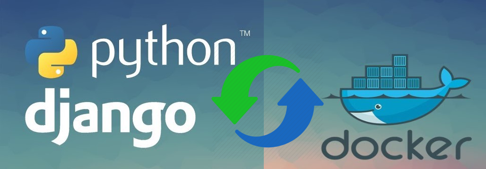

# Django-avanzado

### Pablo Trinidad



# Tabla de contenido
- [1. Bienvenida](#1.-Bienvenida)
  - [¡Bienvenidos!](#¡Bienvenidos!)
- [2. Cimientos](#2.-Cimientos)
  - [Arquitectura de una aplicación](#Arquitectura-de-una-aplicación)
  - [The Twelve-Factor App](#The-Twelve-Factor-App)
  - [Codebase: Settings modular](#Codebase-Settings-modular)
  - [Codebase: Dependencias y archivos de docker](#Codebase-Dependencias-y-archivos-de-docker)
  - [Codebase: Docker](#Codebase-Docker)
  - [Setups alternativos](#Setups-alternativos)
- [3. Modelos](#3.-Modelos)
  - [Herencia de modelos](#Herencia-de-modelos)
  - [Proxy models](#Proxy-models)
  - [App de usuarios](#App-de-usuarios)
  - [Organizando modelos en un paquete de Django](#Organizando-modelos-en-un-paquete-de-Django)
  - [Creando el modelo de perfil de usuario](#Creando-el-modelo-de-perfil-de-usuario)
  - [Solución del reto: arreglando la migración de users a user](#Solución-del-reto-arreglando-la-migración-de-users-a-user)
  - [Aplicación y modelo de círculos](#Aplicación-y-modelo-de-círculos)
  - [Migraciones y admin de círculos](#Migraciones-y-admin-de-círculos)
- [4. Introducción a Django REST Framework](#4.-Introducción-a-Django-REST-Framework)
  - [Aprende cómo construir tu propio API con Django Rest Framework](#Aprende-cómo-construir-tu-propio-API-con-Django-Rest-Framework)
  - [Vistas, URLs y Parsers de DRF](#Vistas-URLs-y-Parsers-de-DRF)
  - [Serializers](#Serializers)
  - [Buenas prácticas para el diseño de un API REST](#Buenas-prácticas-para-el-diseño-de-un-API-REST)
  - [Request, response, renderers y parsers](#Request-response-renderers-y-parsers)
- [5. Real DRF](#5.-Real-DRF)
  - [Autenticación y tipos de autenticación](#Autenticación-y-tipos-de-autenticación)
  - [APIView](#APIView)
  - [Creando el token de autorización](#Creando-el-token-de-autorización)
  - [User sign up](#User-sign-up)
  - [Limitar login a usuarios con cuenta verificada](#Limitar-login-a-usuarios-con-cuenta-verificada)
  - [Configurar envío de email](#Configurar-envío-de-email)
  - [Instalar PyJWT y generar tokens](#Instalar-PyJWT-y-generar-tokens)
  - [Verificar cuenta usando JWT](#Verificar-cuenta-usando-JWT)
  - [Actualizar modelo de circle (membership)](#Actualizar-modelo-de-circle-membership)
  - [Crear CircleViewSet](#Crear-CircleViewSet)
  - [Añadiendo autorización y paginación](#Añadiendo-autorización-y-paginación)
  - [Creación de circulos](#Creación-de-circulos)
  - [Update de círculo, custom permissions y DRF Mixins](#Update-de-círculo-custom-permissions-y-DRF-Mixins)
  - [Migración de vistas de usuarios a ViewSets](#Migración-de-vistas-de-usuarios-a-ViewSets)
  - [Detalle de usuario](#Detalle-de-usuario)
  - [Update profile data](#Update-profile-data)
  - [List members - Recursos anidado](#List-members-Recursos-anidado)
  - [Retrieve destroy member](#Retrieve-destroy-member)
  - [Modelo de invitaciones y manager](#Modelo-de-invitaciones-y-manager)
  - [Obtener invitaciones de un miembro](#Obtener-invitaciones-de-un-miembro)
  - [Unirse a grupo](#Unirse-a-grupo)
  - [Filtrado](#Filtrado)
  - [App de rides y modelos](#App-de-rides-y-modelos)
  - [Implementar la publicación de un ride](#Implementar-la-publicación-de-un-ride)
  - [Validación de campos de un serializer](#Validación-de-campos-de-un-serializer)
  - [Listado de rides](#Listado-de-rides)
  - [Editar un ride](#Editar-un-ride)
  - [Unirse a viaje](#Unirse-a-viaje)
  - [Terminar viaje](#Terminar-viaje)
  - [Calificar viaje](#Calificar-viaje)
- [6. Tareas asíncronas](#6.-Tareas-asíncronas)
  - [¿Qué es Celery?](#¿Qué-es-Celery?)
  - [Creando tarea asíncrona](#Creando-tarea-asíncrona)
  - [Creando tarea periódica](#Creando-tarea-periódica)
- [7. Testing](#7.-Testing)
  - [Python unittest y Django TestCase](#Python-unittest-y-Django-TestCase)
  - [DRF APITestCase](#DRF-APITestCase)
- [8. Django Admin](#8.-Django-Admin)
  - [Admin actions: Modificar datos de un query](#Admin-actions-Modificar-datos-de-un-query)
  - [Admin actions: Regresando una respuesta HTTP](#Admin-actions-Regresando-una-respuesta-HTTP)
- [9. Deployment](#9.-Deployment)
  - [Instalación de la aplicación](#Instalación-de-la-aplicación)
  - [Configuración del dominio en Mailgun y del Bucket en Amazon S3](#Configuración-del-dominio-en-Mailgun-y-del-Bucket-en-Amazon-S3)
  - [Configuración final de Docker Container usando Supervisor](#Configuración-final-de-Docker-Container-usando-Supervisor)
  - [Tutorial de despliegue de la aplicación](#Tutorial-de-despliegue-de-la-aplicación)
  - [Futuros pasos y cierre del curso](#Futuros-pasos-y-cierre-del-curso)

# 1. Bienvenida

# 2. Cimientos
### Back-end
  * Servidor
  * Aplication
  * DataBase

> Un Back-end es un diseñador.

[Roadmap](https://github.com/kamranahmedse/developer-roadmap)

¿Asquitectura?

> The architecture of a sooftware system is a metaphor, analogous to the architecture of a building. It functions as a blueprint for the system.

  * "Moloit&iacute;ca"
  * "Distribuida"
  * "H&iacute;brida"
  * Orientada a Servicios (SOA)


### Service Oriented architecture

+ Es auto-contenida (self-contained)
+ Es una caja negra para sus consumidores
+ Represetna una actividad de negocio con un fin espec&iacute;fico


### Web Services

SOAP

RESTful HTTP

GraphQL

  * [GitHub GraphQL API](https://docs.github.com/en/graphql)
  
  * [Web Tools API Portal](https://www.usps.com/business/web-tools-apis/welcome.htm)

  * [API Graph](https://developers.facebook.com/docs/graph-api/)

  ## The Twelve-Factor App

**Algunos principios de Twelve Factor app**

  * Formas declarativas de configuración
  * Un contrato claro con el OS
  * Listas para lanzar
  * Minimizar la diferencia entre entornos
  * Fácil de escalar

**Codebase:** Se refiere a que nuestra app siempre debe estar trackeada por un sistema de control de versiones como Git, Mercurial, etc. Una sola fuente de verdad.

**Dependencias:** Una 12 factor app nunca debe depender de la existencia implícita de nuestro OS, siempre se declaran explícitamente qué dependencias usa el proyecto y se encarga de que estas no se filtren. Dependency Isolation.

**Configuración:** Acá nos referimos a algo que va a cambiar durante entornos.

**Backing services:** Estos pueden ser conectados y desconectados a voluntad. Es cualquier servicio que nuestra aplicación puede consumir a través de la red como Base de Datos, Mensajería y Cola, Envío de Emails o Caché.

**Build, release, run:** Separa estrictamente las etapas de construcción y las de ejecución. Build es convertir nuestro código fuente en un paquete.Release es la etapa donde agregamos a nuestro paquete cosas de configuración como variables de entorno y Run donde corremos la aplicación en el entorno correspondiente. Las etapas no se pueden mezclar.

**Procesos:** En el caso más complejo tenemos muchos procesos corriendo como Celery y Redis, en esta parte los procesos son stateless y no comparten nada. Cualquier dato que necesite persistir en memoria o en disco duro tiene que almacenarse en un backing services,

**Dev/prod parity:** Reducir la diferencia entre entornos para reducir tiempo entre deploys y las personas involucradas sean las mismas que puedan hacer el deploy

**Admin processes:** Tratar los procesos administrativos como una cosa diferente, no deben estar con la app.

[The Twelve-Factor App ](https://12factor.net/)

## Objetivos 

* Configuraci&oacute;n **declarativa**
* **Contrato claro** con el os
* Lista para **lanzar**
* **reudicr diferncias** entre entornos
* **F&aacute;cil de escalar**

### Docker!

* No necesita un "Guest OS"
* Usa muy poca memoria
* F&aacute;cil de replicar y controlar
* F&aacute;cil de compartir

## Codebase: Settings modular

[Docker Install](https://docs.docker.com/get-docker/)
[Docker Composer](https://docs.docker.com/compose/install/)


**Instalar docker-compose**

`sudo curl -L "https://github.com/docker/compose/releases/download/1.27.4/docker-compose-$(uname -s)-$(uname -m)" -o /usr/local/bin/docker-compose`

**Permisos**

`sudo chmod +x /usr/local/bin/docker-compose` 

**Enalace simbolico**

`sudo ln -s /usr/local/bin/docker-compose /usr/bin/docker-compose` 

listo, docker esta instalado

**Servicios para el Proyecto**
| Django | PostgreSQL | Redis | Celery (Flower) |
|-------- |---------- | ------| -------|
|port `:8000` | port `:5432` | port `:6379` | port `:5555` |

**Clonar el proyecto**
[cride](https://github.com/pablotrinidad/cride-platzi.git)


Antes de que ejecutes cualquier comando, debes ir a la rama `6/Typo-models` del repositorio, la rama `6/Typo-models`, esta en blanco. Y puedes inicializar el stack.

algunos datos que deberas configurar son los siguietnes:
```console
# Passwords security
argon2-cffi==20.1.0

# Static files
whitenoise==4.1.2

# Celery
redis>=3.2.0
django-redis==4.10.0
celery==4.2.1
tornado>=5.0.0,>6.0.0
flower==0.9.2
```
Con todos los datos, configurados realizas tu primer `docker-compose`.


Inicializar `docker-compose`, dentro del directorio del poryecto.

```docker
docker-compose -f local.yml build
```

## Codebase: Docker

Correr el stack
```docker
docker-compose -f local.yml up
```

Detener el stack
```docker
docker-compose -f local.yml down
```

### Pro tip 

```bash
export COMPOSE_FILE=local.yml

  docker-compose build
  docker-compose up
  docker-compose ps
  docker-compose down
```

  ## Comandos de administraci&oacute;n

  `docker-compose run --rm django COMMAND`

debemos ejecutar el comando:

  ```bash
  export COMPOSE_FILE=local.yml

  # luego ejecutamos el comando   👇

  docker-compose run --rm django python manage.py createsuperuser
  ```

  **Habilitar debugger**

  ```bash
  export COMPOSE_FILE=local.yml

  docker-compose up

  docker-compose ps 

  docker-compose rm -f <ID>

  docker-compose run --rm --service-ports django
  ```

  En la carpeta config/urls.py importamos el pedazo de codigo:

  ```py
  import ipdb; ipdb.set_trace()
  ````
  Empezamos a compartir con el debbuger.

  **Docker**

  ```bash
  docker container

  docker images

  docker volume

  docker network
  ```

   * ls
   * rm
   * prune
   * \- a
   * \- q
   

  ## Setups alternativos

  * [Django Api Cookiecutter](https://github.com/gianfrancolombardo/cookiecutter-django-api)

  * [Inventive's Django Cookiecutter](https://github.com/inventivehack/cookiecutter-django-ihk)

# 3. Modelos

  ## Herencia de modelos

La herencia de modelos puede ser útil porque podemos tener datos generales que pueden ser heredados por otras que no necesariamente tienen su propia tabla, porque queremos que haya herencia de múltiples tablas que se reflejan en la base de datos o porque queremos extender la funcionalidad de un modelo.

## Proxy models

Los Proxys nos permiten extender la funcionalidad de un modelo sin crear una nueva tabla en la base de datos, la diferencia con los Abstract Models es que estas solo exponen un molde de atributos y las proxys extienden de una tabla ya existente.

* [proxy models](https://docs.djangoproject.com/en/2.0/topics/db/models/#proxy-models)

## App de Usuario

- [Extending the existing User model](https://docs.djangoproject.com/en/2.0/topics/auth/customizing/#extending-the-existing-user-model)
- [GitHub | ovity/octotree](https://github.com/ovity/octotree)
- [GitHub | django/django](https://github.com/django/django)

## Organizando modelos en un paquete de Django

Deconstruir el modelo de Usuario en múltiples archivos dentro de un paquete

## Creando el modelo de perfil de usuario

  [Modil field reference | Django documentacion](https://docs.djangoproject.com/en/2.1/ref/models/fields/#django.db.models.ForeignKey.on_delete)

**Campos de AbstractUser**

  ```bash
  username	(CharField)

  first_name	(CharField)

  last_name	(CharField)

  email	(EmailField)

  is_staff	(BooleanField)

  is_active	(BooleanField)

  date_joined	(DateTimeField)
  ```

**Campos de AbstractBaseUser**

  ```bash
  password	# (CharField)
  last_login	# (DateTimeField)
  is_active	= True
  ```

  ## Aplicación y modelo de círculos

  Django Integer Field types:

- **IntegerField:** Puede almacenar valores enteres desde -2147483648 hasta 2147483647.

- **PositiveIntegerField:** Como un IntegerField, pero debe ser positivo o cero . Puede almacenar valores desde 0 hasta 2147483647. El valor 0 es aceptado por razones de compatibilidad hacia atrás.

- **PositiveSmallIntegerField:** Como un PositiveIntegerField, pero solo permite valores hasta un cierto limite (dependiente de la base de datos). Puede almacenar valores desde 0 hasta 32767 en todas las bases de datos compatibles con Django.

- **SmallIntegerField**: Como un IntegerField, pero solo permite valores bajo un determinado limite (dependiente de la base de datos). Puede almacenar valores desde -32768 hasta 32767 en todas las bases de datos compatibles con Django.

- **BigIntegerField:** Un entero de 64 bits, muy parecido a IntegerField, excepto que se garantiza que se ajustan a los números desde -9223372036854775808 hasta 9223372036854775807. El widget predeterminado en un formulario para este campo es un TextInput.

  * [Migrations | Django documentation | Django](https://docs.djangoproject.com/en/3.0/topics/migrations/#migration-squashing)
  
  ## Migraciones y admin de círculos

  - [ pablotrinidad/circles.csv](https://gist.github.com/pablotrinidad/93ee462e0ee761bd505f0a2fed3d1c8c)

  - [Welcome to the django-extensions documentation!](https://django-extensions.readthedocs.io/en/latest/)

  ```python
  import csv

  def import_csv(csv_filename):
      with open(csv_filename, mode='r') as csvfile:
          reader = csv.DictReader(csvfile)
          for row in reader:
            circle = Circle(**row)
            if circle.members_limit: circle.is_limited = True
            circle.save()
            print(circle.name)
  ```

  Actualizar los datos, en requirements/local. Tools, con los siguientes datos. 
  Esto es para correr el shell

  ```bash
  # Tools
  django-extensions>=2.2.9
  ```

  ```bash
  docker-compose run --rm django python manage.py shell_plus
  ```


  # 4. Introducción a Django REST Framework

  ## Aprende cómo construir tu propio API con Django Rest Framework

En esta clase el profesor Pablo Trinidad nos explica cómo construir nuestra primera API en Django con Django Rest Framework

Django Rest Framework es una librería que cuenta con muchas herramientas para poder crear nuestras APIs con ayuda de Django. Tiene algunos beneficios como políticas de autenticación incluyendo packetes de OAuth1 y OAuth2, serialización de datos que soporta ORM (Object-relational Mapping), puedes hacer uso de las populares Class Based Views y Function Based Views si necesitas algo más personalizado. Empresas como Mozilla, Red Hat, Heroku y Eventbrit lo utilizan.


  - [JsonResponse objects](https://docs.djangoproject.com/en/2.1/ref/request-response/#jsonresponse-objects)

  - [HTTPie](https://httpie.io/)

**Intalar httpie**

 ```bash
pip install httpie
 ```

**Intalar DjangoFramework**

```bash
pip install djangorestframework
```

Y actualizar el archivo `requeriments/base.txt`, agregarle o cambiar

```bash
# Django REST Framework
djangorestframework==3.12.2
```

  ## Vistas, URLs y Parsers de DRF

  [Request | Django Rest framework](https://www.django-rest-framework.org/api-guide/requests/)

  [django REST framework](https://www.django-rest-framework.org/)

  [Class-based views](https://www.django-rest-framework.org/api-guide/views/)

  [Encode | django-rest-framework](https://github.com/encode/django-rest-framework)

  **Extension GitHub**

  * [octutree | firefox](https://addons.mozilla.org/es/firefox/addon/octotree/)
  * [octutree | Google-chrome](https://chrome.google.com/webstore/detail/octotree-github-code-tree/bkhaagjahfmjljalopjnoealnfndnagc?hl=es)

  ## Serializers

Los serializers son contenedores que nos permiten tomar tipos de datos complejos, convertirlos en datos nativos de python para después poderlos usar como JSON o XML. Son contenedores que amoldan datos para que cumplan con las condiciones de los serializers y sean llevados a un tipo de estos y después estos puedan ser transformados en otra cosa.

- [Validators | Django Rest](https://www.django-rest-framework.org/api-guide/validators/)
- [Serializer fields | Django Rest](https://www.django-rest-framework.org/api-guide/fields/)
- [Serializers | Django Rest](https://www.django-rest-framework.org/api-guide/serializers/)


## Serializers


## Buenas prácticas para el diseño de un API REST


## Request, response, renderers y parsers


5. Real DRF
Autenticación y tipos de autenticación
APIView
Creando el token de autorización
User sign up
Limitar login a usuarios con cuenta verificada
Configurar envío de email
Instalar PyJWT y generar tokens
Verificar cuenta usando JWT
Actualizar modelo de circle (membership)
Crear CircleViewSet
Añadiendo autorización y paginación
Creación de circulos
Update de círculo, custom permissions y DRF Mixins
Migración de vistas de usuarios a ViewSets
Detalle de usuario
Update profile data
List members - Recursos anidado
Retrieve destroy member
Modelo de invitaciones y manager
Obtener invitaciones de un miembro
Unirse a grupo
Filtrado
App de rides y modelos
Implementar la publicación de un ride
Validación de campos de un serializer
Listado de rides
Editar un ride
Unirse a viaje
Terminar viaje
Calificar viaje
6. Tareas asíncronas
¿Qué es Celery?
Creando tarea asíncrona
Creando tarea periódica
7. Testing
Python unittest y Django TestCase
DRF APITestCase
8. Django Admin
Admin actions: Modificar datos de un query
Admin actions: Regresando una respuesta HTTP
9. Deployment
Instalación de la aplicación
Configuración del dominio en Mailgun y del Bucket en Amazon S3
Configuración final de Docker Container usando Supervisor
Tutorial de despliegue de la aplicación
Futuros pasos y cierre del curso