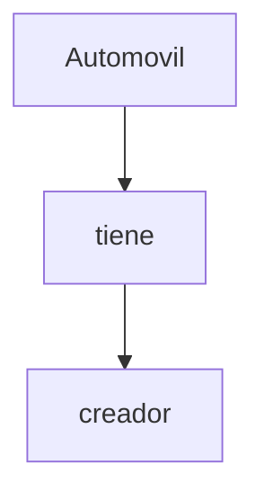
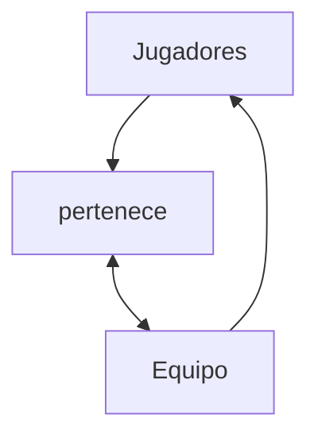
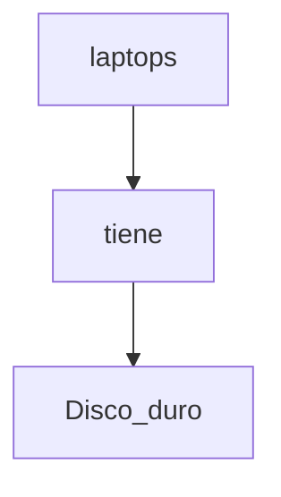

# Fundamentos de Base de Datos

#### Israel Vázquez Morales

- [1. Bienvenida conceptos básicos y contexto histórico de las Bases de Datos](#1-Bienvenida-conceptos-básicos-y-contexto-histórico-de-las-Bases-de-Datos)
  - [Bienvenida conceptos básicos y contexto histórico de las Bases de Datos](#Bienvenida-conceptos-básicos-y-contexto-histórico-de-las-Bases-de-Datos)
- [2. Introducción a las bases de datos relacionales](2-Introducción-a-las-bases-de-datos-relacionales)
  - [Historia de las RDB](#Historia-de-las-RDB)
  - [Entidades y atributos](#Entidades-y-atributos)
  - [Entidades de Platzi Blog](#Entidades-de-Platzi-Blog)
  - [Relaciones](#Relaciones)
  - [Múltiples muchos](#Múltiples-muchos)
  - [Diagrama ER](#Diagrama-ER)
  - [Diagrama Físico: tipos de datos y constraints](#Diagrama-Físico-tipos-de-datos-y-constraints)
  - [Diagrama Físico: normalización](#Diagrama-Físico-normalización)
  - [Diagrama Físico: normalizando Platziblog](#Diagrama-Físico-normalizando-Platziblog)
  - [Formas normales en DB relacionales](#Formas-normales-en-DB-relacionales)
- [3. RDBMS (MySQL) o cómo hacer lo anterior de manera práctica](#3-RDBMS-MySQL-o-cómo-hacer-lo-anterior-de-manera-práctica)
  - [RDB ¿Qué?](#RDB-¿Qué?)
  - [Instalación local de un RDBMS (Windows)](#Instalación-local-de-un-RDBMS-Windows)
  - [Instalación local de un RDBMS (Mac)](#Instalación-local-de-un-RDBMS-Mac)
  - [Instalación local de un RDBMS (Ubuntu)](#Instalación-local-de-RDBMS-Ubuntu)
  - [Clientes gráficos](#Clientes-gráficos)
  - [Servicios administrados](#Servicios-administrados)
- [4. SQL hasta en la sopa](#4-SQL-hasta-en-la-sopa)
  - [Historia de SQL](#Historia-de-SQL)
  - [DDL create](#DDL-create)
  - [CREATE VIEW y DDL ALTER](#CREATE-VIEW-y-DDL-ALTER)
  - [DDL drop](#DDL-drop)
  - [DML](#DML)
  - [¿Qué tan standard es SQL?](#¿Qué-tan-standard-es-SQL?)
  - [Creando Platziblog: tablas independientes](#Creando-Platziblog-tablas-independientes)
  - [Creando Platziblog: tablas dependientes](#Creando-Platziblog-tablas-dependientes)
  - [Creando Platziblog: tablas transitivas](#Creando-Platziblog-tablas-transitivas)
- [5. Consultas a una base de datos](#5-Consultas-a-una-base-de-datos)
  - [¿Por qué las consultas son tan importantes?](#¿Por-qué-las-consultas-son-tan-importantes?)
  - [Estructura básica de un Query](#Estructura-básica-de-un-Query)
  - [SELECT](#SELECT)
  - [FROM](#FROM)
  - [Utilizando la sentencia FROM](#Utilizando-la-sentencia-FROM)
  - [WHERE](#WHERE)
  - [Utilizando la sentencia WHERE nulo y no nulo](#Utilizando-la-sentencia-WHERE-nulo-y-no-nulo)
  - [GROUP BY](#GROUP-BY)
  - [ORDER BY y HAVING](#ORDER-BY-y-HAVING)
  - [El interminable agujero de conejo (Nested queries)](#El-interminable-agujero-de-conejo-Nested-queries)
  - [¿Cómo convertir una pregunta en un query SQL?](#¿Cómo-convertir-una-pregunta-en-un-query-SQL?)
  - [Preguntándole a la base de datos](#Preguntándole-a-la-base-de-datos)
  - [Consultando PlatziBlog](#Consultando-PlatziBlog)
- [6. Introducción a la bases de datos NO relacionales](#6-Introducción-a-la-bases-de-datos-NO-relacionales)
  - [¿Qué son y cuáles son los tipos de bases de datos no relacionales?](#¿Qué-son-y-cuáles-son-los-tipos-de-bases-de-datos-no-relacionales?)
  - [Servicios administrados y jerarquía de datos](#Servicios-administrados-y-jerarquía-de-datos)
- [7. Manejo de modelos de datos en bases de datos no relacionales](#7-Manejo-de-modelos-de-datos-en-bases-de-datos-no-relacionales)
  - [Top level collection con Firebase](#Top-level-collection-con-Firebase)
  - [Creando y borrando documentos en Firestore](#Creando-y-borrando-documentos-en-Firestore)
  - [Colecciones vs subcolecciones](#Colecciones-vs-subcolecciones)
  - [Recreando Platziblog](#Recreando-Platziblog)
  - [Construyendo Platziblog en Firestore](#Construyendo-Platziblog-en-Firestore)
  - [Proyecto final: transformando tu proyecto en una db no relacional](#Proyecto-final-transformando-tu-proyecto-en-una-db-no-relacional)
- [8. Bases de datos en la vida real](#8-Bases-de-datos-en-la-vida-real)
  - [Bases de datos en la vida real](#Bases-de-datos-en-la-vida-real)
  - [Big Data](#Big-Data)
  - [Data warehouse](#Data-warehouse)
  - [Data mining](#Data-mining)
  - [ETL](#ETL)
  - [Business intelligence](#Business-intelligence)
  - [Machine Learning](#Machine-Learning)
  - [Data Science](#Data-Science)
  - [¿Por qué aprender bases de datos hoy?](#¿Por-qué-aprender-bases-de-datos-hoy?)
- [9. Bonus](#9-Bonus)
  - [Bases de datos relacionales vs no relacionales](#Bases-de-datos-relacionales-vs-no-relacionales)
  - [Elegir una base de datos](#Elegir-una-base-de-datos)

---

# 1. Bienvenida conceptos básicos y contexto histórico de las Bases de Datos
  ## Bienvenida conceptos básicos y contexto histórico de las Bases de Datos

Tu profesor será Israel Vázquez, senior web developer en San Francisco, seminarista de bases de datos y entusiasta data engineering.
El almacenamiento en la nube tiene un gran pro comparada con los otros métodos de almacenamiento ya que es accesible desde cualquier parte del mundo. Además es centralizada y puede ser usada por varias personas al mismo tiempo.

Las bases de datos entran cuando hacemos la transición a medios digitales.

**Tipos de bases de datos:**

**Relacionales:** En la industria hay varias compañías dedicadas a ser manejadoras de bases de datos relacionales como SQL Server, Oracle, MariaDB, entre otras.
**No relacionales:** Todavía están avanzando y existen ejemplos muy distintos como cassandra, elasticsearch, neo4j, MongoDB, entre otras.

**Servicios:**

  - **Auto administrados:** Es la base de datos que instalas tú y te encargas de actualizaciones, mantenimiento, etc.
  - **Administrados:** Servicios que ofrecen las nubes modernas como Azure y no debes preocuparte por mantenimiento o actualizaciones.

  - [Fundamentos de Base de Datos.pdf](https://drive.google.com/file/d/1V982h0oTtJUuSubzd88d4-rFBqVOOopX/view?usp=sharing)
  - [Bases de Datos Relacionalesvs No relacionales](https://aukera.es/blog/bases-de-datos-relacionales-vs-no-relacionales/)

# 2. Introducción a las bases de datos relacionales

  ## Historia de las RDB

Las bases de datos surgen de la necesidad de conservar la información más allá de lo que existe en la memoria RAM.

Las bases de datos basadas en archivos eran datos guardados en texto plano, 
fáciles de guardar pero muy difíciles de consultar y por la necesidad de mejorar esto nacen las bases de datos relacionales. 
Su inventor Edgar Codd dejó ciertas reglas para asegurarse de que toda la filosofía de las bases de datos no se perdiera, estandarizando el proceso.

- [Codd's 12 rules](https://www.w3resource.com/sql/sql-basic/codd-12-rule-relation.php)
- [Las 12 reglas de CODD del Modelo Relacional](https://www.mindmeister.com/es/1079684487/las-12-reglas-de-codd-del-modelo-relacional?fullscreen=1#)

**Bases de datos relacionales (RBD)**

Es importante que sea fácil de guardar y extraer, anteriormente se usaban bases de datos basadas en archivos, el cuál era texto plano fácil de guardar, pero difícil de extraer, por esto se inventaron las bases de datos relacionales. En 1990 Codd se preocupó porque los sistemas de gestión de bases de datos (SGBD) que decían ser relacionales, no lo eran. En la práctica es difícil cumplir las 12 pero, un SGBD es más relacional cuantas más reglas cumpla

Las Reglas y mandamientos de Edgar Frank Ted Codd

- Regla 0: Regla de fundación.
a) Cualquier sistema que se proclame como relacional, debe ser capaz de gestionar sus bases de datos enteramente mediante sus capacidades relacionales.

- Regla 1: Regla de la información.
a) Todos los datos deben estar almacenados en las tablas
b) Esas tablas deben cumplir las premisas del modelo relacional
c) No puede haber información a la que accedemos por otra vía

- Regla 2: Regla del acceso garantizado.
a) Cualquier dato es accesible sabiendo la clave de su fila y el nombre de su columna o atributo
b) Si a un dato no podemos acceder de esta forma, no estamos usando un modelo relacional

- Regla 3: Regla del tratamiento sistemático de valores nulos.
a) Esos valores pueden dar significado a la columna que los contiene
b) El SGBD debe tener la capacidad de manejar valores nulos
c) El SGBD reconocerá este valor diferenciándolo de cualquier otro
d) El SGBD deberá aplicársele la lógica apropiada
e) Es un valor independiente del tipo de datos de la columna

- Regla 4: Catálogo dinámico en línea basado en el modelo relacional.
a) El catálogo en línea es el diccionario de datos
b) El diccionario de datos se debe de poder consultar usando las mismas técnicas que para los datos
c) Los metadatos, por tanto, se organizan también en tablas relacionales
d) Si SELECT es una instrucción que consulta datos, también será la que consulta los metadatos

- Regla 5: Regla comprensiva del sublenguaje de los datos completo.
a) Al menos tiene que existir un lenguaje capaz de hacer todas las funciones del SGBD
b) No puede haber funciones fuera de ese lenguaje
c) Puede haber otros lenguajes en el SGBD para hacer ciertas tareas
d) Pero esas tareas también se deben poder hacer con el “lenguaje completo”

- Regla 6: Regla de actualización de vistas.
a) Las vistas tienen que mostrar información actualizada
b) No puede haber diferencias entre los datos de las vistas y los datos de las tablas base

- Regla 7: Alto nivel de inserción, actualización, y cancelación.
a) La idea es que el lenguaje que maneja la base de datos sea muy humano
b) Eso implica que las operaciones del lenguaje de manipulación de los datos (DML) trabajen con conjuntos de filas a la vez
c) Para modificar, eliminar o añadir datos, no hará falta programar de la forma en la que lo hacen los lenguajes de tercera generación como C o Java

- Regla 8: Independencia física de los datos.
a) Cambios en la física de la BD no afecta a las aplicaciones ni a los esquemas lógicos
b) El acceso a las tablas (elemento lógico) no cambia porque la física de la base de datos cambie

- Regla 9: Independencias lógicas de los datos.
a) Cambios en el esquema lógico (tablas) de la BD no afectan al resto de esquemas
b) Si cambiamos nombres de tabla, o de columna o modificamos información de las filas, las aplicaciones (esquema externo) no se ven afectadas
c) Es más difícil de conseguir

- Regla 10: Independencia de la integridad.
a) Las reglas de integridad (restricciones) deben de ser gestionadas y almacenadas por el SGBD

- Regla 11: Independencia de la distribución.
a) Que la base de datos se almacene o gestione de forma distribuida en varios servidores, no afecta al uso de esta ni a la programación de las aplicaciones de usuario
b) El esquema lógico es el mismo independientemente de si la BD es distribuida o no

- Regla 12: La regla de la no subversión.
a) La base de datos no permitirá que exista un lenguaje o forma de acceso, que permita saltarse las reglas anteriores

  ## Entidades y atributos

Una **entidad** es algo similar a un objeto (programación orientada a objetos) y representa algo en el mundo real, incluso algo abstracto. Tienen atributos que son las cosas que los hacen ser una entidad y por convención se ponen en plural.

Los **atributos compuestos** son aquellos que tienen atributos ellos mismos.

Los **atributos llave** son aquellos que identifican a la entidad y no pueden ser repetidos. Existen:

  - Naturales: son inherentes al objeto como el número de serie
  - Clave artificial: no es inherente al objeto y se asigna de manera arbitraria.

**Entidades fuertes:** son entidades que pueden sobrevivir por sí solas.

**Entidades débiles:** no pueden existir sin una entidad fuerte y se representan con un cuadrado con doble línea.

  - Identidades débiles por identidad: no se diferencian entre sí más que por la clave de su identidad fuerte.
  - Identidades débiles por existencia: se les asigna una clave propia.

- [Chen-Notation](https://de.wikipedia.org/wiki/Chen-Notation)

Ejemplo:

Una entidad es algo similar a un objeto (programación orientada a objetos) y representa algo en el mundo real, incluso algo abstracto. Las entidades se escriben en Plural y están representadas por un conjunto de atributos

Estas pueden ser:
  - Concreta: Persona, empleado, casa, auto, etc …
  - Abstracta: cta bancaría, empresa, curso

  

  - Multivaluados: puede tener varios valores (teléfonos, hijos, discos duros)
  - Compuestos: desde los cuales se desprenden más atributos
  - Llave: aquel que identifica la entidad y no se puede repetir y existen dos tipos:
    - Natural: Son inherentes del Objeto (Cedula, No. Serie)
    - Artificial: No es inherente al objeto y se asigna arbitrariamente
  - Derivados: es aquel que se obtiene de un atributo definido (fecha Nac = edad)

  ## Entidades de Platzi Blog

Nuestro proyecto será un manejador de Blogpost. Es un contexto familiar y nos representará retos muy interesantes.

  - Primer paso: Identificar las entidades
  - Segundo paso: Pensar en los atributos

  **Diagrama de Platziblog**
   
  - 

  ## Relaciones

Las relaciones nos permiten ligar o unir nuestras diferentes entidades y se representan con rombos. Por convención se definen a través de verbos.

Las relaciones tienen una propiedad llamada cardinalidad y tiene que ver con números. Cuántos de un lado pertenecen a cuántos del otro lado:

  - Cardinalidad: 1 a 1
  - Cardinalidad: 0 a 1
  - Cardinalidad: 1 a N
  - Cardinalidad: 0 a N

**Diagrama No. 1**

**Diagrama No. 2**

**Relaciones**

**Relaciones**

Las relaciones, representadas por un rombo, sirven para crear relaciones entre entidades. Por convención las relaciones son verbos que conectan entidades. Existen entidades multivaluadas o compuestas que tienen vida propia y se relacionan con otras entidades, por lo que se pueden normalizar (concepto que se explicará luego)

Cardinalidad

Es una propiedad de las relaciones que indica la cantidad y correspondencia con la que puede estar relacionada una entidad y puede ser uno a uno, uno a varios, varios a uno y varios a varios.

  ## Múltiples muchos

Cardinalidades múltiples muchos: También conocida como “Muchos a Muchos”. Es el tipo de cardinalidad en el que muchas entidades de un tipo, pertenecen a muchas entidades de otro, la cual debe ser normalizada y relacionada a partir de llaves foráneas.

  ## Diagrama ER

Un diagrama es como un mapa y nos ayuda a entender cuáles son las entidades con las que vamos a trabajar, cuáles son sus relaciones y qué papel van a jugar en las aplicaciones de la base de datos.

- [Top 5 Free Database Diagram Design Tools](https://www.holistics.io/blog/top-5-free-database-diagram-design-tools/#dbdiagramio)
- [Lucidchart](https://www.lucidchart.com/pages/es/simbolos-de-diagramas-entidad-relacion)
- [Cardinalities](https://en.wikipedia.org/wiki/Entity%E2%80%93relationship_model#Cardinalities)
- [Diagrams](https://app.diagrams.net/)

  ## Diagrama Físico: tipos de datos y constraints

  Para llevar a la práctica un diagrama debemos ir más allá y darle detalle con parámetros como:

  #### Tipos de dato:

  - **Texto:** CHAR(n), VARCHAR(n), TEXT
  - **Números:** INTEGER, BIGINT, SMALLINT, DECIMAL(n,s), NUMERIC(n,s)
  - **Fecha/hora:** DATE, TIME, DATETIME, TIMESTAMP
  - **Lógicos:** BOOLEAN

  #### Constraints (Restricciones)

  - **NOT NULL:** Se asegura que la columna no tenga valores nulos
  - **UNIQUE:** Se asegura que cada valor en la columna no se repita
  - **PRIMARY KEY:** Es una combinación de NOT NULL y UNIQUE
  - **FOREIGN KEY:** Identifica de manera única una tupla en otra tabla
  - **CHECK:** Se asegura que el valor en la columna cumpla una condición dada
  - **DEFAULT:** Coloca un valor por defecto cuando no hay un valor especificado
  - **INDEX:** Se crea por columna para permitir búsquedas más rápidas

  ## Diagrama Físico: normalización

La normalización como su nombre lo indica nos ayuda a dejar todo de una forma normal. Esto obedece a las 12 reglas de Codd y nos permiten separar componentes en la base de datos:

Primera forma normal (1FN): Atributos atómicos (Sin campos repetidos)
Segunda forma normal (2FN): Cumple 1FN y cada campo de la tabla debe depender de una clave única.
Tercera forma normal (3FN): Cumple 1FN y 2FN y los campos que NO son clave, NO deben tener dependencias.
Cuarta forma normal (4FN): Cumple 1FN, 2FN, 3FN y los campos multivaluados se identifican por una clave única.

  ## Diagrama Físico: normalizando Platziblog

  ## Formas normales en DB relacionales

3. RDBMS (MySQL) o cómo hacer lo anterior de manera práctica
RDB ¿Qué?
Instalación local de un RDBMS (Windows)
Instalación local de un RDBMS (Mac)
Instalación local de un RDBMS (Ubuntu)
Clientes gráficos
Servicios administrados
4. SQL hasta en la sopa
Historia de SQL
DDL create
CREATE VIEW y DDL ALTER
DDL drop
DML
¿Qué tan standard es SQL?
Creando Platziblog: tablas independientes
Creando Platziblog: tablas dependientes
Creando Platziblog: tablas transitivas
5. Consultas a una base de datos
¿Por qué las consultas son tan importantes?
Estructura básica de un Query
SELECT
FROM
Utilizando la sentencia FROM
WHERE
Utilizando la sentencia WHERE nulo y no nulo
GROUP BY
ORDER BY y HAVING
El interminable agujero de conejo (Nested queries)
¿Cómo convertir una pregunta en un query SQL?
Preguntándole a la base de datos
Consultando PlatziBlog
6. Introducción a la bases de datos NO relacionales
¿Qué son y cuáles son los tipos de bases de datos no relacionales?
Servicios administrados y jerarquía de datos
7. Manejo de modelos de datos en bases de datos no relacionales
Top level collection con Firebase
Creando y borrando documentos en Firestore
Colecciones vs subcolecciones
Recreando Platziblog
Construyendo Platziblog en Firestore
Proyecto final: transformando tu proyecto en una db no relacional
8. Bases de datos en la vida real
Bases de datos en la vida real
Big Data
Data warehouse
Data mining
ETL
Business intelligence
Machine Learning
Data Science
¿Por qué aprender bases de datos hoy?
9. Bonus
Bases de datos relacionales vs no relacionales
Elegir una base de datos
