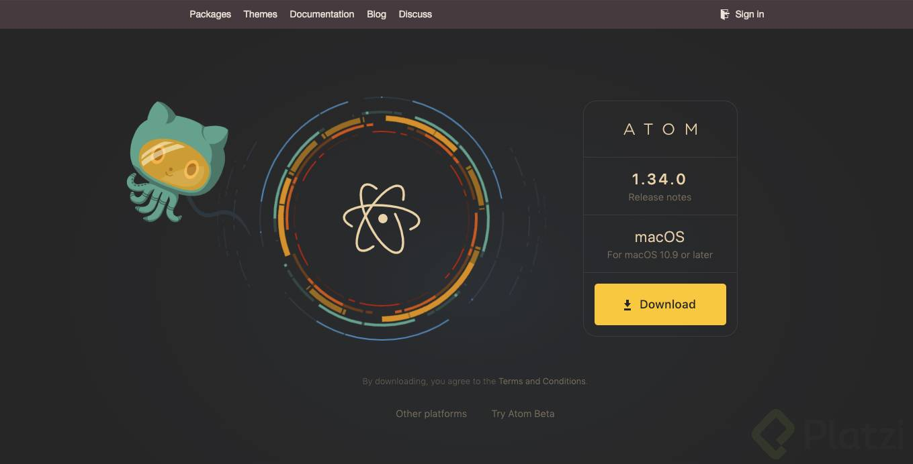
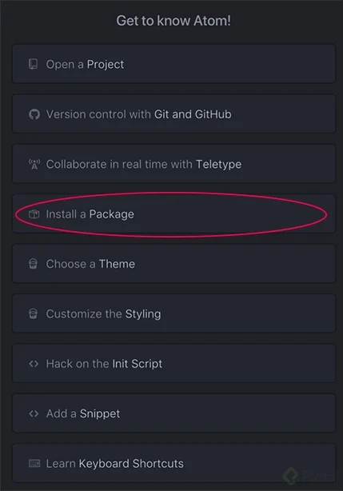
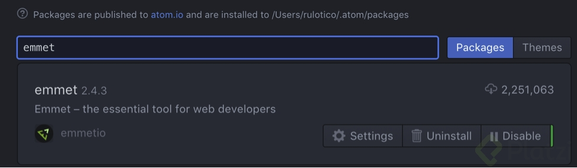

# HTML Y CSS

### 

# Tabla de Contenido

- [1. Internet](#1-Internet)
  - [¡Bienvenido al Curso!](#¡Bienvenido-al-Curso!)
  - [¿Qué conocimientos me recomiendan para tomar este curso?](#¿Qué-conocimientos-me-recomiendan-para-tomar-este-curso?)
  - [¿Cómo se construye la tecnología web?](#¿Cómo-se-construye-la-tecnología-web?)
  - [¿Cómo instalar ATOM?](#¿Cómo-instalar-ATOM?)
  - [Comprendamos Internet](#Comprendamos-Internet)
- [2. Los básicos del web](#2-Los-básicos-del-web)
  - [¿Cómo funciona HTML?](#¿Cómo-funciona-HTML?)
  - [Etiquetas y sus atributos](#Etiquetas-y-sus-atributos)
  - [Reto 1: crea tu fiesta de gifs](#Reto-1-crea-tu-fiesta-de-gifs)
  - [¿Cómo funciona CSS?](#¿Cómo-funciona-CSS?)
  - [¿Cómo funciona JavaScript?](#¿Cómo-funciona-JavaScript?)
  - [Hola mundo y estructura del proyecto](#Hola-mundo-y-estructura-del-proyecto)
  - [Listado de las etiquetas más usadas](#Listado-de-las-etiquetas-más-usadas)
- [3. Construcción de un producto digital](#3-Construcción-de-un-producto-digital)
  - [Paper wireframe](#Paper-wireframe)
  - [¿Cómo instalar XD?](#¿Cómo-instalar-XD?)
  - [Diseño de interfaces](#Diseño-de-interfaces)
  - [Maquetación de la NavBar](#Maquetación-de-la-NavBar)
  - [Maquetación de main_section y agregando estilos CSS](#Maquetación-de-main-section-y-agregando-estilos-CSS)
  - [Maquetación de tarjetas de producto](#Maquetación-de-tarjetas-de-producto)
  - [Fuentes personalizadas y variables de CSS](#Fuentes-personalizadas-y-variables-de-CSS)
  - [Categorizando etiquetas según nuestra estructura en HTML](#Categorizando-etiquetas-según-nuestra-estructura-en-HTML)
  - [Reto 2: Maquetar el home del producto digital](#Reto-2-Maquetar-el-home-del-producto-digital)
  - [Reglas responsive](#Reglas-responsive)
  - [Animaciones y transiciones](#Animaciones-y-transiciones)
- [4. Integrando otras herramientas](#4-Integrando-otras-herramientas)
  - [Atributos especiales de las etiquetas para mejorar el funcionamiento de nuestros formularios](#Atributos-especiales-de-las-etiquetas-para-mejorar-el-funcionamiento-de-nuestros-formularios)
  - [Librería vs Framework](#Librería-vs-Framework)
  - [Sistema de Grillas](#Sistema-de-Grillas)
  - [Completando el Sistema de Grillas](#Completando-el-Sistema-de-Grillas)
  - [Reto 3: implementación del sistema de grillas](#Reto-3-implementación-del-sistema-de-grillas)
  - [Maquetación del formulario](#Maquetación-del-formulario)
  - [Creación de formulario: inputs](#Creación-de-formulario-inputs)
  - [Creación de formulario: botones](#Creación-de-formulario-botones)
  - [¿Cómo crear tu cuenta en Paypal?](#¿Cómo-crear-tu-cuenta-en-Paypal?)
  - [Configuración del botón de pago con Paypal](#Configuración-del-botón-de-pago-con-Paypal)
  - [Autofill del formulario de PayPal](#Autofill-del-formulario-de-PayPal)
  - [Maquetación de pantalla de éxito y error](#Maquetación-de-pantalla-de-éxito-y-error)
- [5. Deploy](#5-Deploy)
  - [Testing con el Navegador](#Testing-con-el-Navegador)
  - [Cómo crear tu cuenta en Github](#Cómo-crear-tu-cuenta-en-Github)
  - [Subiendo nuestro proyecto a Internet con Github](#Subiendo-nuestro-proyecto-a-Internet-con-Github)
- [6. Conclusión](#6-Conclusión)
  - [Conclusiones](#Conclusiones)
- [7. Bonus](#7-Bonus)
  - [Librería vs Framework](#Librería-vs-Framework)

---

# 1. Internet

  ## ¡Bienvenido al Curso!

En este curso vamos a aprender a diseñar y programar productos digitales, vamos a utilizar Adobe XD como herramienta de diseño y Paypal para soportar pagos en línea. En esta ocasión nos acompaña Rulótico González, diseñador y programador al mismo tiempo en SABLE STUDIO.

  ### Frontend ---- Backend
Frontend: la parte visual e interactiva de un sitio o un web app para el usuario.
Backend: funciones básicas; CRUD - Create, Read, Update, Delete
funcionalidad, bases de datos, host. Podemos decir el motor. Conexiones entre back y front.

  ### HTML - CSS - JS

**HTML:** Hyper Text Markup Language - Estructura del sitio - Partes, etiquetas, etc.
**CSS:** Cascading Style Sheet - Estilo del sitio, colores, tamaños, espaciados, animaciones.
**JS:** JavaScript - Interacción dinámica con el usuario, como manejo de variables de datos de usuario, modificación de DOM (o elementos en la estructura HTML), animaciones complejas, manipulación de APIs, etc.

  ## ¿Qué conocimientos me recomiendan para tomar este curso?

Estamos felices de que quieras fortalecer tus destrezas como desarrollador Frontend. Si quieres crear una página web, aprender a bocetarla, maquetarla y darle estilo este curso es para ti.

Antes de comenzar con las primeras clases quiero hacerte algunas recomendaciones de algunos conocimientos previos o paralelos que podrías repasar para aprovechar mucho mejor los ejercicios prácticos que nuestro profesor Raúl “Rulótico” González realiza a lo largo de todos los módulos del curso.

**Curso de desarrollo web online:**

Este curso te explicará de manera detallada todas las bases conceptuales para entender el proceso y uso de HTML.

**Curso de Responsive Design:**

Este curso te permitirá entender los procesos detrás de las buenas prácticas para hacer tu producto digital responsivo.

**Curso de CSS Grid Layout:**

Nuestro profesor usa el framework Bootstrap en varias clases de este curso. Aunque es una gran forma de resolver la maquetación de las Grids o grillas de tu página web, es importante que comprendas el origen de este proceso.

¿Quieres comenzar las clases de nuestro curso de HTML y CSS sin ver estos cursos? Claro que puedes hacerlo, varios estudiantes lo han hecho y han logrado llegar hasta el final. Estas recomendaciones están especialmente diseñadas para aquellos que están comenzando en el maravilloso mundo de la programación frontend.

  ## ¿Cómo se construye la tecnología web?

El **Frontend** es la parte del software que interactúa con los usuarios, en cambio, el **Backend** es la parte que no puedes ver, esta oculta porque contiene la información privada o sensible de nuestros usuarios.

HTML nos permite crear la estructura de la página: títulos, párrafos, menús, etc. CSS nos permite configurar los estilos del HTML, los colores, formas, posiciones, etc. Además, JavaScript (JS) se encarga de la parte funcional, nos permite conectarnos con otros servicios (como PayPal) y nos ayuda a hacer las interacciones mucho más fluidas.

Los **Compiladores** nos ayudan a construir el frontend de nuestras páginas web de forma mucho más rápida y sencilla. En vez de escribir el mismo código una y otra vez, vamos a utilizar estas herramientas para obtener estos mismos resultados de forma automatizada.

El trabajo y las operaciones del backend se pueden resumir con las siglas **CRUD:** Create, Read, Update y Delete. Cuando el frontend se comunica con el backend, debe indicar el tipo de operación y los datos necesarios para que todo funcione correctamente.

Por ejemplo: cuando registramos un usuario, el frontend debe mandar los nombres y contraseña de este usuario para que, el backend, pueda guardar esta información en la base de datos y podamos consultarla más adelante.

- [Desarrollo de páginas web](https://platzi.com/blog/como-hacer-desarrollo-de-paginas-web/)

  ## ¿Cómo instalar ATOM?

Para editar código y crear proyectos super cool necesitas un editor de texto, hay varios que puedes utilizar como:

- [Sublime](https://www.sublimetext.com/)
- [Atom](https://atom.io/)
- [Visual Studio](https://visualstudio.microsoft.com/es/?rr=https%3A%2F%2Fwww.google.com%2F)

Estos son los más populares, sin embargo para crear el proyecto de nuestro Curso Profesional de Desarrollo Web usaremos Atom.

Para la instalación de Atom seguiremos los siguiente pasos:
Para la instalación de Atom seguiremos los siguiente pasos:


1. Ingresa a https://atom.io/



2. Descarga e instala la versión de ATOM de acuerdo a tu sistema operativo.

3. Esta es la primera sección que vas a ver cuando abras ATOM, da click en el botón Install a package.



4. En la sección Install a package busca: emmet y agrégalo a tu editor de texto. Esta herramienta nos ayudará a escribir código de manera más rápida.



5. Te recomiendo que no instales otros paquetes, por ahora. Pues algunos pueden generar conflicto si no tienes claridad sobre su función.

  ## Comprendamos Internet

Internet es un conjunto descentralizado de redes de comunicación interconectadas, en otras palabras, son dos (o más) computadoras que se conectan entre sí. Los Protocolos son un conjunto de reglas que hacen posible la comunicación entre diferentes elementos que forman parte de un sistema.

La **World Wide Web** es un sistema de distribución de documentos (de hipertexto o hipermedia) interconectados y accesibles vía internet, mientras que, 
los **Hipertextos** son textos que contienen enlaces a otros textos.

**FTP** es el protocolo de transferencia de archivos entre sistemas conectados a una red, así es cómo diferentes personas podemos compartir documentos entre nosotros.

Hay algunas computadoras que solo utilizamos para entregar documentos los conocemos como servidores, en cambio, las computadoras que solo leen y reciben estos documentos los conocemos como **clientes**. 
También existe el protocolo de comunicación **P2P** (Peer to Peer) donde una misma computadora trabaja como servidor y cliente al mismo tiempo.

La **tecnología de la la información** es la aplicación de ordenadores y equipos de telecomunicación para almacenar, recuperar, transmitir y manipular datos, con frecuencia, utilizado en el contexto de negocios o empresas.

La **Comunicación Síncrona** es comunicación en tiempo real, por ejemplo, en aplicaciones de mensajería y video-chat. Sin embargo, también existe la 
**Comunicación Asíncrona**, comunicación en tiempo NO real, así funciona Gmail, puede pasar que recibamos un nuevo correo pero no lo leemos inmediatamente lo envían, por eso es comunicación asíncrona.

# 2. Los básicos del web

  ## ¿Cómo funciona HTML?

  **Estructura Basica html5**


```html
<html>
  <head>
    <meta>
  </head>
  <body>
    <h1>Hola</h1>
    <h2>Hola soy un h2</h2>
    <p>Hola soy parrafo.</p>
    <h3>Hola soyun h3</h3>
    <footer>

    </footer>
  </body>
</html>
```

  ## Etiquetas y sus atributos

Las Etiquetas son fragmentos de texto rodeados por corchetes angulares `(< y >)` con funciones y usos específicos:

```html
<html>Contenido</html>
```

Los Atributos afectan a los elementos por su presencia o enriquecen la definición de la misma. Por ejemplo, el atributo lang en la etiqueta html indica que el contenido de esta página esta en un idioma específico:

```html
<html lang=""es"">Contenido en Español</html>
```

Las etiquetas meta (meta tags) son etiquetas que se incorporan en el encabezado de una página web y son invisibles para los usuarios normales, sin embargo, son de gran utilidad para navegadores u otros programas que pueden valerse de esta información:

```html
<head>
  <meta name=""description"" content=""Descripción de nuestra página"">
</head>
```

```html
Metadatos del documento

<base>
<head>
<link>
<meta>
<style>
<title>

Seccionamiento del contenido

<address>
<article>
<aside>
<footer>
<header>
<h1>, <h2>, <h3>, <h4>, <h5>, <h6>
<hgroup>
<main>
<nav>
<section>

Organizar bloques o secciones de contenido(Es importante para la accessibility y el SEO)


<blockquote>
<dd>
<dir>
<div>
<dl>
<dt>
<figcaption>
<figure>
<hr>
<li>
<main>
<ol>
<p>
<pre>
<ul>
```

También encontramos etiquetas comunes como `<footer>` para agrupar el contenido del pie de página, <span> para guardar texto genérico y sin reglas de espaciado o tamaño predeterminadas, `` para incluir imágenes, entre otras.

  ## Reto 1: crea tu fiesta de gifs

¡Bienvenido a tu primer reto!

Ahora que sabes incluir elementos dentro de una web, te invito a que apliques lo aprendido creando una fiesta de gifs.

Descarga algunos gifs bailarines en https://giphy.com/ sobre todo échale un ojo a la sección de stickers. Cuando tengas un conjunto de gifs bailarines ponlos dentro de la carpeta donde esté tu index.

Tip: Trata de escoger los gifs que no tengan fondo, esto te ayudará a que no se vean cortados.

Ahora que ya tienes una colección de gifs utiliza la estructura de las etiquetas para hacer una fiesta de gifs dentro de tu documento. Usa la etiqueta img para lograrlo.

  ## ¿Cómo funciona CSS?

El CSS son las hojas de estilo en cascada que definen la apariencia de nuestros documentos en HTML.

Para que nuestros estilos CSS se apliquen correctamente a nuestras páginas web, debemos utilizar la etiqueta link con el atributo href y la ruta a nuestro archivo .css:

```html
<html>
        <head>
                <link rel=""stylesheet"" href=""estilos.css"">
        </head>
        <body>
                ... etc ... etc....
        </body>
</html>
```

Los Selectores nos permiten conectar las etiquetas de HTML con sus respectivos estilos en CSS.

Existen muchos tipos de selectores, por ejemplo, los selectores de clase buscan el contenido que tenga un cierto valor en su atributo class:

CSS (con punto antes del nombre de la clase):

```css
.caja { color: red; }
```

HTML:

```html
<div class=""caja"">Contenido</div>
```

También tenemos selectores de tipo ID (estos selectores solo pueden aplicar a un elemento, no va a funcionar si escribimos dos o más etiquetas con el mismo ID):

CSS (con `#` antes del nombre del ID):

```css
#caja { color: red; }
```

HTML:

```html
<div id=""caja"">Contenido</div>
```

En CSS utilizamos atributos para definir los estilos de nuestros elementos, podemos modificar el color de la letra, tamaño, color de fondo, espaciado, entre otras:

```css
.caja {
        color: red;
        background: yellow;
        font-size: 10px;
        padding: 20px;
}
```

Juego para familiarizarse con los [selectores CSS](https://flukeout.github.io/)

  ## ¿Cómo funciona JavaScript?

JavaScript es un lenguaje de programación que nos permite realizar actividades complejas en nuestras páginas web: almacenar valores en variables o realizar operaciones.

Para incluir JavaScript en nuestro HTML debemos utilizar la etiqueta `script:`

```js
<html>
    <head>
        <script src=""script.js"">
        </script>
    </head>
</html>
```

  ## Hola mundo y estructura del proyecto

- Crear una carpeta por cada elemento:

  - `css`
    - `archivo.css`
  - `js`
    - `index.js`
  - `img`
    - imagenes


  ## Listado de las etiquetas más usadas

En esta clase veremos algunas de las etiquetas más utilizadas y para qué sirven. Esta lista te será muy útil en el proceso de realización de nuestro proyecto.

```html
<!doctype html>
```

Define que el documento está bajo el estándar de HTML.

```html
<head>
```

Representa una colección de metadatos acerca del documento, incluyendo enlaces a, o definiciones de, scripts y hojas de estilo.

```html
<title>
```

Define el título del documento, el cual se muestra en la barra de título del navegador o en las pestañas de página. Solamente puede contener texto y cualquier otra etiqueta contenida no será interpretada.

```html
<base>
```

Define la URL base para las URLs relativas en la página.

```html
<link>
```

Usada para enlazar JavaScript y CSS externos con el documento HTML actual.

```html
<meta>
```

Define los metadatos que no pueden ser definidos usando otro elemento HTML.

```html
<style>
```

Etiqueta de estilo usada para escribir CSS en línea.

```html
<body>
```

Representa el contenido principal de un documento HTML. Solo hay un elemento <body> en un documento.

```html
<section>
```

Define una sección en un documento.

```html
<nav>
```

Define una sección que solamente contiene enlaces de navegación

```html
<article>
```

Define contenido autónomo que podría existir independientemente del resto del contenido.

```html
<aside>
```

Define algunos contenidos vagamente relacionados con el resto del contenido de la página. Si es removido, el contenido restante seguirá teniendo sentido

```html
<h1>, <h2>, <h3>, <h4>, <h5>, <h6>
```

Los elemento de cabecera implementan seis niveles de cabeceras de documentos; `<h1>` es la de mayor jerarquía y `<h6>` es la de menor importancia. Un elemento de cabecera describe brevemente el tema de la sección que introduce

```html
<header>
```

Usualmente contiene un logotipo, el título del sitio Web y una tabla de navegación de contenidos.

```html
<footer>
```

Define el pie de una página o sección. Usualmente contiene un mensaje de derechos de autoría, algunos enlaces a información legal o direcciones para dar información de retroalimentación.

```html
<address>
```

Define una sección que contiene información de contacto.

```html
<main>
```

Define el contenido principal o importante en el documento. Solamente existe un elemento <main> en el documento.

```html
<form>
```

Representa un formulario, con atributos de controles que puede ser enviado a un servidor para procesamiento.

```html

```

Representa una imagen.

```html
<iframe>
```

Representa un contexto anidado de navegación, es decir, un documento HTML embebido.

```html
<a>
```

Representa un hiperenlace, enlazando a otro recurso.

```html
<em>
```

Representa un texto enfatizado, como un acento de intensidad.

```html
<strong>
```

Representa un texto especialmente importante .

```html
<small>
```


El elemento p (párrafo) es el apropiado para distribuir el texto en párrafos.

```html
<p></p>
```

Representa un comentario aparte, es decir, textos secundarios como un descargo de responsabilidad o una nota de derechos de autoría, que no son esenciales para la comprensión del documento.

- [Lista de Elementos HTML5](https://developer.mozilla.org/es/docs/conflicting/Web/HTML/Element)

# 3. Construcción de un producto digital

  ## Paper wireframe

Un documento esquemático para un perfil personal creado usando Balsamiq.

Un wireframe para un sitio web, también conocido como un esquema de página o plano de pantalla, es una guía visual que representa el esqueleto o estructura visual de un sitio web.

  - El wireframe esquematiza el diseño de página u ordenamiento del contenido del sitio web, incluyendo elementos de la interfaz y sistemas de navegación, y cómo funcionan en conjunto.
  - Usualmente este esquema carece de estilo tipográfico, color o aplicaciones gráficas, ya que su principal objetivo reside en la funcionalidad, comportamiento y jerarquía de contenidos.
  - En otras palabras, se enfoca en “qué hace la pantalla, no cómo se ve”.
  - Los esquemas pueden ser dibujados con lápiz y papel o esquemas en una pizarra, o pueden ser producidos con medios de diseño de aplicaciones de software libre o comerciales.

Los wireframes se enfocan en 5:

  - Los tipos de información que será mostrada
  - La cantidad de las funciones disponibles
  - Las prioridades relativas de la información y las funciones
  - Las reglas para mostrar ciertos tipos de información
  - El efecto de los distintos escenarios en la pantalla

El wireframe del sitio web conecta la estructura conceptual, o arquitectura de la información, con la superficie, o diseño visual del sitio web.2 Los wireframes ayudan a establecer funcionalidad, y las relaciones entre las diferentes plantillas de pantallas de un sitio web. Un proceso iterativo de creación de wireframes es una forma efectiva de hacer prototipos de páginas rápidos, mientras se mide la practicidad de un concepto de diseño. Típicamente, la esquematización comienza entre “diagramas de flujo de estructuras de trabajo de alto nivel o mapas de sitio y diseños de pantallas.”3 Dentro del proceso de construcción de un sitio web, el dibujo de un wireframe es donde el concepto se vuelve tangible.

**¿Qué es y para qué sirve una landing page?**

Una landing page es una página web preliminar o pagina de aterrizaje donde queremos destacar algo en especial, ya sea un producto, o alguna novedad o promoción de un producto. Se utilizan para todo lo que es SEM (search engine marketing), más conocido como los anuncios de Google Adwords.

**¿Qué es el footer de una página web?**

El footer es la parte inferior de una estructura web en la que generalmente se incluyen links de navegación, enlaces de interés, copyright o botones a las redes sociales del site. El footer suele estar claramente diferenciada de alguna forma del resto de la página web.


  - **Sitio**


  ## ¿Cómo instalar XD?

Ya que tienes los conceptos básicos sobre la creación de un producto digital, vamos a comenzar con el proceso de diseño visual y la definición de la estructura. Para esto vamos a instalar el software XD de Adobe, con este podremos crear nuestras propias interfaces.

1. Entra a: https://www.adobe.com/es/products/xd.html

2. Da click en el botón de descarga


3. Inicia sesión con Facebook o Google.


4. Después de haber iniciado sesión en tu computadora se instalará Adobe Creative Cloud. Este software te permite gestionar los programas de Adobe.

5. Da click en “Open Creative Cloud Desktop App".


6. Al instalar Adobe Creative Cloud verás esta ventana donde se pueden gestionar todos los programas de Adobe.


7. Para nuestro curso solo debemos seleccionar la descarga de Adobe XD. Al finalizar el proceso de descarga, estás listo para usar Adobe XD.


Por último quiero recordarte que Adobe XD tiene una versión gratuita y una versión paga.

La versión paga te permite publicar todos los prototipos y diseños que hagas. Si te quedas con la versión gratuita podrás diseñar todo lo que haremos en el curso, pero la publicación de los diseños solo podrás hacerla una vez.

  ## Diseño de interfaces


  ## Maquetación de la NavBar


  ## Maquetación de main_section y agregando estilos CSS


  ## Maquetación de tarjetas de producto


  ## Fuentes personalizadas y variables de CSS


  ## Categorizando etiquetas según nuestra estructura en HTML


  ## Reto 2: Maquetar el home del producto digital


  ## Reglas responsive


  ## Animaciones y transiciones


# 4. Integrando otras herramientas

  ## Atributos especiales de las etiquetas para mejorar el funcionamiento de nuestros formularios


  ## Librería vs Framework


  ## Sistema de Grillas


  ## Completando el Sistema de Grillas


  ## Reto 3: implementación del sistema de grillas


  ## Maquetación del formulario


  ## Creación de formulario: inputs


  ## Creación de formulario: botones


  ## ¿Cómo crear tu cuenta en Paypal?


  ## Configuración del botón de pago con Paypal


  ## Autofill del formulario de PayPal


  ## Maquetación de pantalla de éxito y error


# 5. Deploy

  ## Testing con el Navegador


  ## Cómo crear tu cuenta en Github


  ## Subiendo nuestro proyecto a Internet con Github


# 6. Conclusión

  ## Conclusiones


# 7. Bonus

  ## Librería vs Framework


