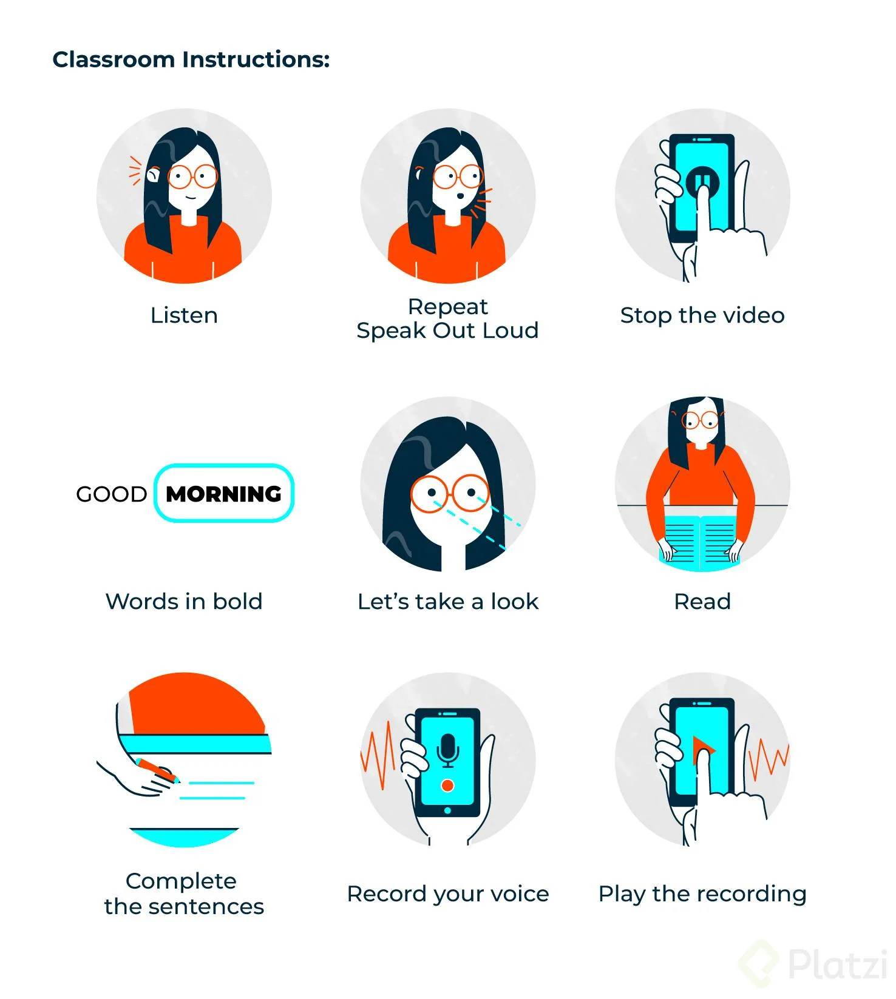
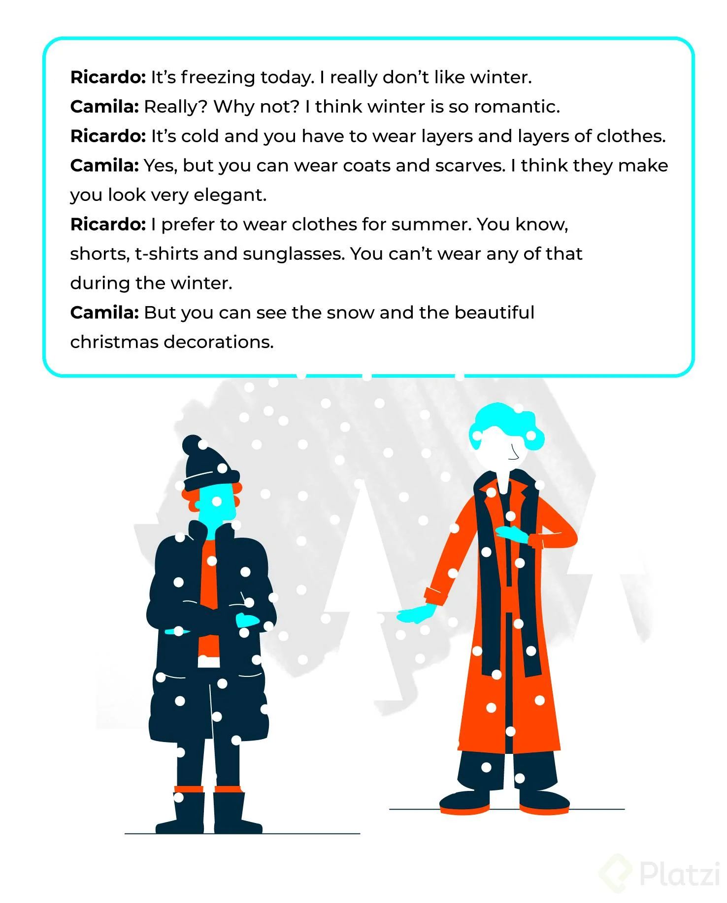

# Curso de Inglés Básico: Gramática

#### Paula Becerra

# Tabla de Contenido

+ [1. Welcome](#1.-Welcome)
  - [Welcome](#Welcome)
+ [2. Module 1](#2.-Module-1)
  - [Classroom Instructions](#Classroom-Instructions)
  - [Vocabulary: Clothes for seasons](#Vocabulary-Clothes-for-seasons)
  - [Conversation: Clothes and seasons](#Conversation-Clothes-and-seasons)
  - [Grammar: Can and can´t](#Grammar-Can-and-can-t)
  - [Vocabulary: abilities](#Vocabulary-abilities)
  - [Listening: Abilities](#Listening-Abilities)
  - [Verb patterns](#Verb-patterns)
  - [Task: Likes and dislikes](#Task-Likes-and-dislikes)
  - [Useful expressions: Love-adore, be crazy about](#Useful-expressions-Love-adore-be-crazy-about)
- [3. Module 2](#3.-Module-2)
  - [Grammar: Present Simple](#Grammar-Present-Simple)
  - [Listening exercise: Simple present](#Listening-exercise-Simple-present)
  - [Routines](#Routines)
  - [Grammar: Simple present](#Grammar-Simple-present)
  - [Listening: Routines](#Listening-Routines)
  - [Exercise: Complete and organize the sentences](#Exercise-Complete-and-organize-the-sentences)
  - [Task: Create your schedule](#Task-Create-your-schedule)
  - [Vocabulary: WH Questions](#Vocabulary-WH-Questions)
  - [Grammar: WH questions](#Grammar-WH-questions)
  - [Useful expressions: Frequency adverbs.](#Useful-expressions-Frequency-adverbs)
- [4. Module 3](#4.-Module-3)
  - [My childhood](#My-childhood)
  - [Vocabulary: Adjectives](#Vocabulary-Adjectives)
  - [Grammar: The Past](#Grammar-The-Past)
  - [Exercises: Answer the questions](#Exercises-Answer-the-questions)
  - [Task: Your childhood](#Task-Your-childhood)
  - [Useful expressions: Time expressions](#Useful-expressions-Time-expressions)
  - [Vocabulary: Last night I...](#Vocabulary-Last-night-I)
  - [Grammar: Past Events](#Grammar-Past-Events)
  - [Spelling rules: Regular verbs conjugation](#pelling-rules-Regular-verbs-conjugation)
  - [Famous people](#Famous-people)
  - [Grammar: Simple past (irregular verbs)](#Grammar-Simple-past-irregular-verbs)
  - [Exercises: Complete the sentences](#Exercises-Complete-the-sentences)
  - [Task: Write what you did last night](#Task-Write-what-you-did-last-night)
- [5. Module 4](#5.-Module-4)
  - [Plans for the future](#Plans-for-the-future)
  - [Vocabulary: Important life events](#Vocabulary-Important-life-events)
  - [Grammar: Plans for the future](#Grammar-Plans-for-the-future)
  - [Task: Make a life plan](#Task-Make-a-ife-plan)
  - [Useful expressions: Plans for the future](#Useful-expressions-Plans-for-the-future)
  - [End of the Basic English Course: Grammar](#End-of-the-Basic-English-Course-Grammar)

***

# 1. Welcome
  ## Welcome

Welcome to our **Basic English Course: Grammar**. In this course you will learn the basic elements of grammar in English. In this course you will learn **how to talk about abilities, likes and dislikes, your past, your childhood, your future plans and many other things.** Do all the activities planned for this course.

# 2. Module 1

  ## Classroom Instructions

Welcome to our English Basic Course: Grammar. To start we want to show you important vocabulary from the course. Come back to this guide anytime you need:

  ## Vocabulary: Clothes for seasons

**Listen and repeat:**

**Winter:**
  - Sweater
  - Scarf
  - Coat
  - Boots
  - Wooly hat

**Spring:**

  - Tee
  - Dress
  - Denim jacket
  - Flats
  - Skirt

**Summer**

  + T- shirt
  + Sandals
  + Hat
  + Sunglasses
  + Shorts

**Fall**

  - Vest
  - Scarves
  - Sweater

  [curso-basico-de-gramatica-de-ingles-compressed.pdf](doc/curso-basico-de-gramatica-de-ingles-compressed.pdf)

  ## Conversation: Clothes and seasons

  + What season does Camila like?
  + What season does Ricardo like?
  + What clothing can you wear in winter?
  + What clothing can you wear in summer?

  ## Grammar: Can and can´t

n this lesson you will learn to use can and can’t to talk about abilities and possibilities.

If you are talking about seasons and clothes you can use can and can’t. Let’s look at some examples:

I can wear t-shirts in the summer.
I can’t wear a sweater in the summer.
Can I wear a sweater in the summer?

Now let’s practice with some exercises:

___________________ he wear tees in the winter?
They _______________ wear sandals in the spring.
I ______________ wear t-shirts in the summer.
We______________ wear sneakers in the fall.
You _____________ wear a wooly hat in the summer.

**Answers**

- **Can** he wear tees in the winter?
- They **Can** wear sandals in the spring.
- I **can** wear t-shirts in the summer.
- We **can** wear sneakers in the fall.
- You **can't** wear a wooly hat in the summer.

***Check the answers of the exercise:***

Can he wear tees in the winter?
  - They can’t wear sandals in the spring
  - I can wear t-shirts in the summer
  - We can wear sneakers in the fall
  - You can’t wear a wooly hat in the summer

  ## Vocabulary: abilities

  ## Listening: Abilities

**Listen to different abilities then listen and repeat:**

  1. Speak a foreign language
  2. Play a musical instrument
  3. Dance
  4. Draw
  5. Sing
  6. Cook
  7. Drive
  8. Play soccer

  ## Verb patterns

In this lesson we will talk about things that you want to do, that you like to do, that you love to do and that you enjoy doing. There are many options to express likes and dislikes. Let’s see in this class some examples.

Let’s practice with some exercises. Complete the sentences using the correct conjugation of the verb in brackets:

She ________________ (want) play the guitar.
I ________________ (love) cook pasta.
We ______________ (enjoy) driving in the main road.
I _______________ (not like) waking up early.
She _____________ (not like) study French.

**Check the answers to the exercise:**

She wants to play the guitar.
I love to cook pasta.
We enjoy driving in the main road.
I don’t like waking up early.
She doesn’t like to study French.
Now decide to use the infinitive (to-) or the gerund (-ing). Complete the exercise:

I enjoy ___________________ (run) in the morning.
Do you like to __________________ (work) late?
He wants ___________________ (make) the report for us.
We don’t enjoy ___________________ (drive) to new places.
They love _______________________ (play) the guitar.

**Check the answers to the exercise:**

I enjoy running in the morning
Do you like to work late?
He wants to make the report for us
We don’t enjoy driving to new places
They love playing the guitar

  ## Task: Likes and dislikes

  ## Useful expressions: Love, adore, be crazy about

# 3. Module 2

  ## Grammar: Present Simple

  ## Listening exercise: Simple present

  ## Routines

  ## Grammar: Simple present

  ## Listening: Routines

  ## Exercise: Complete and organize the sentences

  ## Task: Create your schedule

  ## Vocabulary: WH Questions

  ## Grammar: WH questions

  ## Useful expressions: Frequency adverbs.

# 4. Module 3

  ##  My childhood

  ##  Vocabulary: Adjectives

  ##  Grammar: The Past

  ##  Exercises: Answer the questions

  ##  Task: Your childhood

  ##  Useful expressions: Time expressions

  ##  Vocabulary: Last night I...

  ##  Grammar: Past Events

  ##  Spelling rules: Regular verbs conjugation

  ##  Famous people

  ##  Grammar: Simple past (irregular verbs)

  ##  Exercises: Complete the sentences

  ##  Task: Write what you did last night

# 5. Module 4

  ## Plans for the future

  ## Vocabulary: Important life events

  ## Grammar: Plans for the future

  ## Task: Make a life plan

  ## Useful expressions: Plans for the future

  ## End of the Basic English Course: Grammar

