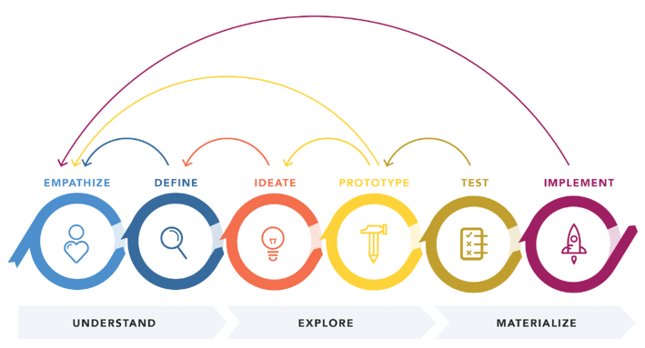
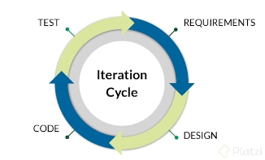
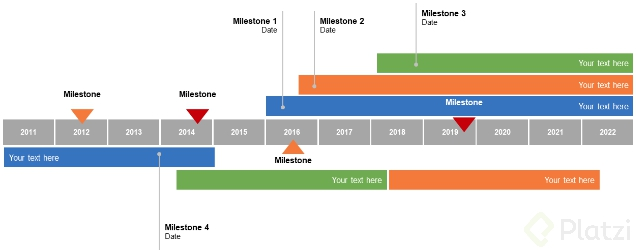
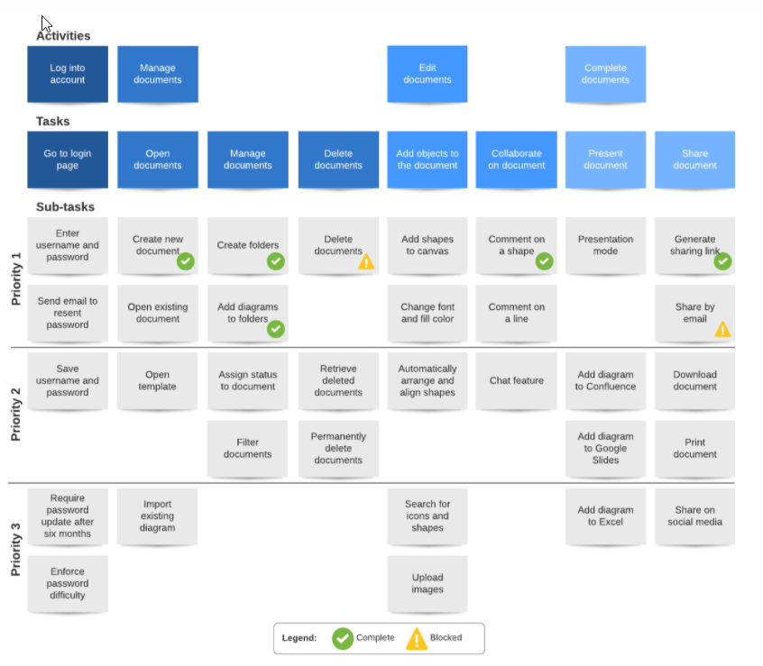
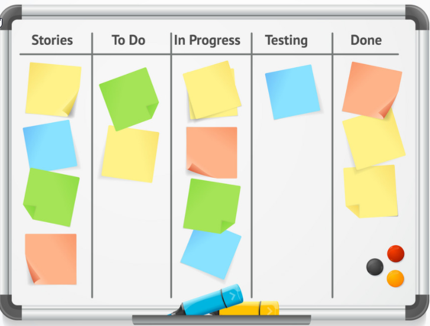
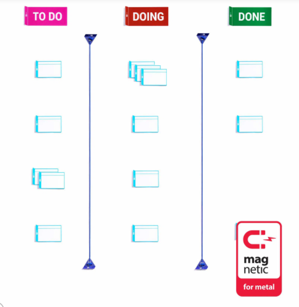
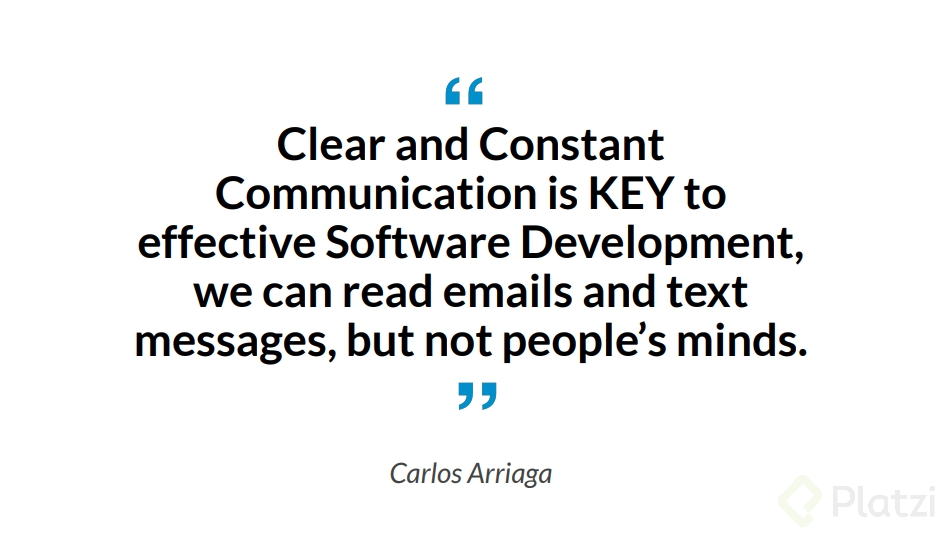

# 🗽 🛸 Ingles for Developers 🛰 🚀
#### Carlos Arriaga

# Tabla de contenido
- [1. Understand the fundamentals of software development](#1.-Understand-the-fundamentals-of-software-development)
  - [Introduction to software development](#Introduction-to-software-develop)
- [2. Communicate with your customer accurately](#2.-Communicate-with-your-customer-accurately)
  - [Customer-oriented requirements and important concepts for iteration cycles](#Customer-oriented-requirements-and-important-concepts-for-iteration-cycles)
  - [How iteration cycles works](#How-iteration-cycles-works)
  - [Planning considering priorities](#Planning-considering-priorities)
  - [Review: communicate with your customer accurately](#Review:-communicate-with-your-customer-accurately)
- [3. Understand your customer and the requirements](#3.-Understand-your-customer-and-the-requirements)
  - [Prioritizing requirements](#Prioritizing-requirements)
  - [Backlog and Milestone 1.0](#Backlog-and-Milestone-1.0)
- [4. Organize your tasks!](#4.-Organize-your-tasks!)
  - [Organizing your time into user stories and tasks](#Organizing-your-time-into-user-stories-and-tasks)
  - [Stand-up meetings, analyze and design](#Stand-up-meetings-analyze-and-design)
  - [Review: organize your tasks!](#Review-organize-your-tasks!)
- [5. Create deliverable design](#5.-Create-deliverable-design)
  - [Creating deliverable design](#Creating-deliverable-design)
  - [Refactoring, meetings and release](#Refactoring-meetings-and-release)
- [6. Protect your very valuable software](#6.-Protect-your-very-valuable-software)
  - [Understanding the principles of defensive development](#Understanding-the-principles-of-defensive-development)
  - [Functional and unit testing](#Functional-and-unit-testing)
  - [Review: protect your very valuable software](#Review-protect-your-very-valuable-software)
- [7. Understanding Continuous Integration (CI) and testing](#7.-Understanding-Continuous-Integration-(CI)-and-testing)
  - [Types of software testing](#Types-of-software-testing)
  - [Handle accidents when building the code and what CI means](#Handle-accidents-when-building-the-code-and-what-CI-means)
- [8. Test your Software!](#8.-Test-your-Software!)
  - [TDD Test-Driven Development](#TDD-Test-Driven-Development)
  - [Review: test your software!](#Review-test-your-software!)
- [9. Be ready for the end](#9.-Be-ready-for-the-end)
  - [Prepare for the next iteration](#Prepare-for-the-next-iteration)
  - [End an iteration](#End-an-iteration)
- [10. Fix your bugs!](#10.-Fix-your-bugs!)
  - [Handle bugs to fit your process](#Handle-bugs-to-fit-your-process)
  - [Continuous integration test delivery method](#Continuous-integration-test-delivery-method)
  - [Review: fix your bugs!](#Review-fix-your-bugs!)
- [11. See the real world!](#11.-See-the-real-world!)
  - [Best practices for software development in real life](#Best-practices-for-software-development-in-real-life)
- [12. Expert Mentorship](#12.-Expert-Mentorship)
  - [Cómo puedo mejorar mi inglés](#Cómo-puedo-mejorar-mi-inglés)
  - [Play](#Play)

# 1. Understand the fundamentals of software development

## Introduction to software development

In this lesson you will learn about: Customer’s Inception, User Stories, Developing Iterations, Customer Feedback(PDF).

**Challenge:** using your new knowledge of Software Development, answer a Multiple Choice Quiz to reinforce your concepts.

[Customer Freedback.pdf](doc/Customer-Feedback.pdf)

[Ingles Developers Slides](doc/ingles-developers-slides.pdf)

# 2. Communicate with your customer accurately

## Costomer-orinted requirements and importan concepts for iteration cycles

**Accurate communication**
* Customer requirements/Understanding the customer
* At the beginning some information might still be unclear - go back to the customer and clarify.
* Get info on requirements. Think of everything you need before you start building the software.
* What questions do you Think you could ask if we take the bicycle online sales as an example?
  - **Can you think of some questions?**
  - Let me know in the chat

 **Examples:**

 1. How many different types of bicycles does the software have to support?
 2. should the software allow any changes to color or model once bicycles have been purshased? 
 3. Doess the software have an administrator interface to make changes?
 4. Will the software to talk other systems? Paypal or others?
 
**Idea brainstorming**

A session designed to express ideas about the project design. any idea can be expressed.

Promote the right atmosphere to avoid having a foffy or muffled session.

> Two heads are better than one and four heads are better than two, as long as people can contribute  without criticism - Carlos arriaga.

The objective of brainstorming is getting good requirements that will create great result and great software.

You can also try brainstorming and observation as a complement to Brainstorming to gather good requirements

**User Stories**

Working, functional software is the primary measure of progress.

User stories help you sort out what is most important.

Your priority is to satisfy your customer throungh early and continuous delivery of valuable software.

User sotries should describe onde thing that the software needs to do for the customer, they must be short.

Written using language that the custormer undestands...avoid using technical terms.

User stories must be Written from the customer's perspective

**Example:**
AS A SUSER IWANT TO ... change my password
SO I CAN .... keep my account secure.

**Estimates**

After your initial requirement capture stage you will have clear user stories.

The customer will then want to know when those stories will be built.

How long will it take to complete the project? (Estimation)

Your estimate is the sum of all the time you take to build the user stories.

*Exmple:*
User story 1. Catalog creation (5 days)
User story 2. Selecting a bicycle (2 days)
User story 3. Selecting a color (2 days)

Total = 9 days.

**Desing Thinking summary**

[Design Thinkking](doc/design-thinkingf_reduce.pdf)

## How iteration cycles works

**Iteration cycles**

The secret tp great spftware os Iterations, and constant communication.

You can't simply ignore customer during development.

Your get to ask the quwstion: how am I doing?

Each iteration is a mini cycle to produce quality software with requirements, design, code and test.

Each cycle produces working quality software. 
A process is really just a sequence of steps.

**Estimating the whole project**

Your iteration length should be at the right tempo for your project.

User stories define the *"WHAT"* of your project.

Estimates define the *WHEN*.

This is where the customer asks the big question: How long will it take?

Your project estimate is the sum of the estimates for your user stories.

To figure out how long it will take to complete all of the requirements captured in your sotries, you need to reach consensus in your estimations.

**Reaching consensus in estimations**

Let's analyze the next example:

**NEXT USERT STORY:** You need to enble the software to receive payments.

Think about people paying with a credit/debit card.

Developers may have different estimations based on the individual assuptions.

**Assumptions =**
The action of accepting something without proof.

**Exmple**

People will pay with a Visa or MasterCard

But what about Paypal? On Bitcoin? Or American Express?

Developers might disagree about estimates.

It is essential your team comes to a consensus, only then can you start estimating accurately.

Eliminate assumptions, have a meeting and agree on Estimates by playing planning poker.

[prioritizing with the customer](doc/prioritizing-with-the-customer.pdf)

  ## Planning considering priorities

  **Planning considering priorites**

We previously played planning poker and the total time is: 300 days.

However, after informing the customer she says:
Listen, I don't have that much time, I will give you 90 days ...

What do you do?

Go back and prioritize your stories with the client.

The client is responsible for selecting the most relevant user stories, it's her decision.

You should have a meeting with your client, lay out all the user sotries and ask her about the order of the priorities.

Then select the set of features to be delivered in milestone 1.0

  **Milestones**

  A Milestones is major release.

  Your deliver your software (and your expect to get paid for it)

  This differs from iterations because during an iteration you show your customer the software for your feedback.

  A Milestones is about delivering software with baseline functionality.

  Don't try to include fancy functions, instead focus on delivering software that will cover baseline functionality.

  

  ## Review: communicate with your customer accurately

**Customer’s Inception:** Customer’s Inception is the customer’s initial idea to get software for various purposes.

**User Stories:** A User Story is the representation of an individual task the Software has to do, it is composed of smaller tasks and it contains a title, a description and a priority value.

**Iterations as part of a development process:** A work period after which you get together with the customer, show her your work and receive feedback.

**Accurate Communication:** It is key to understanding Customer’s requirements and avoiding mistakes.

**Idea Brainstorming:** Is necessary to get good requirements that will create fantastic results.

**Estimate:** The time you agree with your team to finish User Stories.

**Iteration cycle:** Is a little work cycle that produces quality, working software.

**Estimating the whole Project:** Takes place when you decide the length of the complete project.

**Reaching consensus in estimations:** Takes place when you have agreed on the length of the estimation with the entire team, after playing planning poker.

**Planning considering priorities:** Takes place after having a meeting with the Customer and agreeing on the features that should be included in the next Iteration. It is the Customer’s decision to include certain features.

**Milestone:** It is a MAJOR release, when you show your Customer your working, functional Software and and you expect to get paid for it.

[review](doc/review-i.pdf)

# 3. Understand your customer and the requirements

  ## Prioritizing requirements

**Achievable development plan**

Setting ambitious goals is always important, however if your goals and the customer's goals are not aligned then there's a great chance something will go wrong.

At the beginning of each iteration, make sure you have the right set of features and that you're doing what you're supposed to do.

Stay customer-cocused at all times, only the customer knows what is needed.

user stories take priority based on your customer's decisions.

Help the customer make dicisions, lay out all your user sotries in front of him/her.

This influences the set of features that your software will contain.

**defining iterations**

The shorter your iterations are the better the chance yuo have to catch any modifications or any unexpected details quickly.

this way you can adjust your plans and change what you're doing if necessary before reaching a milestone.

**VELOCITY - Productive time**

People are not bots and you can't expect them to be working 100% of the time.

People have different personal issues to deal with such as:

- Holidays,
- Sickness,
- Paperwork.

Add a little reality into the plan.

- Factor in all those little things that can happen and prevent you from reaching 100% velocity.

- Velocity is how fast your team can actually work. It is a percentage.

- Given X number of days, how much of that time is Productive work.

- Your team will be working about 70% of their available time.

- This means your team has a velocity of 0.7 .I.e. For every 10 days of work about three will be taken up personal events. 

- At the beginning a 0.7 velocity estimate should be enough to start and adjust.

- This will give you a lrealistic estimate.

- Be confident in your plans by applying velocity and not overworking yourself and your team.

[prioritizing with the customer](doc/prioritizing-with-the-customer.pdf)

  ## Backlog and Milestone 1.0

**1. Bocklog**

It's time to set up your software development dashboard aka backlog for iteration I. 

The blclog is actually just a big board on the wall of your office.

Use it to keep tabs on what work's in the pipeline, what's in progress, and what's done. 

**2. Milestone 1.0**

Reach it as early as you can, during Milestone 1.0 try to iterate around once a mount to keep your development work on track.

When you don't have enough time to build everything ask the customer to reprioritize.

Once you have agreed-upon an  achievable set of user stories for milestone 1.0, set up your backlog and get developing!.

**This is an example of the user mapping stories**

**The kanban board, because is very easy to use**

**This is commonly used in the software development**

# 4. Organize your tasks!

  ## Organizing your time into user stories and  tasks

**Break user stories into tasks**

Breaking user stories into tasks adds confidence and accuracy to your estimates and your plan.

User stories are like the ingredients of a bigger more complex "salad".

Tasks really add another level of detail specific to the actual coding you'll do for a user story.

**Use estimates to track your project**
**Update ypur backlog**

Track your projext form inception to completion.

It's often besto break out tasks from your user stories right at the beginning of the estimation process, if you have time.

This will add even more confidence to the plan that you give your customer.

It's always best to rely on the task estimates.

Tasks describe the actual software development work that needs to be done and are far less of a guesstimate than a coarse-grained user story estimate.

[updating-your](doc/updating-your.pdf)

  ## Stand-up meetings, analyze and design

**1. Standup meetings**

You have some tasks i progress now, to keep everyone in the loop, you conduct a quick stand up meeting everyday.

- Track your progress
- Update your burn-down-rate
- Update tasks
- Talk about what happened yesterday and what's going to happen today.
- Bring up any issues
- Last between 5 and 15 minutes
- A daily stand up meeting should keep everyone motivated, keep your board up to date and highlinght anny problems early. 

**2. Analyze and desing**

Analyzing and designing your software as things start coming up is an integral part of the software development process.

The ability to pivot after seeing necessities that may ariese on the fly will demostrate your readiness and adaptability.

**Moderling your desing**

Once you realize there are things you need to change then you will need to model your design to fit the new requirements.

Modifications might forece you to add or delete tasks from  your backlog.

They might have an impact on the overall estimate for the project.

  [burn-downate](doc/burn-downate.pdf)

## Review: organize your tasks!

**Achievable Development Plan:** It is always important to align your goals with the Customer’s goals. Stay focused on your Customer’s requirements.

**Defining Iterations:** It is important you define your Iterations with your team. Iterations should be short, about 30 work days, that way you can catch mistakes quickly.

**VELOCITY-Productive time:** Velocity is how fast your team can actually work. In other words velocity is a percentage. Given X number of days, how much of that time is Productive work.

**Backlog**: The backlog is actually just a big board on the wall of your office. You should Use it to keep track on what work’s in the pipeline, what’s in progress, and what’s done.

**Milestone 1.0:** It is your FIRST MAJOR release, you show your Customer your working, functional Software and you expect to get paid for it.

**Break User Stories into tasks:** Divide the work into smaller, achievable tasks. By Breaking User Stories into tasks you add confidence to your Estimates and your plan.

**Use estimates to track your project:** Track your project from Inception to Completion, it is always smart to know exactly where you are and how you are doing.

**Update your backlog:** Your User Stories and tasks must be moving from the Pipeline to “in progress”, to “completed” all the time. It is important to update the Backlog daily.

**Standup Meetings:**Small daily meeting you have with your team to inform others of your progress, general feelings and difficulties.

**Analyze and Design:** Analyzing and designing your software , and pivoting when necessary is going to be an Integral part of the Software Development Process.

**Modeling your Design:** Once you know you need to adjust remember you must adjust your Backlog, User Stories and Estimates too.

  [review-ii](doc.review-ii.pdf)

5. Create deliverable design
Creating deliverable design
Refactoring, meetings and release
6. Protect your very valuable software
Understanding the principles of defensive development
Functional and unit testing
Review: protect your very valuable software
7. Understanding Continuous Integration (CI) and testing
Types of software testing
Handle accidents when building the code and what CI means
8. Test your Software!
TDD Test-Driven Development
Review: test your software!
9. Be ready for the end
Prepare for the next iteration
End an iteration
10. Fix your bugs!
Handle bugs to fit your process
Continuous integration test delivery method
Review: fix your bugs!
11. See the real world!
Best practices for software development in real life
12. Expert Mentorship
Cómo puedo mejorar mi inglés
Play