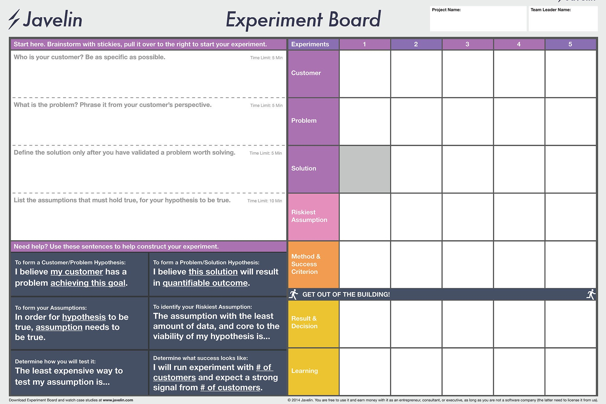
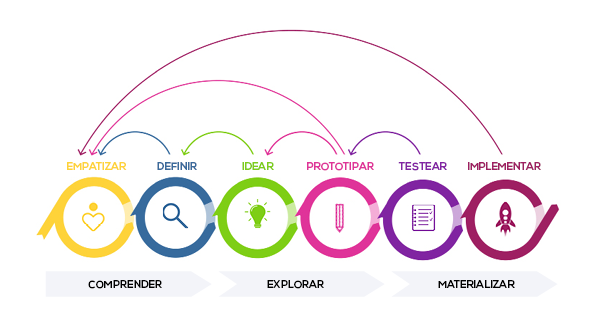
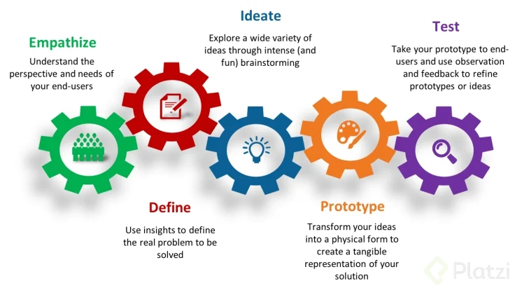

# Emprender es para ti ❤️❤️❤️❤️
##### Mariana De Giobbi


[TED Ideas worth spreading](https://www.ted.com/talks/simon_sinek_how_great_leaders_inspire_action?language=es)

* Encuentra primero el "por qu&eacute;", luego el "c&oacute;mo" y finalmente el "qu&eacute;".

¿Cuál es tu propósito?
  
  *Es la pasión te dará las fuerzas necesarias, para recorrer el camino de Emprender.

¿Qué te apasiona?

  * Problemas = Oportunidades
  * Diferentes aristas

Las Oportunidades

Una oportunidad de negocio para un emprendedor puede no serlo para otro.
 
  ### Problemas Cercanos
  ### Problemas Lejanos

* Estar preparado 
* Prepárate

  ## Imagina tu día a día

  Crecimiento de la Empresa

1.- Encontrar un tema que tenga que ver contigo y luego ver problemas relacionados a eso.

2.- Anotar todos los problemas.

3.- Oportunidad de negocio: problemas relacionados con nosotros. Problemas que dominemos y entendamos bien. Hay que ser un experto en este tema. La otra opción es prepararse y estudiar sobre ese tema.

4.- Imaginar tu día a día con el emprendimiento en el futuro.

Sugerencia: no lo pienses tanto.

## El mercado

* Tendencia para Emprender

  * ¿Pagarías por tu producto o servicio? ¿Quíen lo haría?

    > "Haz algo que las personas quieran"


    #### Tendencia o Moda

    Tendencia: Largo plazo, hacía donde va el mundo.

    Moda: Corto Platzo, es dinámica y cambia.

  
  | **Ejemplos de Moda** |  **Ejemplos de Tendencia**
  |:---------------- |:---------------|
  |   Canchas de paddle |    **Medio Ambiente:** Auto eléctrico | 
  |   Cervecería Artesanal |  **Hábitos de consumo que van cambiando:** tables vs jugueterías. |
  |  Barberías |  **Avance de la Tecnología:** Internet y todo en la nube. |

  GameStop: Videojuegos físicos

  nvidia: Videojuegos online

  **¿Comó identificarlas?**

  * Razón de fondo que difícilmente se revierta.
  * Tendencias relacionadas con el rubro que cierran.
  * Acciones del rubro que suben o bajan.


    #### Empresas de Triple Impacto

  |  Económico 🎟️   | Ambiental 🌎   | Social 👪   |

  ## Lluvia de Ideas

  [reto1](doc/reto-1.pdf)

# Fases del emprendimiento

## Las ventajas comparativas de una idea de negocio

  1. Importantes necesidades de capital.
  2. Economías de escala.
  3. Diferencia de producto.
  4. Carácter legal.
      - Aprobación de algún organismo oficial
      - Requisitos especiales
  5. Activos Estratégicos
  
## Medir el interés de una Idea

  [Experiment Board](https://www.youtube.com/watch?v=F-5Iyj9A1MU)

  * Hipótesis
    ```md  
    Hipótesis = cliente + problemas + solucion 
    ```
    Ejemplo "Los niños quieren comer comida saludable"

    #### La supoción más arriesgada

    * La más crítica: Viabilidad del negocio.
    * La más incierta: Dispones de menos información.

    **Métodos de Experimentación**

    * Entrevistas  👥
    * Pre-ventas  💵 
    * Consejeria (Prueba del producto con el cliente) 🛡

    **Criterios de éxito**

    En porcentajes o fracciones.

    > Al menos 20 de 100 perosnas deben tener esta respuesta o comportamiento ante la prueba.🚀

    #### Tablero de Experimentación

    ## Definir el perfil del clinte y el mercado objetivo de un producto

    **¿Por qué difinir un clinete ideal?**

    * Reducir costos
    * Optimizar el tiempo
    * Definir la comunicación
    * Ofrecerle lo que necesita
    * Acceder a nichos

      > "El grupo que es más probable que compre el producto que tu empresa tiene para ogrecer"

      * **Cliente:** fidelidad / frecuencia
      * **Consumidor:** decisión de comparativas
      * **Comprador:** transacción
      * **Usuario:** le daré uso

      

### Encontrar elementos diferenciadores de tu producto en el mercado actual

  **Estrategias de diferenciación**

  * Producto
  * Servicio
  * RRHH 
  * Imagen 
  * Canal

**Servico**


 **¿Los clientes están dispuestos a pagar más por esa diferencia?**

## Requisitos para la diferenciación 

  Los requisitos para la diferenciación:

  1. Importante.
  2. Distinta.
  3. Inimitable.
  4. Asequible.
  5. Rentable.

## Definir el modelo de negocio

**¿Qué es un modelo de negocio?**

  * Consumidor
  * Oferta
  * Infraestructura
  * Viabilidad finaciera

  

  ### Canvas | Modelo de negocio

**Modelo de Canvas**


**Patrones de modelos de negocios**

* Diseño similar
* Fuente de inspiración 
* Pensar la dinámica 

_¿Cómo aportamos valor a los clientes y cómo estos pagarán por ese valor?_

## Determinar las estrategias y el proceso de captación de clientes

__¿Qué es la captación?__

Busqueda de clientes potenciales que tenemos que convertir en clientes finales.

__Promociones__

* Efectivas para nuevos clientes 
* Bajo fidelidad
> gratis 2*1 descuento del 70%

__Exclusividad y escasez__

+ Técnica de persuación 
* Psicología (Miedo a la pérdida)

  > Quedan solo dos unidades, oferta limitada a dos horas, otras dos personas están viendo la misma habitación.

__Recomendación y referidos__

  * Opiniones
  * Recomendaciónes
  * Casos de éxito
  > **Tip:** Asegúrate de que sean honestos y no parezcan artificiales. Ofrece incentivos para recomendados.


**Influencer y embajadores de marca**

* Persona relevantes de tu sector
* Difundir nuestra marca
* Puerta de entrada de nuevos clientes

__Distribuidores y agentes de ventajas__

* Misma cartera de clientes
* Reciben una comisión
* Colegas

## Definir las necesidades y estrategias de financiamiento

__Obtener financiamiento__

* Tener claro qué problema estás resolviendo
* Esta solucionandolo de una manera inteligente.

  Capital propósito

  Generalmente no alcanzan a finaciar proyectos de alto Impacto.
  No contamos con la expreriencia que un inversionista especializado podría volcar al proyecto.

  **Amigos, familiares y novatos**
   **Friends, family and Fools(3f)**

  * Entre el 50% y 75% de los emprendimientos a nivel mundial
  * No nos pedirán el modelo de negocio
  * Tomarán la confianza y la experiencia personalcomo evidencias del potencial del proyecto.

  **Créditos**

  * Posivilidad de disponer del dinero como desee.
  * Hay que devolver el dinero, con interés en un determinado plazo.
  * Estudiar el retorno para que sea mayor que el interés.

  __Fondos y concursos públicos__

  * Documentación detallada
  * Requisitos estrictos (modificaciones en el proyecto)
  * Algunos son rembolsables y otros nos
  * Presentar todas las facturas y rendir cuentas en varias instancias.

Incubadoras, aceleradoras y concursos privados

* pitch
* Alto riesgo y alto retorno
* Foco: Cómo lo lograremos 
* Ventajas: mentoria
* Tienen objetivos propios.

* [Tu startup merece un buen pitch, aprende cómo hacerlo](https://platzi.com/blog/aprende-a-hacer-tu-pitch/)

## Fases del emprendimiento

**Fases del emprendimiento**

1. Al menos 2 barreras de entrada, fáciles de mantener para ti: **Que sean superables para nosotros y difíciles para los cometidores.**

2. Medir interés mediante hipótesis. **Tablero Javelin**

3. Para quien es más óptima la solución. **Quién lo necesita.**

4. Aprende a diferenciarte. **Producto, Servicio, Personal, Imagen o canales.**

5. Como haces para otorgar el valor, define el modelo, es el esqueleto del negocio. **Canvas**

6. Varía entre las formas de captar clientes. **_Estrategia_**

7. El financiamiento puede venir con asesoría o no, busca experiencia ajena. **Fuentes**

**Tablero Javelin**



# 3. Encontrar ideas de negocio rentables

## Patrones de modelo de negocio

**Modelos de negocio:**

1.- Long Tail (Cola Larga). - Contar con varios productos.

2.- Cebo con anzuelo. - Vender o regalar un producto que requiera de productos complementarios.

3.- Franquicia. - Explotar un negocio ya probado y establecido.

4.- Suscripción. - Pagar una cuota fija cada cierto tiempo a cambio de un producto o servicio.

[Qué es un Modelos de Negocios ](https://www.youtube.com/watch?v=p_ABY9DrmLI)

## Patrones de modelo de negocio que parecen gratis

Patrones de modelo que parecen gratis (clave es tener en cuenta el costo de adquisición de cada cliente)

**Freemiun:** hay una versión gratis y una versión paga con mucha diferencia entre la propuesta del servicio.

**Marketin y afiliados:** comisiones a quienes generen clientes. Una persona que ya tiene una audiencia, se le paga por venta.
Modelo de publicidad usuarios gratis a cambio de ver publicidad de empresas

**Plataformas multilaterales:** juntas dos grupos de personas que uno quiere lo que tiene el otro.

## Resumen y desafío: Uber

- [Canvanizer](https://canvanizer.com/choose-canvas)

[reto-3](doc/reto-3.pdf)

# 4. Innovación para Emprender

## ¿Qué es innovar? Desmintiendo mitos

**Mitos:**

1. Innovación es creatividad: se puede innovar y no ser creativo Nuevo + Implementado=Impacto en el mercado
2. Genio solitario: Trabajo de equipo
3. Esperar la inspiración: Hay técnicas específicas para fomentar la innovación
4. Solo sirven las ideas más extrañas: Ideas pequeñas y simples pueden producir un gran impacto
5. “La idea” es lo más importante de mi negocio: La ejecución es la pieza más importante de tu negocio.

## Tipos de innovación

En principio hay 3 tipos de innovación:

**Marginal:** Hacer mejor lo mismo que ya estábamos haciendo. Pequeñas mejoras en el proceso, productos, etc.

**Sustancial:** Introducir cambios qué son nuevos para la empresa.

**Disruptivos:** Introducir cambios qué son nuevos para él mundo (o al menos para el mercado en el que se encuentra la empresa).

## Cómo innovar en equipo

**Formar un equipo heterogéneo**

- Que tenga distintos puntos de vista
- Distintas edades
- Que tengan distintas culturas
- Sinergia
- Diversidad

**Buena Relación**

- Confianza
- Finidad
- Cordialidad y respeto

**Sin jerarquías ni roles**

- Todos pueden aportar
- No importa quién sabe más de un tema

**Espacio de trabajo**

- Cambiar el ambiente
- Cambiar los días y horarios

El equipo unido por Misión y Pasión

## La personalidad innovadora

**Técnicas de innovación**

- Mantenerse presente
- Amigarse con el fracaso
- Conocer el status quo antes de romperlo
- Cuestionar todo

**Nutrirse de nueva información**

- Combinar y asociar
- Poner en práctica y experimentar

> "Los emprendedores deben ser personas inquietas y resilientes que se mantengan en una búsqueda continua de aprendizaje y respuestas. La actitud lograra que la innovación sea una practica diaria"

## El proceso de innovación



**“Design Thinking”**

**Empatizar:** investigar el problema, la competencia, cliente, el contexto , con esto generar oportunidades de mejora.

**Definir:** definir el desafio, crear equipo e identificar el problema a solucionar.

**Idear:** lluvia de ideas para ver como se va a solucionar el problema, selecionamos solo 1.

**Prototipar:** buscamos hacer un mvp para implementar la idea (debe tener la soulción del prblema base) no puede tener menos.

**Evaluar:** exponer el prototipo al cliente objetivo, tomar feedback y adaptar la solución e iterar. Puedes volver al inicio , es parte del proceso



## Reto: define tu modelo de negocio

[reto-4](doc/reto-4_.pdf)

# 5. El Producto
Planificación del producto o servicio
¿Qué entendemos por atributos esenciales de un producto?
Ciclo de vida del producto
Reto: diseño de tu producto
# 6. Definición de la estrategia de marketing y análisis FODA
Diseñar una estrategia de marketing
Matriz FODA
La marca: imagen e identidad
Identidad gráfica
Plan de comunicación
Las Relaciones Públicas
Los modelos de fijación de precios
Estrategias de distribución
Reto: plan de comunicación
# 7. Conclusiones
Conclusiones
