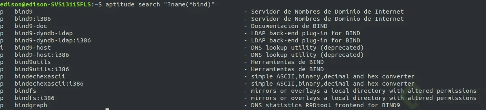
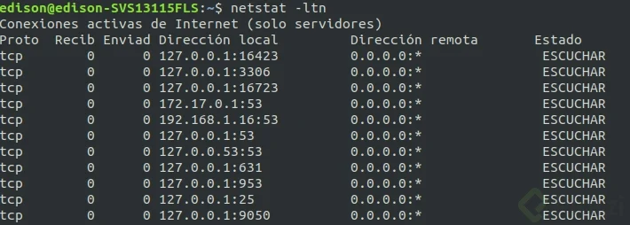
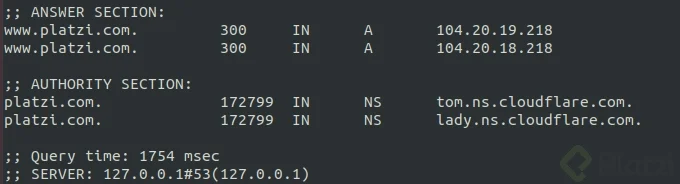
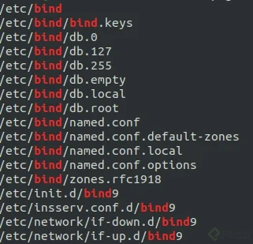
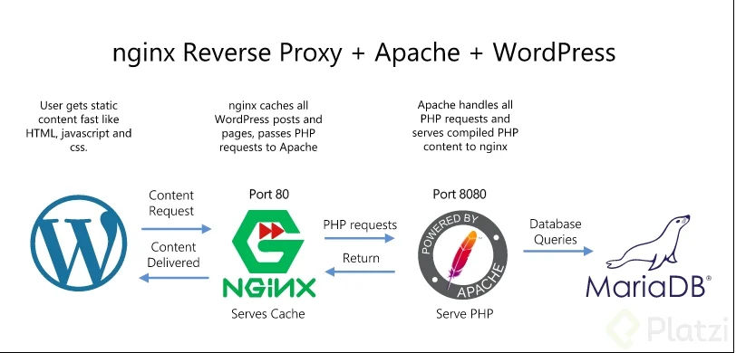
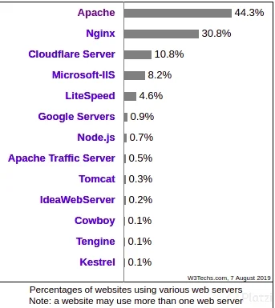
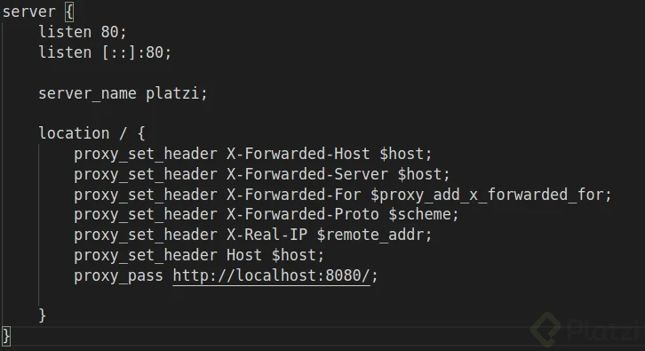
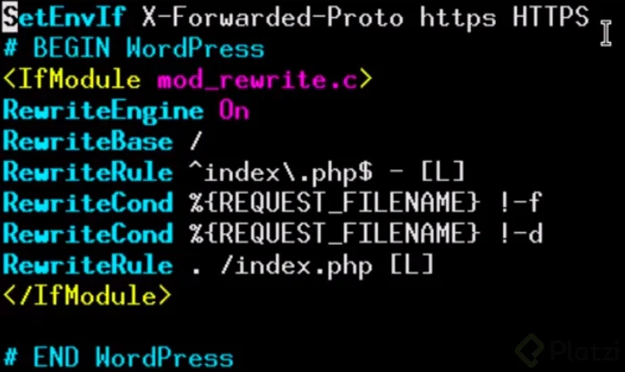

# Administracion de Servidores Linux
##### Jhon Edison Castro Sánchez

# Tabla de Contenido
- [1. Bases del sistema operativo](#1.-Bases-del-sistema-operativo)
  - [Introducción](#Introducción)
  - [Distribuciones más utilizadas de Linux](#Distribuciones-más-utilizadas-de-Linux)
  - [Instalación de Ubuntu Server](#Instalación-de-Ubuntu-Server)
  - [Instrucciones para instalar CentOS](#Instrucciones-para-instalar-CentOS)
  - [Gestión del árbol de directorios](#Gestión-del-árbol-de-directorios)
  - [Diferencias entre LESS, CAT, HEAD y TAIL para lectura de archivos](#Diferencias-entre-LESS,-CAT,-HEAD-y-TAIL-para-lectura-de-archivos)
  - [Interacción con archivos y permisos](#Interacción-con-archivos-y-permisos)
  - [Conociendo las terminales en linux](#Conociendo-las-terminales-en-linux)
  - [Manejo y monitoreo de procesos y recursos del sistema](#Manejo-y-monitoreo-de-procesos-y-recursos-del-sistema)
  - [Monitoreo de recursos del sistema](#Monitoreo-de-recursos-del-sistema)
- [2. Instalación y manejo de software en Linux](#2.-Instalación-y-manejo-de-software-en-Linux)
  - [Análisis de los parámetros de red](#Análisis-de-los-parámetros-de-red)
  - [Administración de paquetes acorde a la distribución](#Administración-de-paquetes-acorde-a-la-distribución)
  - [Manejo de paquetes en sistemas basados en Debian](#Manejo-de-paquetes-en-sistemas-basados-en-Debian)
  - [Administración de software con YUM y RPM para CentOS](#Administración-de-software-con-YUM-y-RPM-para-CentOS)
  - [Nagios: Desempaquetado, descompresión, compilación e instalación de paquetes](#Nagios-Desempaquetado-descompresión-compilación-e-instalación-de-paquetes)
- [3. Administración de usuarios](#3.-Administración-de-usuarios)
  - [Los usuarios, una tarea vital en el proceso de administración del sistema operativo](#Los-usuarios,-una-tarea-vital-en-el-proceso-de-administración-del-sistema-operativo)
  - [Creando y manejando cuentas de usuario en el sistema operativo](#Creando-y-manejando-cuentas-de-usuario-en-el-sistema-operativo)
  - [Entendiendo la membresía de los grupos](#Entendiendo-la-membresía-de-los-grupos)
  - [Usando PAM para el control de acceso de usuarios](#Usando-PAM-para-el-control-de-acceso-de-usuarios)
- [4. Servicios en el sistema operativo](#4.-Servicios-en-el-sistema-operativo)
  - [Autenticación de clientes y servidores sobre SSH](#Autenticación-de-clientes-y-servidores-sobre-SSH)
  - [Configurando DNS con bind](#Configurando-DNS-con-bind)
  - [Arranque, detención y recarga de servicios](#Arranque,-detención-y-recarga-de-servicios)
  - [NGINX y Apache en Ubuntu server](#NGINX-y-Apache-en-Ubuntu-server)
  - [Instalación y configuración de NGINX](#Instalación-y-configuración-de-NGINX)
  - [¿Qué es NGINX Amplify?](#¿Qué-es-NGINX-Amplify?)
  - [NGINX Amplify: Instalación y configuración de un servidor para producción](#NGINX-Amplify-Instalación-y-configuración-de-un-servidor-para-producción)
  - [Monitoreo de MySQL con Nagios](#Monitoreo-de-MySQL-con-Nagios)
  - [Configuración de Nagios](#Configuración-de-Nagios)
  - [Los logs, nuestros mejores amigos](#Los-logs,-nuestros-mejores-amigos)
  - [Otros servicios de logs](#Otros-servicios-de-logs)
- [5. Bash scripting](#5.-Bash-scripting)
  - [Las bases de bash](#Las-bases-de-bash)
  - [Las variables y su entorno de ejecución](#Las-variables-y-su-entorno-de-ejecución)
  - [Automatizando tareas desde la terminal](#Automatizando-tareas-desde-la-terminal)
  - [Automatizando la copia de seguridad](#Automatizando-la-copia-de-seguridad)
  - [Crontab](#Crontab)
- [6. Asegurando tu servidor](#6.-Asegurando-tu-servidor)
  - [Entendiendo la gestión de vulnerabilidades](#Entendiendo-la-gestión-de-vulnerabilidades)
  - [¿Qué es una superficie de ataque? Principio del menor privilegio](#¿Qué-es-una-superficie-de-ataque?-Principio-del-menor-privilegio)
  - [El firewall y sus reglas](#El-firewall-y-sus-reglas)
  - [Escaneo de puertos con NMAP y NIKTO desde Kali Linux](#Escaneo-de-puertos-con-NMAP-y-NIKTO-desde-Kali-Linux)
  - [Lynis: Herramientas de auditoria de seguridad en Linux](#Lynis-Herramientas-de-auditoria-de-seguridad-en-Linux)
- [7. Proyecto](#7.-Proyecto)
  - [Configuración de Node.js en un ambiente productivo](#Configuración-de-Node.js-en-un-ambiente-productivo)
  - [Configuración de NGINX para la aplicación de Node.js](#Configuración-de-NGINX-para-la-aplicación-de-Node.js)
- [8. Conclusiones](#8.-Conclusiones)
  - [Conclusiones](#Conclusiones)


# 1. Bases del sistema operativo

  ## Distribuciones más utilizadas de Linux

Vamos a usar dos distribuciones de **Linux: Ubuntu Server** en su **versión 18.04** y **CentOS Server versión 7**.

Recuerda que puedes usar cualquier versión para hacer pruebas y estudiar, pero al trabajar con servidores debemos instalar las versiones LTS, ya que incluyen soporte de largo plazo (actualizaciones de software por al menos 5 años).

Recuerda que puedes probar estas distribuciones con una máquina virtual o el proveedor de nube que prefieras **(Google, Amazon, Digital Ocean, entre otros).**

  ## Instalación de Ubuntu Server

  Descargar [Virtual Box]( https://www.virtualbox.org/)

  Descargar [Ubuntu Server](https://ubuntu.com/download/server)

  * Crear una nueva máquina virtual

  * En la configuración de nuestra máquina, en la sección Red cambiar de NAT a Adaptador puente. En avanzadas, colocar en el Modo promiscuo “Permitir todo”.

  * En la sección Storage seleccionamos el cd que dice “Vacío”, y en el apartado de atributos a la derecha seleccionamos el icono del cd para buscar nuestra imagen ISO de Ubuntu ya descargada anteriormente. Aceptamos los cambios.

  * Iniciamos la máquina virtual

  * Si estamos trabajando en un servidor físico, deberíamos seleccionar “Comprobar memoria”

  * Instalamos el sistema operativo

  * Virtualbox, muestra errores al instalar ubuntu-server. Lo que comendable es instalar Qemu.

  [](https://geeksencuarentena.com/linux/como-instalar-kvm-en-ubuntu-20-04/)


  ## Instalación de CentOS

  Descargar [Virtual Box](https://www.virtualbox.org/)

  Descargar [CentOS](http://isoredirect.centos.org/centos/7/isos/x86_64/CentOS-7-x86_64-DVD-1908.iso)

  [CentOS Mirror](https://centos.org/)

  **Crear una nueva máquina virtual**

  * En la configuración de nuestra máquina, en la sección Red cambiar de NAT a Adaptador puente. En avanzadas, colocar en el Modo promiscuo “Permitir todo”.

  * En la sección Storage seleccionamos el cd que dice “Vacío”, y en el apartado de atributos a la derecha seleccionamos el icono del cd para buscar nuestra imagen ISO de CentOS ya descargada anteriormente. Aceptamos los cambios.

  * Iniciamos la máquina virtual

  * Instalamos el sistema operativo

  * En la configuración, en el apartado de NETWORK & HOST NAME, activar la interfaz con el botón “on”. Cambiamos el host name a “platzi-server” y damos click en aplicar

  * En el apartado de INSTALLATION DESTINATION seleccionamos el disco de Virtual Box

  * Configuramos la hora y damos click en done

  * Hacemos click en ROOT PASSWORD y creamos una contraseña para el usuario root

  * Creamos un usuario nuevo dando click en USER CREATION y finalizamos la instalación


  ## Gestión del árbol de directorios

- **pwd:** nos muestra nuestra ubicación actual en el árbol de directorios `(Print Working Directory).`
**ls:** nos muestra el contenido de las carpetas de nuestro sistema operativo. Podemos especificar alguna ruta o, por defecto, listar el contenido de la carpeta donde estamos trabajando.
- **cd:** cambiar nuestra ubicación en el árbol de directorios `(Change Directory).` Usamos dos puntos `(..)` para referirnos al directorio padre y solo uno `(.)` para referirnos a nuestro directorio actual.
- **touch:** nos ayuda a crear archivos desde la terminal.
- **mkdir:** nos ayuda a crear carpetas desde la terminal.
- **cp:** nos permite duplicar archivos y carpetas.
- **mv:** cambiar el nombre de nuestros archivos y carpetas.

Recuerda que la terminal de Linux es sensible a la diferencia entre mayúsculas o minúsculas.
  
  ## Diferencias entre LESS, CAT, HEAD y TAIL para lectura de archivos

- **cat:** nos permite leer archivos en su totalidad.
- **less:** nos ayuda a leer el contenido de nuestros archivos por páginas. Nos movemos con las flechas del teclado o la tecla de espacio. Salimos de la lectura del archivo con la letra q. Buscamos palabras específicas escribiendo /palabra.
- **tail:** nos muestra las últimas 10 líneas de nuestros archivos.
- **head:** nos muestra las primeras 10 líneas de nuestros archivos.

  ## Interacción con archivos y permisos

Interacción con archivos y permisos

Con el comando **ls -l** podemos observar la lista de archivos de nuestro directorio actual con información un poco más detallada. El primer campo nos indica los diferentes permisos para cada archivo o directorio. Por ejemplo: **-rwxrw-r--**.

El primer carácter nos indica si tenemos un archivo `(-)`, enlace simbólico `(l)` o directorio `(d)`.

Los siguientes caracteres se dividen en grupos de 3: lectura `(r)`, escritura `(w)` y ejecución `(x)`. El primer grupo son los permisos del usuario que creó ese archivo, el segundo para el grupo al que pertenece este usuario y el tercero para cualquier otro usuario de tu sistema operativo.

Los grupos nos ayudan a darle los mismos permisos a diferentes usuarios sin necesidad de asignarlos a cada uno individualmente. Todos los usuarios que pertenezcan al grupo tendrán los mismos permisos.

Si en vez de estas letras encuentras un guion significa que ese usuario o grupo de usuarios no tiene permiso para esa acción en particular.

Por ejemplo: **-rwxrw-r--** _nos indica que trabajamos con un archivo. Todos los usuarios del sistema tienen permisos de lectura. El usuario creador y su grupo tienen permiso de escritura. Y solo el usuario creador puede ejecutar el archivo_.

También podemos encontrar estos permisos como 3 números del 1 al 7. Estos números son la suma de los 3 caracteres de permisos para cada usuario o grupo.


  * \- = 0
  *  x = 1
  *  w = 2
  *  r = 4

Por lo tanto, los permisos de nuestro archivo de ejemplo serían:`7 (1+2+4) 6 (0+2+4) 4 (0+0+4)`.

Para cambiar los permisos de un archivo o directorio podemos usar el comando `chmod + a` quién queremos añadir o quitar los permisos:

  *  El usuario propietario: `u`.
  *  El grupo, `g`.
  *  El resto de usuarios, `o`.
  *  Para todos, `a`.

Por ejemplo, para añadir permisos de ejecución a nuestro usuario propietario usamos:

  * `chmod u+x nombre-del-archivo`

También podemos cambiar al usuario propietario del archivo con el comando `chown`.

  * `sudo chown nuevo-usuario:grupo-usuarios nombre-del-archivo`

  ## Conociendo las terminales en linux 

  Las distribuciones de Linux para servidores no incluyen interfaz gráfica, ya que consumen muchos recursos. Esto significa que siempre vamos a trabajar desde la terminal.

Tendremos disponibles 6 terminales virtuales a las que podemos entrar o salir con las teclas `Ctrl + Alt + Fx`. También podemos usar el comando `chvt`. La séptima terminal es la interfaz gráfica, así que en este caso no disponemos de ella.

Cada usuario activo en nuestro sistema operativo crea una nueva conexión. Podemos ver todas estas conexiones con los comandos who y w (este último nos da un poco más de información).

Para ver todos los procesos que corren en el sistema podemos usar el comando `ps`. Para filtrar los procesos y ver únicamente las conexiones de los usuarios usamos `ps -ft tty`.

Este comando nos muestra el identificador de cada proceso. Para terminarlo podemos usar el comando `kill -9 PID`

* [chmod](https://es.wikipedia.org/wiki/Chmod)

## Manejo y monitoreo de procesos y recursos del sistema

Para ver todos los procesos que corren en el sistema podemos usar el comando `ps`. Recuerda que puedes ver la documentación de este comando con el comando `man ps`.

El comando grep nos ayuda a filtrar el resultado de un comando o archivo dependiendo de las palabras de cada línea. Para esto también vamos a usar el pipe `(|)`, un símbolo que nos ayuda a enviar el resultado de un comando a un segundo comando.

Por ejemplo, el comando `ps aux | grep platzi` imprime los procesos activos del sistema y, con ayuda del pipe, envía la lista al comando grep para filtrar el resultado, mostrando únicamente las líneas con la palabra platzi.

* Ejecutar script en sengundo plano:

  * `script &`
  * `nohup script &`

|
`ps`: Muestra los procesos corriendo. Modificadores:

`aux`: Muestra todos los procesos

- `jobs`: Al igual que el comando anterior, muestra los procesos. A diferencia de ps, es un comando interno de la terminal
- `fg`: Abre un proceso que estaba pausado
nohup: Genera un archivo llamado “nohup.out” que muestra toda la información que produjo un proceso
- `grep`: Nos ayuda a filtrar el resultado de un comando o el contenido de un archivo dependiendo de las palabras (o incluso expresión regular) que le indiquemos

**Símbolos especiales**

`| # Pipe`: Envia el standard output de un comando al standard input de otro.
`&` Ampersand: Envia un proceso al background
`./`: Ruta de archivo a ejecutar

- `Pipe`: Nos permite concatenar comandos
- `ls -l | wc -l`: cuantas lineas tiene este
- `cat [peliculas.csv] | wc -l`: nos indica cuantas lineas tiene este archivo.
- `cat [peliculas.csv] | wc -l | grep [Thriller] wc - -l` : nos indica cuantas lineas tiene del parametro que estamos buscando.
- `cat movies.dat | grep Thriller | awk -F"::" '{printf("%s\n", $3)}’:` nos imprime las categorias que contenga Thriller
- `cat movies.dat | grep Thriller | awk -F"::" ‘{printf("%s\n", $3)}’ | grep -v Comedy : grep -v` evitamos que no nos imprima el parametro que le mandamos.

  ## Monitoreo de recursos del sistema

El comando top nos permite interactuar con una interfaz gráfica que nos muestra información específica del sistema operativo: cantidad de usuarios, tareas corriendo o “durmiendo”, identificadores de los procesos, entre otras.

Para ver la información de la CPU podemos usar el comando `cat /proc/cpuinfo | grep "processor"`. Recuerda que Linux hace diferencia entra mayúsculas y minúsculas, pero puedes usar el comando grep `-i` para filtrar sin estas diferencias.

Para ver la información de la memoria podemos usar el comando free o, para que la información sea más fácil de leer, `free -h`. Y para ver el uso del disco duro está el comando `du o du -hsc`.

**Comandos**

`top`: Muestra la siguiente información del sistema:

```console
  load average (carga promedio): Provee una representación en números del 1 al número de procesadores que tenga nuestro servidor del uso de los mismos.
  Uso de la memoria
  Cantidad de usuarios
  Uso del CPU
  Procesos
  Etc
```

- `free`: Me muestra información sobre la memoria de mi sistema. Con el modificador -h la información es más legible para un humano
- `du`: Muestra información sobre el disco duro. Con el modificador -hsc y un directorio especificado muestra el tamaño de ese directorio
- `htop`: Funciona como top pero funciona de forma más intuitiva

**Comandos útiles**

```console
cat /proc/cpuinfo | grep "processor" # : Muestra información sobre el CPU
sudo ps auxf | sort -nr -k 3 | head -5 # : Muestra los 5 procesos que más uso hacen del CPU
sudo ps auxf | sort -nr -k 4 | head -5 # : Muestra los 5 procesos que más uso hacen de la memoria RAM
```

# 2. Instalación y manejo de software en Linux

## Análisis de los parámetros de red

Una **IP** es un **identificador único** para los equipos que están conectados a una red.

Las **IPs Privadas** se utilizan para identificar los dispositivos dentro de una red local. Por ejemplo: los dispositivos conectados en tu casa u oficina.

Las **IPs Públicas** son la que se asignan a cualquier dispositivo conectado a Internet. Por ejemplo: los servidores que alojan tus sitios web, el router que te da acceso a internet, entre otros.

Si tu dispositivo tiene una IP pública significa que puede conectarse a otro que también tenga una. Por esto mismo, no puede haber dos dispositivos con la misma IP pública.

Para **encontrar la dirección IP de nuestros dispositivos** podemos usar los comandos ifconfig en Linux y Mac o ipconfig en Windows. También podemos usar el comando ip a.

Para ver el **nombre/identificador** de nuestro equipo en todas las redes podemos usar el comando hostname. También podemos ver qué dispositivo nos permite acceso a Internet con el comando `route -n`.

Para identificar las IPs de diferentes dominios podemos usar el comando` nslookup nombredominio.ext.` También podemos usar el comando `curl` para realizar consultas a algún servidor.

**2.1 Análisis de los parámetros de red**

En la administración de servidores siempre existen IPs privadas e IPs públicas.

**La ip pública:**
Permite una conexión remota desde cualquier lugar al servidor, mediante el protocolo SSH.

**ifconfig ==> Interface Configuration**
Se enlistan las tarjetas que tenemos y su direccionamiento especifico.

**ip a ==> ip address** show
También muestra la información de la red.
Algunos modificadores para este comando son -4 para listar solo las ipv4 ó -6 para listar las ipv6.

`hostname`
Para visualizar el nombre del equipo, este hostname es como se identifica el equipo en las redes.

`route -n`
Para visualizar la puerta de enlace predeterminada del equipo. Muestra la IP routing table.

`nslookup nombredominio`
Para visualizar la ip de cualquier dominio especifico.

`curl`
Puede realizar simulaciones como las que hace Postman.

`wget nombredominio`
Para obtener información desde internet.

[Herramientas de desarrollo Backend: JSON Viewer y Postman](https://platzi.com/clases/1650-prework/21963-herramientas-de-desarrollo-backend-json-viewer-y-p/)

## Administración de paquetes acorde a la distribución

Cada distribución de Linux maneja su software de maneras diferentes.
Red Hat / CentOS / Fedora

Su gestor de paquetes es `.rpm `(Red hat Package Manager). La base de datos de este gestor está localizada en `/var/lib/rpm`.

El comando `rpm -qa` nos permite listar todos los rpms instalados en la máquina. Con `rpm -i nombre-del-paquete.rpm` instalamos los paquetes y con `rpm -e nombre-del-paquete.rpm` los removemos el sistema.

Los paquetes se pueden instalar desde un repositorio sin tener que conocer la ruta del archivo o las dependencias con el comando yum install nombre-del-paquete.

También podemos buscar paquetes más específicos con el comando `yum search posible-nombre-del-paquete` 

**Debian / Ubuntu**

Su administración de paquetes es .deb. Podemos realizar las instalaciones con `dpkg -i nombre-del-paquete.deb` o repositorios `apt`.

Su base de datos está localizada en `/var/lib/dpkg`. Con el comando `dpkg -l` listamos todos los debs instalados en la máquina. Instalamos los paquetes con `dpkg -i nombre-del-paquete` y los removemos del sistema con `dpkg -r nombre-del-paquete`.

Si ya tenemos software configurado podemos usar el comando `dpkg-reconfigure nombre-paquete` para volver a ejecutar el asistente de configuración (si está disponible).

También podemos realizar las instalaciones con el comando a`pt install nombre-paquete` y búsquedas de paquetes con `apt search posible-nombre-paquete`.

**Red Hat / CentOS / Fedora**

`.rpm` Red Hat Package Manager.
  - Base de datos RPM, localizada en `var/lib/rpm
    rpm -qa` Listar todos los rpms instalados en la máquina. (query all)
  -  `rpm -i` paquete.rpm Realizar la instalación de un paquete. (install)
  -  `rpm -e paquete.rpm` Remover un paquete del sistema. (erase)

**Repositorios** 

yum Permite instalar un paquete desde un repositorio sin tener que conocer la ruta del archivo o las dependencias.
    `yum install paquete`

**Debian / Ubuntu**
.deb Debian package management.

  -  Base de datos DPKG, localizada en `/var/lib/dpkg`
  -  `dpkg -l` Listar todos los debs instalados en la máquina.
  -  `dpkg -i paquete.deb` Realizar la instalación de un paquete.
  -  `dpkg -r paquete.deb` Remover un paquete del sistema.
- `dpkg-reconfigure`
  -  `dpkg-reconfigure` paquete Volver a ejecutar el asistente de configuración si está disponible.
- Repositorios `apt` otra forma de instalar.
   ` apt install paquete`


## Manejo de paquetes en sistemas basados en Debian

Antes de actualizar el software de nuestro sistema debemos ejecutar el comando` sudo apt update` para saber qué paquetes pueden actualizarse y desde dónde se realizará la descarga. Luego de esto podremos actualizar todas las herramientas del sistema usando el comando `sudo apt upgrade`.

Recuerda que todo lo que tenga que ver con actualizaciones o modificaciones del sistema operativo necesitará permisos con sudo. También necesitarás conexión a Internet.

**Manejo de paquetes en sistemas basados en Debian**

*Comandos útiles*

- `sudo apt update`: Actualiza la información local sobre los repositorios de Ubuntu
- `sudo apt upgrade`: Actualiza todos los programas que tenemos instalados en la máquina
- `sudo snap install paquete`: Instala un paquete con el nuevo gestor de paquetes de Canonical, snap
- `date`: Imprime la fecha actual

[Canonical Livepatch Service](https://ubuntu.com/security/livepatch)

[Snapcraft | Getting started](https://snapcraft.io/docs/getting-started#5)

  ## Administración de software con YUM y RPM para CentOS

- `rpm -qa`: ver todos los paquetes instalados
- `rpm -qi bash`: Consultar información del paquete bash
- `rpm -qc bash`: Ver configuración de bash
- `sudo yum update`: (desde usuario root) actualizar repositorios.
- `yum-install net-tools`: Este paquete incluye las herramientas importantes para controlar el subsistema de red del núcleo Linux. Esto incluye arp, ifconfig, netstat, rarp, nameif y route. Además, este paquete contiene utilidades relativas a tipos particulares de «hardware» de red `(plipconfig, slattach, mii-tool)` y aspectos avanzados de configuración IP (iptunnel, ipmaddr).
Recordar que se debe tener cuidado con el tipo de enlaces que se agregan a los repositorios.

- `rpm -qi paquete`: Muestra la información de un paquete
- `rpm -qc paquete`: Muestra los archivos asociados a un paquete

**Datos interesantes**

Instalar el paquete `net-tools` para tener disponible el comando `ifconfig`

`rpm -qa`
Enlista los paquetes instalados en el SO.

`rpm -qi nombre_paquete`
Mostrar la información sobre un paquete especifico.

**Con Bash podemos hacer scripting en SO Linux**

`rpm -qc nombre_paquete`
Muestra todos los archivos involucrados sobre el paquete.

También podemos usar `yum`. Pero lo primero es dar `yum update`. Pero para poder ejecutarlo necesitamos un usuario con todos los permisos, por ejemplo el usuario root.

Si se muestra un # al final del nombre del usuario, eso indica que estamos trabajando con un usuario root. Por ejemplo:
`[root@server ~]#`

Lo ideal es nunca trabajar con un usuario root. Lo ideal es crear usuarios que tengan ciertos permisos específicos, por medidas de seguridad y evitar errores.

`yum install net-tools`
Para habilitar el ifconfig.

`rpm -e nombre_paquete`
Para eliminar un paquete del SO.

- [EPEL](https://fedoraproject.org/wiki/EPEL)

  ## Nagios: Desempaquetado, descompresión, compilación e instalación de paquetes

No todo el software que necesitamos se encuentra en los repositorios. Debido a esto, algunas veces debemos descargar el software, realizar un proceso de descompresión y desempaquetado para finalmente instalar la herramienta.

Instalación de algunas herramientas para manejar una base de datos MySQL (recuerda que instalaremos y trabaremos con MySQL en una próxima clase):

```console
sudo apt install build-essential libgd-dev openssl libssl-dev unzip apache2 php gcc libdbi-perl libdbd-mysql-perl
```

Instalación de Nagios:

`wget https://assets.nagios.com/downloads/nagioscore/releases/nagios-4.4.4.tar.gz -O nagioscore.tar.gz`

**Descomprimir y desempaquetar archivos con tar:**

`tar xvzf nagioscore.tar.gz`

Este comando creará una carpeta nagios-4.4.4. El nombre de la carpeta puede variar dependiendo de la versión que descargaste. Entrando a esta carpeta podemos ejecutar diferentes archivos y comandos para configurar el software y realizar la instalación.

```console
# 1:
sudo ./configure --with-https-conf=/etc/apache2/sites-enabled
# 2:
sudo make all
# 3:
sudo make install
# 4:
sudo make install-init
# 5:
sudo make install-commandmode
# 6:
sudo make install-config
#7:
sudo make install-webconf
```

Error en el paso al ejecutar `sudo make install`, primero tienen que hacer lo siguiente:

```console
sudo make install-groups-users
sudo usermod -a -G nagios www-data
```

Por último, para administrar el servicio de nagios podemos usar el comando `sudo systemctl (status, start, restart, reload, stop, enable, disable, list-dependencies) nagios`.

- [Nagios](https://www.nagios.org)
- [assets-nagios](https://assets.nagios.com/downloads/nagioscore/releases/nagios-4.4.4.tar.gz)
- [Nagios-plugins](https://nagios-plugins.org/download/nagios-plugins-2.2.1.tar.gz)

**Instalar plugins-nagios**

```console
wget https://nagios-plugins.org/download/nagios-plugins-2.2.1.tar.gz -O nagios-plugins.tar.gz
tar xzvf nagios-plugins.tar.gz
cd nagios-plugins-2.2.1
sudo ./configure
sudo make all
sudo make install
```

- [plugings-nagios](https://support.nagios.com/kb/article.php?id=569#Ubuntu)

La instalacion a continuacion es opcional, eliges la primera o la segunda ambos instalan los paquetes.

```console
sudo apt update

sudo apt-get install -y autoconf gcc libc6 libmcrypt-dev make libssl-dev wget bc gawk dc build-essential snmp libnet-snmp-perl gettext -y

sudo apt-get install -y libpqxx3-dev

sudo apt-get install -y libdbi-dev

wget https://github.com/FreeRADIUS/freeradius-client/archive/release_1_1_7.tar.gz

 tar xvzf release_1_1_7.tar.gz

 ls

 ls -
 
--------------------------------
 cd freeradius-client-release_1_1_7/

 sudo ./configure

 sudo make

 sudo make install

 sudo apt-get install -y libldap2-dev

 sudo apt-get install -y libmysqlclient-dev

 sudo apt-get install -y dnsutils

 sudo apt-get install -y smbclient

 sudo apt-get install -y qstat -y

 sudo apt-get install -y fping

 sudo apt-get install -y qmail-tools

 cd ..

------------------------------------------

wget --no-check-certificate -O nagios-plugins.tar.gz https://github.com/nagios-plugins/nagios-plugins/archive/release-2.2.1.tar.gz

o

wget https://nagios-plugins.org/download/nagios-plugins-2.2.1.tar.gz -O nagios-plugins.tar.gz


tar zxf nagios-plugins.tar.gz

cd nagios-plugins-release-2.2.1/

ls

sudo ./tools/setup

sudo ./configure

sudo make

sudo make install

sudo systemctl restart apache2.service

sudo systemctl status apache2.service

sudo systemctl start nagios.service

sudo systemctl restart nagios.service

sudo systemctl start nagios.service

sudo systemctl status nagios.service

history 
```

# 3. Administración de usuarios

  ## Los usuarios, una tarea vital en el proceso de administración del sistema operativo

El comando `id` nos muestra el identificador único `(uid)` de cada usuario en nuestro sistema operativo. El ID 0 está reservado para el usuario root.

Con el comando `whoami` podemos ver con qué usuario estamos trabajando en este momento. Podemos ver todos los usuarios del sistema leyendo el archivo `/etc/passwd`.

Las contraseñas de los usuarios están almacenadas en el archivo `etc/shadow`, pero están cifradas. Y solo el usuario root tiene permisos de lectura/escritura.

Para cambiar la contraseña de nuestros usuarios usamos el comando `passwd`.

Comandos útiles

**cat /etc/passwd:** Muestra todos los usuarios del sistema operativo
**cat /etc/shadow:** Muestra las contraseñas del sistema operativo

  ## Creando y manejando cuentas de usuario en el sistema operativo

**Comandos para administrar cuentas de usuarios ⚑**

- **sudo useradd nombre-usuario:** crea un usuario sin asignarle inmediatamente alguna contraseña ni consultar más información. Debemos terminar de configurar esta cuenta a mano posteriormente.
- **sudo adduser nombre-usuario:** crea un nuevo usuario con contraseña y algo más de información. También creará una nueva carpeta en la `carpeta /home/`.
- **userdel nombre-usuario:** eliminar cuentas de usuarios.
- **usermod:** modificar la información de alguna cuenta.

Nunca modifiques a mano el archivo `/etc/passwd`. Para administrar los usuarios debemos usar los comandos que estudiamos en clase.

- Un truco al momento de utilizar el comando history es filtrar los resultados con `grep` obteniendo así información más precisa, en el ejemplo de la clase, se puede utilizar el comando:

`history | grep passwd`

  ## Entendiendo la membresía de los grupos

Los grupos nos ayudan a darle los mismos permisos a diferentes usuarios al mismo tiempo, sin necesidad de asignar el mismo permiso a cada usuario individualmente. Todos los usuarios que pertenezcan al mismo grupo tendrán los mismos permisos.

Para cambiar de usuario sin necesidad de reiniciar el sistema podemos usar el comando `su - nombre-usuario`. También podemos cambiar de usuario sin necesidad de saber su contraseña usando el comando `sudo su - nombre-usuario`.

Para ver a qué grupos pertenecen nuestros usuarios usamos el comando groups nombre-usuario. Para agregar usuarios a un nuevo grupo usamos el comando `sudo gpasswd -a nombre-usuario nombre-grupo`. Los eliminamos de la misma forma con `gpasswd -d`.

Para esto también podemos usar el comando `sudo usermod -aG nombre-grupo nombre-usuario`. Recuerda que en este caso el orden en que escribimos el grupo y el ususario se invierte.

Para listar los permisos de nuestros usuarios ejecutamos el comando `sudo -l`.

**Comandos**

- `su - usuario`: Switch User, cambia de usuario
- `groups usuario`: Muestra a que grupos pertenece cierto usuario
- `sudo gpasswd -a usuario grupo`: Agrega un usuario a un grupo
- `sudo gpasswd -d usuario grupo`: Quita a un usuario de un grupo
- `usermod -aG grupo usuario`: Agrega un usuario a un grupo
- `sudo -l`: Muestra que permisos tiene el usuario actual

  ## Usando PAM para el control de acceso de usuarios

PAM es un mecanismo para administrar a los usuarios de nuestro sistema operativo. Nos permite autenticar usuarios, controlar la cantidad de procesos que ejecutan cada uno, verificar la fortaleza de sus contraseñas, ver la hora a la que se conectan por SSH, entre otras.

Con el comando `pwscore` podemos probar qué tan fuertes son nuestras contraseñas. Recuerda que para usar este comando en sistemas basados en Ubuntu debemos instalar el paquete `libpwquality-tools`.

El comando ulimit nos ayuda a listar los permisos de nuestros usuarios. Para limitar el número de procesos que nuestros usuarios pueden realizar ejecutamos `ulimit -u max-numero-procesos`.

**Comandos**

- **pwscore:** Evalúa si una contraseña es buena o mala del 0 al 100
- **ulimit:** Muestra los permisos que tiene el usuario actual. Modificadores:

- **ulimit -u numero:** Cambia la cantidad de procesos que mi usuario puede ejecutar

**Comandos útiles**

- **sudo vi /etc/security/time.conf:** Modifica el archivo que indica en que horarios pueden conectarse ciertos usuarios

```console
ls /etc/pam.d
ls /lib64/security
ls /etc/security
pwscore
ulimit -a
ulimit -u 10  --numero de procesos
vi script.sh
chmod +x script.sh
./script.sh
vi /etc/security/time.conf
sudo vi /etc/security/time.conf
gpasswd -a dbz wheel  # centos wheel | Ubuntu sudo
groups dbz
```

# 4. Servicios en el sistema operativo

  ## Autenticación de clientes y servidores sobre SSH

**SSH** es un protocolo que nos ayuda a conectarnos a nuestros servidores desde nuestras máquinas para administrarlos de forma remota. No es muy recomendado usar otros protocolos como Telnet, ya que son inseguros y están deprecados.

Con el comando **ssh-keygen** podemos generar llaves públicas y privadas en nuestros sistemas, de esta forma podremos conectarnos a servidores remotos o, si es el caso, permitir que otras personas se conecten a nuestra máquina.

Para conectarnos desde nuestra máquina a un servidor remoto debemos:

1. Ejecutar el comando `ssh-copy-id -i` `ubicación-llave-pública nombre-usuario@dirección-IP-servidor-remoto` y escribir nuestra contraseña para enviar nuestra llave pública al servidor.

Conocer IP `ifconfig wlan0`

2. Usar el comando `ssh nombre-usuario@dirección-IP-servidor-remoto` para conectarnos al servidor sin necesidad de escribir contraseñas.
También podemos usar el comando `ssh -v ...` para ver la información o los errores de nuestra conexión con el servidor. Puedes usar la letra v hasta 4 veces **(-vvvv)** para leer más información.

Las configuraciones de SSH se encuentran en el archivo `/etc/ssh/sshd_config`.

**SSH:** Secure Shell, es un protocolo que permite conectar dos computadoras de forma remota sin necesidad de un password, únicamente con la interacción de una llave pública y una llave privada (aunque podemos colocar una contraseña sobre las llaves)

**Configuración**

1. En el servidor, abrir el archivo `/etc/ssh/sshd_config` con algún editor. Leer el archivo y configurar a gusto.
2. En la consola de la máquina cliente abrir `ssh-keygen` para generar las llaves
3. Elegir ubicación para guardar la llave privada
Ejecutar `ssh-copy-id -i directorio_de_llave/id_rsa`.`pub nombre_usuario@direccion_ip_del_servidor` para copiar la llave pública al servidor

**Ejecutar ssh**

`nombre_usuario@direccion_ip_del_servidor` en la máquina cliente para conectarnos exitosamente de forma remota

**Tips**

En lugar de descargar `Putty` en Windows podemos utilizar el emulador de consola Unix llamado `Cmder` para ejecutar los comandos vistos en clase. Incluso si esto falla, lo que personalmente recomiendo es instalar un subsistema de linux si tenemos Windows 10. Platzi tiene incluso un artículo sobre como hacer eso: https://platzi.com/clases/1378-python-practico/19200-importante-instalando-ubuntu-bash-en-windows-para-/
Si la conexión falla, podemos usar el modificador` -v (verbose)` en el comando `ssh` para poder ver la información que envían las máquinas que intentan conectarse. La “v” puede repetirse hasta cuatro veces, quedando el comando, por ejemplo, como: `ssh -vvvv nombre_usuario@direccion_ip_del_servidor`. A mas “v” pongamos, más información se mostrará

BONUS

**Reto:** Restringir el acceso al usuario root por ssh, y permitir solo un usuario determinado conectado

Solución:

Colocar en el archivo` /etc/ssh/sshd_config` del 

servidor las siguientes líneas:

```bash
PermitRootLogin no
AllowUsers nombre_usuario
```

Ejecutar el siguiente comando para reiniciar el 

**servicio de ssh:**

`sudo service sshd restart`

  ## Configurando DNS con bind

Antes de empezar a configurar el servicio de DNS, es importante conocer algo de historia, así como algunas alternativas que tenemos para comprar DNS.

**Contexto histórico de los DNS**

En Junio de 1983 alrededor de 70 sitios estuvieron conectados a la red de ciencias de la computación, permitiendo de esta forma la unión de algunos establecimientos gubernamentales, científicos y universitarios para que pudieran compartir datos, por esta razón los archivos de host no eran suficientes para hacer la replicación entre sitios, por este motivo en noviembre de 1983 se publicó el [RFC 882](https://www.techopedia.com/definition/27929/request-for-comments-rfc) que define el servicio de nombre de dominios. Paso siguiente en octubre de 1984 se crearon 7 TLDs (Dominios de nivel superior) o también conocidos como dominios de propósito general .arpa, .com, .org, .edu, .gov, .mil y la letra de los países respetando su código ISO.

**Instalación de Bind**

Para realizar el proceso de instalación de `bind` lo primero que realizaremos es verificar que `bind` se encuentre en los repositorios, para esto utilizaremos otro gestor de paquetes llamado `aptitude`, para instalarlo simplemente diremos `sudo apt install aptitude`.

Con aptitude instalado buscaremos el paquete `bind` utilizando para ellos una expresión regular.



El proceso de instalación se realiza con `sudo apt install -y bind9` , la opción `-y` es para confirmar que si queremos instalar el paquete en mención.

Validamos la instalación con `netstat` y verificaremos que el puerto 53 esté en escucha



Si deseamos ver el programa que está ejecutando este servicio agregamos el modificador `p` a `netstat`, así como sudo. `sudo netstat -ltnp`


Para realizar consultas al DNS podemos utilizar varias herramientas, entre ellas **dig**, que me permiten conocer más al respecto del nombre de dominio, para ello usaremos el dominio platzi.com y lo buscaremos en la máquina local, es decir 127.0.0.1

```shell
dig www.platzi.com @127.0.0.1
```

Allí encontraremos una salida, nos interesa la parte de respuesta y la de tiempo de ejecución para validar que la respuesta se dio desde localhost.



Paso siguiente después de instalarlo es verificar todo lo que viene incluido dentro del paquete como lo son los archivos de configuración manuales entre otros, para esto podemos hacer uso de `dpkg -L bind9`.



El archivo de configuración principal será `/etc/bind/named.conf`, también tenemos el archivo `/etc/bind/rndc.key` en este se puede configurar la clave que se puede usar para obtener acceso al nombre de dominio.

Podemos ver la versión de bind de dos formas named -v o una versión extendida con named -V

Si deseas adquirir tu DNS, tienes varias opciones:

1. [Namecheap](https://www.namecheap.com)
2. [Hover](https://www.hover.com)
3. [Route 53](https://aws.amazon.com/es/route53/)

Como cliente tienes varias opciones para configurar tus DNS, lo que influirá directamente en tu velocidad, seguridad o reputación. Para eso te daré algunas opciones, el orden no significa nada:

1. [OpenDns](https://www.opendns.com)
2. [Google DNS](https://developers.google.com/speed/public-dns/)
3. [Neustar UltraDNS](https://www.home.neustar/dns-services)
4. [Cloudflare](https://www.cloudflare.com/dns)
5. [quad](https://www.quad9.net)
6. [Public DNS](https://public-dns.info)
7. [Yandex DNS](https://dns.yandex.com)

Existe una herramienta que nos permite seleccionar cuál será el DNS que debemos utilizar basados en nuestra ubicación y nuestras búsquedas, se llama [namebench](https://code.google.com/archive/p/namebench/downloads). Para ello sólo basta instalarlo y ejecutarlo en la máquina cliente y con esto obtendremos sugerencias al respecto.

- [Domain Requirements](https://tools.ietf.org/html/rfc920)

  ## Arranque, detención y recarga de servicios

  El comando **systemctl** nos permite manejar los procesos de nuestro sistema operativo. Nuestros servicios pueden estar **activos** (es decir, encendidos) o **inactivos** (apagados). También podemos configurar si están **habilitados** o **deshabilitados** para correr automáticamente con el arranque del sistema.

- `sudo systemctl status nombre-servicio`: ver el estado de nuestros servicios.
- `sudo systemctl (enable, disable) nombre-servicio`: activar o desactivar el arranque automático de nuestros servicios.
- `sudo systemctl (start, stop, restart) nombre-servicio`: encender, apagar o reiniciar los servicios.
- `sudo systemctl list-units -t service --all`: ver todos los servicios del sistema.

El comando `journalctl` nos permite ver los logs de los procesos de nuestro sistema operativo. Recuerda que todos ellos están almacenados en la carpeta `/var/log/`.

- `sudo journalctl -fu nombre-servicio` (apache2): ver los logs de nuestros servicios y hacer un seguimiento.
- `sudo journalctl --disk-usage`: ver la cantidad de espacio que ocupan nuestros logs.
- `sudo journalctl --list-boots`: ver los logs desde el último arranque del sistema.
- `sudo journalctl -p (critic, info, warning, error)`: filtrar los logs por el tipo de mensaje.
- `sudo journalctl -o json`: ver los logs en formato JSON.

  ## NGINX y Apache en Ubuntu server

  NGINX y Apache son softwares para montar servidores web, puedes realizar la instalación de ambos en el sistema operativo, teniendo como base que pueden estar corriendo al mismo tiempo, siempre y cuando no estén a la espera de conexiones por el mismo puerto.

Para validar los puertos que tienen un proceso activo usamos:

```shell
sudo netstat -tulpn
```

Podríamos tener una infraestructura donde NGINX puede servir como proxy y Apache como servidor web.

[](https://guides.wp-bullet.com/how-to-configure-nginx-reverse-proxy-wordpress-cache-apache/)

Si revisamos las estadísticas podemos ver que Apache aún es el líder del mercado en servidores web, seguido por NGINX, es por esta razón que veremos la instalación y configuración de ambos.



Existen en internet artículos interesantes de comparación entre ambos y el caso de uso de cada uno de ellos.

- [Apache vs Nginx](https://www.digitalocean.com/community/tutorials/apache-vs-nginx-practical-considerations)
- [NGINX? How different is it from Apache](https://www.nginx.com/faq/what-is-nginx-how-different-is-it-from-e-g-apache/)

**Proceso de instalación**

**Apache**

Ejecuta el siguiente comando

```shell
sudo apt install apache2
```

**NGINX**

**Ejecuta el siguiente comando**

`sudo apt install nginx nginx-extras`

Para verificar si los servicios está corriendon se debe ejecutar los siguientes comandos:

```bash
systemctl status apache2
systemctl status nginx
```

Si se siguió el orden de instalación, NGINX no debe estar ejecutándose, pues por defecto intentará levantarse en el puerto 80, el cual ya se encuentra ocupado por Apache, para ello cambiaremos el puerto de Apache al puerto alterno `http 8080`.

`sudo nano /etc/apache2/ports.conf`

A continuación tenemos que cambiar el puerto al `8080`, para esto se debe cambiar la instrucción Listen `8080` dentro del documento ports.conf.

Después abrimos nuestro archivo de configuración de Apache `sudo nano /etc/apache2/sites-available/000-default.conf` y cambiamos el virtualhost a `8080 <VirtualHost *:8080>`

Después realizamos el proceso de detener apache2 y volverlo a encender, con los siguientes comandos

```bash
sudo systemctl restart apache2
systemctl status apache2
systemctl status nginx
```

Ambos sitios deberían estar activos y en ejecución.
Paso siguiente, dirígete al archivo de configuración de NGINX donde te asegurarás que exista una directiva en el location llamada proxy_pass que contenga lo siguiente:

```bash
cd /etc/nginx/sites-enabled # Archivo default
```

`proxy_pass http://127.0.0.1:8080`



Si por alguna razón el servidor Apache no se encuentra en la misma máquina, debemos cambiar la dirección IP y el puerto respectivo.

Apache tiene un comando para activar sitios que es `a2ensite` que recibe como parámetro el archivo de configuración definido en `/etc/apache2/sites-available`. NGINX no cuenta con este comando, motivo por el cual se tiene un enlace blando, es decir, cuando creemos un archivo de configuración en `/etc/nginx/sites-available` debemos ejecutar `sudo ln -s /etc/nginx/sites-available/configuracion_nginx /etc/nginx/sites-enabled/`

Apache también me permite deshabilitar sitios y agregar módulos

```bash
sudo a2dissite 000-default

sudo a2enmod rewrite headers env dir mime
```

Si queremos activar `letsecrypt` en NGINX, debemos agregar una línea en el `.htaccess` en la ruta `/var/www/html/nombre_host/.htaccess`. La linea es `SetEnvIf X-Forwarded-Proto https`



**Conclusión**

Antes de realizar la elección de uno de los dos, deberías mirar el tipo de proyecto en el que estás trabajando y que se acople mejor a tus necesidades, es un proceso de evaluación y prueba en cada uno de los aspectos que esperamos como administradores de sistemas.
Existen múltiples diferencias entre ambos proyectos, que tienen impacto real en el rendimiento y tiempo de configuración para lograr que el servicio quede funcionando perfectamente. Algunos prefieren NGINX por la sintaxis de configuración, otros eligen basado en las estadísticas presentadas y otros por simple experiencia con trabajos anteriores. Yo te recomiendo probar ambos y elegir según el proyecto, o quizás puedes usarlos ambos y sacar lo mejor de cada uno.

  ## Instalación y configuración de NGINX

Busqueda de nginx en el repositorio 

`sudo apt search "nginx$"`

Actualizamos el repositorio e Instalamos **nginx**

```bash
sudo apt update && sudo apt install nginx

# Verificamos el estado Nginx
sudo systemctl status nginx # En consola saldra inactive, ya que apache esta utilzando el pueto 80. Dos servidores no pueden funcionar en el mismo puetto.

sudo netstat -tulpn # Servidores que se estan ejecutando

sudo systemctl stop apache2 # Apagar apache2
sudo systemctl status apache2 # Verificamos que este apagados

sudo systemctl start nginx # Iniciamos nginx
sudo systemctl status nginx # Verfificamos status nginx

# configuracion_nginx
cd /etc/nginx

vim nginx.conf  # Configuramos 

/etc/nginx$ cd sites-available
/etc/nginx/sites-available$ less default

/etc/nginx/sites-available$ cd /var/www/html
/var/www/html$ ls
index.html index.nginx-debian.html

/var/www/html$ curl localhost
/var/www/html$ curl -I localhost # Nuestra los datos relevantes

/var/www/html$ cd /etc/nginx/sites-enabled/
/etc/nginx/sites-enabled$ ll
```
  ## ¿Qué es NGINX Amplify?

NGINX Amplify es una herramienta SaaS que permite realizar el monitoreo de NGINX y NGINX Plus. Los factores que permite monitorear son el rendimiento, configuraciones con análisis estático. parámetros del sistema operativo, así como PHP-FPM, bases de datos y otros componentes. Nginx Amplify es de fácil configuración y llevar control de nuestros servidores es agradable por los tableros de administración que posee.

Con NGINX Amplify podrás **recolectar más de 100 métricas de NGINX** y el sistema operativo. Amplify analiza los archivos de configuración propios del servidor, detecta configuraciones incorrectas y da recomendaciones de seguridad, también permite crear notificaciones que pueden ser enviadas por correo o a un canal de Slack con un simple clic.

Los tableros de mando de Amplify sirven para verificar la disponibilidad del sitio e identificar situaciones anómalas en diferentes periodos de tiempo. Otra característica a destacar es que NGINX Amplify te permite administrar varios sitios, direcciones IP y un nombre para identificarlo.

Si necesitas conocer un poco más de esta herramienta visita el sitio:

[](https://www.nginx.com/products/nginx-amplify/)

  ## NGINX Amplify: Instalación y configuración de un servidor para producción

**NGINX Amplify** es una herramienta que permite monitorear aplicaciones y servicios de NGNIX. Nos ayuda a detectar problemas en nuestros proyectos, trackear las peticiones, conexiones, tiempos de respuesta, tráfico, uso de CPU, entre otras.

Instalar **NGINX Amplify**

```bash
# Verificamos si existe python 2.7
python --version # No esta instalado, lo Instalamos

sudo apt install python2.7

# Nos movemos a la carpeta de nginx
cd /etc/nginx/
/etc/nginx$ grep -i include\.*conf nginx.config
/etc/nginx$ sudo su
root@name/etc/nginx$ cat > conf.d/stub_status.conf
server{
  listen 127.0.0.1:80;
  server_name 127.0.0.1;
  location /nginx_status {
            stub_status on;
            allow 127.0.0.1;
            deny all;
  }
}     # Guardamos el archivo


root@name/etc/nginx$ cat conf.d/stub_status.conf # Verificamos que los datos esten correctos

root@name/etc/nginx$ kill -HUP `cat /var/run/nginx.pid` # Matar el proceso

root@name/etc/nginx$ systemctl restart nginx && systemctl enable nginx  # reinicamos y iniciamos nginx
```

Al crear el archivo `cat > conf.d/stub_status.conf` no vemos el error. Ejecutamos el siguiente comando

```bash
nginx -t -c /etc/nginx/nginx.conf
```

Muestra la ubicaci&oacute;n del error, corregimos. 

- [Command Kill](https://rm-rf.es/linux-enviar-senales-a-un-proceso-con-el-comando-kill/)


**Dato interesante, en ubuntu20.04** se puede instalar en Ubuntu 20 de la siguiente manera:

Después de darle los permisos de ejecución al archivo

```bash
install.sh # editatr con vi o nano

“packages_url=” # se edita la linea que dice 

https://packages.amplify.nginx.com/py3/ # se reemplaza la url de las comillas por esta

# Se ejecuta como dice en Nginx Amplify 

API_KEY=’#####…’ sh ./install.sh
```
Y listo ya con eso!

  ## Monitoreo de MySQL con Nagios
  ## Configuración de Nagios
  ## Los logs, nuestros mejores amigos
  ## Otros servicios de logs
# 5. Bash scripting
  ## Las bases de bash
  ## Las variables y su entorno de ejecución
  ## Automatizando tareas desde la terminal
  ## Automatizando la copia de seguridad
  ## Crontab
# 6. Asegurando tu servidor
  ## Entendiendo la gestión de vulnerabilidades
  ## ¿Qué es una superficie de ataque? Principio del menor privilegio
  ## El firewall y sus reglas
  ## Escaneo de puertos con NMAP y NIKTO desde Kali Linux
  ## Lynis: Herramientas de auditoria de seguridad en Linux
# 7. Proyecto
  ## Configuración de Node.js en un ambiente productivo
  ## Configuración de NGINX para la aplicación de Node.js
# 8. Conclusiones
  ## Conclusiones
