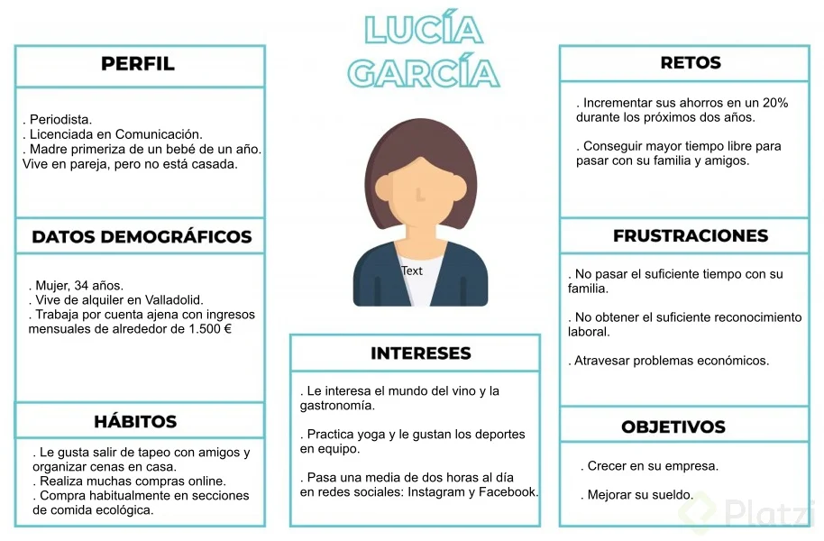
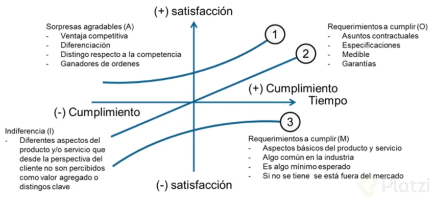
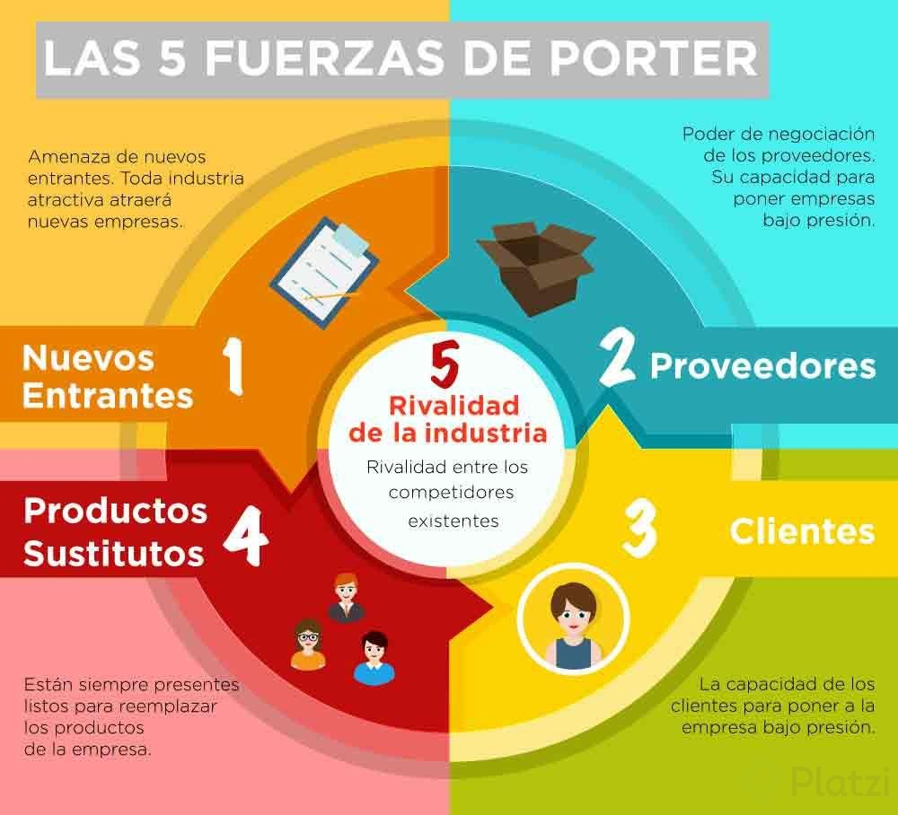
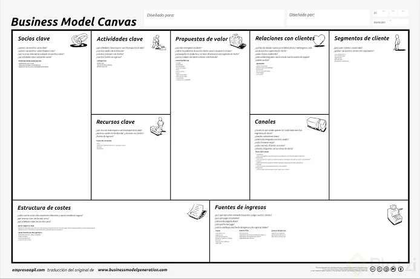

# Emprender es para ti ❤️❤️❤️❤️
##### Mariana De Giobbi


[TED Ideas worth spreading](https://www.ted.com/talks/simon_sinek_how_great_leaders_inspire_action?language=es)

* Encuentra primero el "por qu&eacute;", luego el "c&oacute;mo" y finalmente el "qu&eacute;".

¿Cuál es tu propósito?
  
  *Es la pasión te dará las fuerzas necesarias, para recorrer el camino de Emprender.

¿Qué te apasiona?

  * Problemas = Oportunidades
  * Diferentes aristas

Las Oportunidades

Una oportunidad de negocio para un emprendedor puede no serlo para otro.
 
  ### Problemas Cercanos
  ### Problemas Lejanos

* Estar preparado 
* Prepárate

  ## Imagina tu día a día

  Crecimiento de la Empresa

1.- Encontrar un tema que tenga que ver contigo y luego ver problemas relacionados a eso.

2.- Anotar todos los problemas.

3.- Oportunidad de negocio: problemas relacionados con nosotros. Problemas que dominemos y entendamos bien. Hay que ser un experto en este tema. La otra opción es prepararse y estudiar sobre ese tema.

4.- Imaginar tu día a día con el emprendimiento en el futuro.

Sugerencia: no lo pienses tanto.

## El mercado

* Tendencia para Emprender

  * ¿Pagarías por tu producto o servicio? ¿Quíen lo haría?

    > "Haz algo que las personas quieran"


    #### Tendencia o Moda

    Tendencia: Largo plazo, hacía donde va el mundo.

    Moda: Corto Platzo, es dinámica y cambia.

  
  | **Ejemplos de Moda** |  **Ejemplos de Tendencia**
  |:---------------- |:---------------|
  |   Canchas de paddle |    **Medio Ambiente:** Auto eléctrico | 
  |   Cervecería Artesanal |  **Hábitos de consumo que van cambiando:** tables vs jugueterías. |
  |  Barberías |  **Avance de la Tecnología:** Internet y todo en la nube. |

  GameStop: Videojuegos físicos

  nvidia: Videojuegos online

  **¿Comó identificarlas?**

  * Razón de fondo que difícilmente se revierta.
  * Tendencias relacionadas con el rubro que cierran.
  * Acciones del rubro que suben o bajan.


    #### Empresas de Triple Impacto

  |  Económico 🎟️   | Ambiental 🌎   | Social 👪   |

# Fases del emprendimiento

## Las ventajas comparativas de una idea de negocio

  1. Importantes necesidades de capital.
  2. Economías de escala.
  3. Diferencia de producto.
  4. Carácter legal.
      - Aprobación de algún organismo oficial
      - Requisitos especiales
  5. Activos Estratégicos
  
## Medir el interés de una Idea

  [Experiment Board](https://www.youtube.com/watch?v=F-5Iyj9A1MU)

  * Hipótesis
    ```md  
    Hipótesis = cliente + problemas + solucion 
    ```
    Ejemplo "Los niños quieren comer comida saludable"

    #### La supoción más arriesgada

    * La más crítica: Viabilidad del negocio.
    * La más incierta: Dispones de menos información.

    **Métodos de Experimentación**

    * Entrevistas  👥
    * Pre-ventas  💵 
    * Consejeria (Prueba del producto con el cliente) 🛡

    **Criterios de éxito**

    En porcentajes o fracciones.

    > Al menos 20 de 100 perosnas deben tener esta respuesta o comportamiento ante la prueba.🚀

    #### Tablero de Experimentación

    ## Definir el perfil del clinte y el mercado objetivo de un producto

    **¿Por qué difinir un clinete ideal?**

    * Reducir costos
    * Optimizar el tiempo
    * Definir la comunicación
    * Ofrecerle lo que necesita
    * Acceder a nichos

      > "El grupo que es más probable que compre el producto que tu empresa tiene para ogrecer"

      * **Cliente:** fidelidad / frecuencia
      * **Consumidor:** decisión de comparativas
      * **Comprador:** transacción
      * **Usuario:** le daré uso

      

### Encontrar elementos diferenciadores de tu producto en el mercado actual

  **Estrategias de diferenciación**

  * Producto
  * Servicio
  * RRHH 
  * Imagen 
  * Canal

**Servico**


 **¿Los clientes están dispuestos a pagar más por esa diferencia?**

## Requisitos para la diferenciación 

  Los requisitos para la diferenciación:

    1.- Importante.
    2.- Distinta.
    3.- Inimitable.
    4.- Asequible.
    5.- Rentable.

## Definir el modelo de negocio

**¿Qué es un modelo de negocio?**

  * Consumidor
  * Oferta
  * Infraestructura
  * Viabilidad finaciera

  

  ### Canvas | Modelo de negocio

**Modelo de Canvas**



**Patrones de modelos de negocios**

* Diseño similar
* Fuente de inspiración 
* Pensar la dinámica 

_¿Cómo aportamos valor a los clientes y cómo estos pagarán por ese valor?_

## Determinar las estrategias y el proceso de captación de clientes

__¿Qué es la captación?__

Busqueda de clientes potenciales que tenemos que convertir en clientes finales.

__Promociones__

* Efectivas para nuevos clientes 
* Bajo fidelidad
> gratis 2*1 descuento del 70%

__Exclusividad y escasez__

+ Técnica de persuación 
* Psicología (Miedo a la pérdida)

  > Quedan solo dos unidades, oferta limitada a dos horas, otras dos personas están viendo la misma habitación.

__Recomendación y referidos__

  * Opiniones
  * Recomendaciónes
  * Casos de éxito
  > **Tip:** Asegúrate de que sean honestos y no parezcan artificiales. Ofrece incentivos para recomendados.


**Influencer y embajadores de marca**

* Persona relevantes de tu sector
* Difundir nuestra marca
* Puerta de entrada de nuevos clientes

__Distribuidores y agentes de ventajas__

* Misma cartera de clientes
* Reciben una comisión
* Colegas

## Definir las necesidades y estrategias de financiamiento

__Obtener financiamiento__

* Tener claro qué problema estás resolviendo
* Esta solucionandolo de una manera inteligente.

  Capital propósito

  Generalmente no alcanzan a finaciar proyectos de alto Impacto.
  No contamos con la expreriencia que un inversionista especializado podría volcar al proyecto.

  **Amigos, familiares y novatos**
   **Friends, family and Fools(3f)**

  * Entre el 50% y 75% de los emprendimientos a nivel mundial
  * No nos pedirán el modelo de negocio
  * Tomarán la confianza y la experiencia personalcomo evidencias del potencial del proyecto.

  **Créditos**

  * Posivilidad de disponer del dinero como desee.
  * Hay que devolver el dinero, con interés en un determinado plazo.
  * Estudiar el retorno para que sea mayor que el interés.

  __Fondos y concursos públicos__

  * Documentación detallada
  * Requisitos estrictos (modificaciones en el proyecto)
  * Algunos son rembolsables y otros nos
  * Presentar todas las facturas y rendir cuentas en varias instancias.

Incubadoras, aceleradoras y concursos privados

* pitch
* Alto riesgo y alto retorno
* Foco: Cómo lo lograremos 
* Ventajas: mentoria
* Tienen objetivos propios.

# Encontrar ideas de negocio rentables