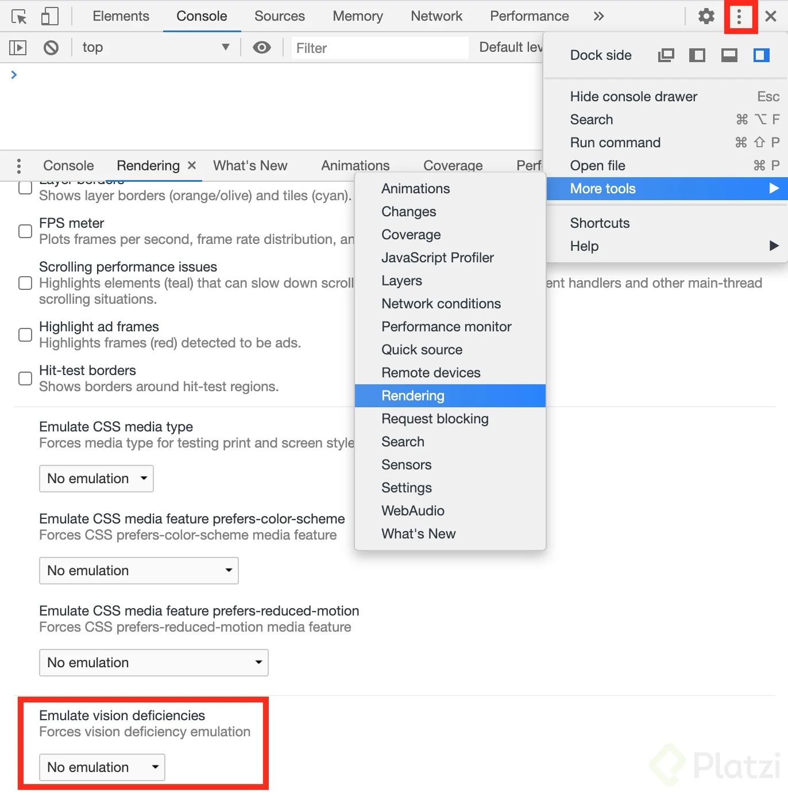

# Accesibilidad Web
#### Juliana Gomez

# Tabla de Contenido
- [Accesibilidad](#Accesibilidad)
- [¿Por qué accesibilidad?](#¿Por-qué-accesibilidad?)
  - [Historia de WCAG](#Historia-de-WCAG)
  - [¿Qué es WCAG?](#¿Qué-es-WCAG?)
  - [Los cuatro principio](#Los-cuatro-principio)
  - [Tecnologías asistivas](#Tecnologías-asistivas)
- [3. Evaluar la accessibilidad de sitios web](3.-Evaluar-la-accessibilidad-de-sitios-web)
  - [Pruebas con simuladores de discapacidades visuales](#Pruebas-con-simuladores-de-discapacidades-visuales)
  - [Pruebas manuales con tu teclado](#Pruebas-manuales-con-tu-teclado)
  - [Pruebas manuales con lectores de pantalla](#Pruebas-manuales-con-lectores-de-pantalla)
  - [Pruebas manuales con VoiceOver](#Pruebas-manuales-con-VoiceOver)
- [4. Refactorizar HTML para ser mas accessible](#4.-Refactorizar-HTML-para-ser-mas-accessible)
    - [¿Qué es el HTML semántico y por qué es importante?](#¿Qué-es-el-HTML-semántico-y-por-qué-es-importante?)
    - [Usando HTML semántico en el header de nuestro sitio](#Usando-HTML-semántico-en-el-header-de-nuestro-sitio)
    - [ARIA - Accessible Rich Internet Applications](#ARIA---Accessible-Rich-Internet-Applications)
    - [ARIA roles](#ARIA-roles)
    - [ARIA properties](#ARIA-properties)
    - [ARIA states](#ARIA-states)
- [5. Utilizar CSS para aumentar la acessibilidad de un sitio web](#5.-Utilizar-CSS-para-aumentar-la-acessibilidad-de-un-sitio-web)
    - [Iconos](#Iconos)
    - [Skip Links](#Skip-Links)
    - [Estilos de foco y hover](#Estilos-de-foco-y-hover)
- [6. Extender la accesibilidad usando JavaScript](#6.-Extender-la-accesibilidad-usando-JavaScript)
    - [Manejando el foco del teclado - botones](#Manejando-el-foco-del-teclado---botones)
    - [Manejando el foco del teclado - el carousel](#Manejando-el-foco-del-teclado---el-carousel)
    - [Coordinando el foco del teclado con el foco de lectores de pantallas](#Coordinando-el-foco-del-teclado-con-el-foco-de-lectores-de-pantallas)
    - [Manejando modales](#Manejando-modales)
    - [Mejorando la accesibilidad con teclado de nuestro modal](#Mejorando-la-accesibilidad-con-teclado-de-nuestro-modal)
    - [Ayudando a nuestros usuarios a interactuar correctamente con el sitio](#Ayudando-a-nuestros-usuarios-a-interactuar-correctamente-con-el-sitio)
    - [Validando formularios](#Validando-formularios)
    - [Manejando cambios dinámicos](#Manejando-cambios-dinámicos)


  ## Accesibilidad 
La pr&aacute;ctica continua de asegurarnos que todo lo que creamos para la web se puede usar, interpretar y operar por una variedad de personas en una variedad de situaciones **a11y** -> numer&oacute;nimo de accesibilidad.

## ¿Por qué accesibilidad?

  * Para incluir a personas en situaciones de discapacidad.
 
  * Para mejorar la usabilidad de nuestros proyectos.
   
  * Porque en algunos lugares es la ley.

### ¿Qué es WCAG? 

En inglés son las Web Content Accessibility Guidelines o en español las Pautas de Accesibilidad para el Contenido Web. Un rango de recomendaciones para crear contenido web más accesible.

### Historia de WCAG

W3C - World Wide Web Consortium : Creadores de los estándares que usamos para construir la web.

WAI - Web Accessibility Initiative : Iniciativa dentro de W3C cuya meta es asegurar la accesibilidad web.

[Introducción a las Pautas de Accesibilidad para el Contenido Web (WCAG)](https://www.w3.org/WAI/standards-guidelines/wcag/es)

[Accessibility Inspector](https://developer.mozilla.org/en-US/docs/Tools/Accessibility_inspector)

 ***Los 3 niveles son:***

  A - nivel basico

  AA - nivel intermedio

  AAA - nivel avanzado al cual debemos apuntar si trabajamos en servicios del gobierno, universidades o servicios esenciales de la vida cotidiana.

  ## **Los cuatro principio:**

| Perceptieble | Operables | Comprensible | Robusto |
|-----|:------:|:-----:|--------|
|1. Tratar de que todos los usuarios de una manera sencilla y fácil puedan percibir nuestro sitio.| 2. Tratar que nuestra sitio se pueda utilizar con otras herramientas que no sean el mouse o teclado.| 3.  Tratar de que nuestra sitio sea el usuario pueda entenderlo fácilmente.| 4. Que nuestro sitio puedo utilizar de mejor posible las herramientas (performance).|

 ## **Tecnologías asistivas:**

  **Visuales**

  - Lectores de pantallas
  - Extensiones que manipulan el CSS.

  **Motoras**

  - Varilla bucal
  - Switch

# 3. Evaluar la accessibilidad de sitios web

  ## Pruebas con simuladores de discapacidades visuales


  **Discapacidades visuales**

  - Visi&oacute;n borrosa
  - Protanopia
  - Deuteranopia
  - Acromatopsia

   Extensions google-chrome [NoCoffe](https://chrome.google.com/webstore/detail/nocoffee/jjeeggmbnhckmgdhmgdckeigabjfbddl)

  

  ## Pruebas manuales con tu teclado
  El teclado es muy importante en la accesibilidad web porque las tecnologías asistivas tienden a conectarse con el teclado para darle a sus usuarios diferentes maneras de navegar cuando no tienen acceso a un mouse o un teclado como nosotros.

Los elementos que reciben foco de teclado son elementos interacctivos:

  Enlaces: nos llevan a otra página, son para la navegación.
  Botones: nos ayudan a interactuar con la página de alguna manera.
  Formularios: requieren nuestra interacción para llenar nuestros datos.

Los div no reciben foco porque son un elemento presentacional, no esperan ninguna interacción a menos de que tú lo programes.

## Pruebas manuales con lectores de pantalla

Lectores de Pantalla: Software que mapea las páginas que usamos y las lee en voz alta.

Combinaciones de lectores de pantalla y navegadores:

NVDA - Mozilla Firefox
JAWS - Internet Explorer
VoiceOver - Safari
ChromeVox - Google Chrome
Apartado de Chorme DevTools → En Elements → Accessibility → Accessibility Tree

## Prueba manuales con VoiceOver

**Comando para ChromeVox:**

ChromeVox modifier key = Search

Turn on braille captions = Search + A, B

Show ChromeVox Menus = Search + Period

Next heading = Search + H

Previous heading = Search + Shift + H

Enter Learn Mode = Search + O, K

Next group = Search + Ctrl + Down

Next object = Search + Right

Next line = Search + Down

Next word = Search + Shift + Ctrl + Right

Next character = Search + Shift + Right

# 4. Refactorizar HTML para ser mas accessible

  ## ¿Qué es el HTML semántico y por qué es importante?

  El HTML semántico nos ayuda con algunos aspectos de presentación y le agrega significado a nuestro contenido en el navegador.

  

  Html semántico es saber usar las etiquetas Html y no solo usar `<div>` para todo.

**Utilizar código semántico ofrece varias ventajas:**

- Posicionamiento en buscadores.
- Accesibilidad.
- Practicidad.
- Reusabilidad.

## Usando HTML semántico en el header de nuestro sitio

`<headers></headers>` Es la parte superior de nuestra pagina Lo primero que ve el usuario en cuanto orden.

`` Es la etiqueta para poner imágenes, y tiene el atributo alt="El lector de pantalla lee lo que esta aqui.

`<nav></nav>` Es para colocar un menú de navegación.

`<ul></ul>` Es para poner una lista que no tiene un orden especifico.

`<li></li>` Un elemento de lista.

> *Consejo:* Para cambiar la etiqueta de apertura y cierre al mismo tiempo presiona F2 al lado del nombre de la etiqueta de apertura o cierre.

## ARIA - Accessible Rich Internet Applications

ARIA[ARIA] (Accessible Rich Internet Applications): Un conjunto de atributos especiales para accesibilidad que pueden añadirse a cualquier etiqueta, pero especialmente adaptado a HTML.

Fue creado por la W3C, lo crearon para que podamos comunicar cambios especiales en nuestras aplicaciones.

[ARIA]: Accessible Rich Internet Applications

[HTML]: Hyper Text Markup Language

[W3C]: World Wide Web Consortium


**Atributos de ARIA:**

  - Roles
  - Propiedades
  - Estados

  ## ARIA roles

 **Roles de ARIA:** Define el tipo general del objeto ( como un artículo, una alerta o un deslizador)

Los roles le comunican al navegadores cuales son las interacciones que debería esperar y cómo se va a usar este objeto en nuestro proyecto. Se usan en situaciones muy especificas, es mejor depender del HTML semántico para comunicar los roles.


  - Los roles definen el tipo general del objeto (como un artículo, una alerta o un deslizador)

  - Comunican al navegador cuales son las interacciones que se debe esperar y como se va a usar este objeto dentro de nuestra página o aplicación

  - Se usan en situaciones muy específicas

  - Es una especificación muy difícil de usar

  - Los navegadores y especialmente los lectores de pantalla navegan diferentes roles en diferentes estilos


## ARIA properties
Propiedades de ARIA: Comunican atributos que son esenciales para el comportamiento o significado de un elemento pero que suelen comunicar visualmente.

`Atributo: “aria-label”`

[HTML <label> for Attribute](https://www.w3schools.com/tags/att_label_for.asp)


    Las propiedades ARIA la vamos a usar más seguido

Qué son

Comunican atributos que son esenciales para el comportamiento o significado de un elemento pero que se suelen comunicar visualmente

  Agregar significado a nuestro contenido visual

ARIA label

  Podemos usar para agregar un string para describir un elemento de nuestro código
  Aria Ejemplo:


```html
<form class="form-container">
  Nombre<input type="text" aria-label="nombre"/> <br />
  Correo<input type="text" aria-label="correo"/> <br />
  <div class="message-input">Mensaje<input type="text" /> <br /></div>
  <button class="send-button">Enviar</button>
</form>
```

Ejemplo: 

<form class="form-container">
  Nombre<input type="text" aria-label="nombre"/> <br />
  Correo<input type="text" aria-label="correo"/> <br />
  <div class="message-input">Mensaje<input type="text" /> <br /></div>
  <button class="send-button">Enviar</button>
</form>


## ARIA states

[ARIA Labels and Relationships](https://developers.google.com/web/fundamentals/accessibility/semantics-aria/aria-labels-and-relationships)


  Lo importante es que las personas que navegan con un lector de pantalla le demos una experiencia casi igual a las personas que utilizan tecnologías asistivas

**Qué son**

Comunican estados y cambios de estados en elementos que se suelen comunicar visualmente. Tenemos que comunicar los diferentes estados que tengamos en nuestras aplicaciones a nuestros usuarios

  **aria-hidden="true"** → nos ayuda a esconder el contenido del carrusel para que el Voice Over no lo lea cuando aún no hemos tenido interacción con el carrusel

```html
<li aria-hidden="true"><button></button></li>
<li aria-hidden="true"><button></button></li>
```

# 5. Utilizar CSS para aumentar la acessibilidad de un sitio web

## Contrastes de color


## Iconos

Consulta agregarle una etique de title="" a cada enlace no seria correcto!? no romperia el diseño original y le agregaria ese texto para identificar cuando se hace :hover sobre el.

```html
<ul class=“social-media”>
<li>
<a
href=“https://twitter.com/gmzjuliana"
title=“Twitter"
target=”_blank”
></a>
</li>
<li>
<a
href=“https://github.com/gmzjuliana"
title=“Github"
target=”_blank”
></a>
</li>
<li>
<a
href="https://www.linkedin.com/in/gomezjuliana/“
title=“LinkedIn"
target=”_blank”
></a>
</li>
</ul>
```
## Skip Links

[Skip Links:](https://a11y-101.com/development/skip-link) son enlaces de página internos que ayudan a la navegación por la página actual, en lugar de a páginas completamente nuevas.

Es lo más recomendable, gracias a ello tenemos por defecto este comportamiento habilitado.
Antes de ello, aprendan bien a posicionar la etiqueta main, semánticamente tiene un orden que hay que cumplir.

Si te preocupa la compatibilidad de Main: Incluso es aceptado por Internet Explorer 11 con la propiedad: width: tuvalor, pero para 2020 la el uso de este browser es del 2%, así que: Ni se preocupen ya por darle soporte, está “prácticamente muerto IE 11”

## Estilos de foco y hover

* [:focus-within](https://developer.mozilla.org/en-US/docs/Web/CSS/:focus-within)

La pseudo-clase CSS :focus-within representa un elemento que ha recibido el foco o que contiene un elemento que ha recibido el foco.

buenas prácticas para cuando escriban CSS.

El orden de las propiedades dentro de los selectores si importa y tienen un orden:

  -  Position
  -  Modelo de caja
  -  Texto
  -  color
  -  Miscelanea

```css
.button {
  display: block;
  width: 220px;
  height: 40px;
  position: relative;
  text-transform: uppercase;
  background-color: #fff;
  @extend h1;
}
```

# 6. Extender la accesibilidad usando JavaScript

  ## Manejando el foco del teclado - botones

  ## Manejando el foco del teclado - el carousel

  **Tabindex**

  Inidca si su elemento puede ser enfocado, y si participa en la navegaci&oacute;n secuencial del teclado.

  Valores de Tabindex:

  **Valor negativo(-1):** El elemento debe ser enfocado, pero no debe de ser accesible a través de la navegación.

  **Valor positivo (>0):** Debe poder ser enfocado y su orden relativo es definido por el valor del atributo.

  **Valor de 0:** Debe ser enfocado y ser accesible a través de la navegación secuencial del teclado, pero su orden relativo es definido por convención de la plataforma.

  ## Coordinando el foco del teclado con el foco de lectores de pantallas

  `setAttribute:` Agrega un nuevo atributo.

  `remoteAttribute:` Elimina un atributo

  ## Manejando modales

  ## Mejorando la accesibilidad con teclado de nuestro modal

*  [keycode](http://keycode.info/)

El `focus()` se envía a un elemento cuando se enfoca. Este evento es implícitamente aplicable a un conjunto limitado de elementos, tales como elementos de formulario `( <input>, <select>, etc.)` y enlaces `( <a href>).` En versiones recientes del navegador, el evento se puede extender para incluir todos los tipos de elementos al establecer explícitamente la tabindexpropiedad del elemento . Un elemento puede enfocarse mediante comandos del teclado, como la tecla Tabulador, o haciendo clic con el mouse sobre el elemento.


## Ayudando a nuestros usuarios a interactuar correctamente con el sitio

> “El poder de la Web está en su universalidad. El acceso de todas las personas independientemente de la discapacidad es un aspecto esencial.”

## Validando formularios

El atributo es require (No recibe ningún valor)
este atributo hace que al momento de hacer un submit, si el input en el que pusiste el require esta vacío, lo enfoca y nos avisa de forma automática que es obligatorio llenarlo.

```html
<label for="nombre">Nombre</label>
<input type="text" name="nombre" id="nombre" require />
```

[require | html](https://www.w3schools.com/tags/att_input_required.asp)

## Manejando cambios dinámicos

**aria-live:** Se utilizan para establecer la prioridad con la que el lector de pantalla debe tratar a cambios a las regiones en vivo - los valores posibles son: off, politeo assertive. La configuración predeterminada es off. Este atributo es, con mucho, el más importante.

[ARIA live regions](https://developer.mozilla.org/en-US/docs/Web/Accessibility/ARIA/ARIA_Live_Regions)