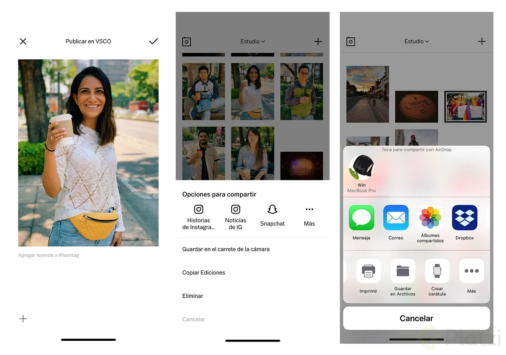

# Fotografía con tu Teléfono

#### Ludwin Cuevas

- [1. Presentación y Bienvenida al curso](#1.-Presentación-y-Bienvenida-al-curso)
  - [Bienvenida al curso](#Bienvenida-al-curso)
  - [Qué vas a aprender](#Qué-vas-a-aprender)
  - [Referencias](#Referencias)
- [2. Proyecto](#2.-Proyecto)
  - [Proyecto](#Proyecto)
- [3. Fotografía móvil](#3.-Fotografía-móvil)
  - [¿Qué es fotografía móvil?](#¿Qué-es-fotografía-móvil?)
  - [Ajustes de la cámara](#Ajustes-de-la-cámara)
  - [Modos de la cámara en Android](#Modos-de-la-cámara-en-Android)
  - [Modos de la cámara en iPhone](#Modos-de-la-cámara-en-iPhone)
  - [Tipos de fotografía](#Tipos-de-fotografía)
  - [Composición para móviles](#Composición-para-móviles)
  - [Formatos](#Formatos)
- [4. Tomando una fotografía](#4.-Tomando-una-fotografía)
  - [Sacando ventaja al formato RAW en tu teléfono](#Sacando-ventaja-al-formato-RAW-en-tu-teléfono)
  - [Tomando una fotografía](#Tomando-una-fotografía)
  - [RAW en Android y activar cuadrícula](#RAW-en-Android-y-activar-cuadrícula)
  - [RAW en iPhone](#RAW-en-iPhone)
- [5. Edición de fotografía móvil](#5.-Edición-de-fotografía-móvil)
  - [Herramientas de edición: Exposición, contraste, ajuste, enfoques y claridad](#Herramientas-de-edición:-Exposición,-contraste,-ajuste,-enfoques-y-claridad)
  - [Herramientas de edición: Saturación, tono, tono de piel, balance de blancos y viñeta](#Herramientas-de-edición-Saturación-tono-tono-de-piel-balance-de-blancos-y-viñeta)
  - [Herramientas de edición: Grano, difuminar, tono separado, bordes y HSL](#Herramientas-de-edición-Grano-difuminar-tono-separado-bordes-y-HSL)
  - [Aprendiendo a exportar en VSCO](#Aprendiendo-a-exportar-en-VSCO)
  - [Snapseed: Rotación de cabeza, Modo Retrato, Corrección](#Snapseed-Rotación-de-cabeza-Modo-Retrato-Corrección)
- [6. Ejemplos de edición](#6.-Ejemplos-de-edición)
  - [Editando un retrato](#Editando-un-retrato)
  - [Editando una fotografía de paisaje](#Editando-una-fotografía-de-paisaje)
  - [Editando fotos de comida](#Editando-fotos-de-comida)
  - [Editando una fotografía con bajas condiciones de luz](#Editando-una-fotografía-con-bajas-condiciones-de-luz)
  - [Editando fotografías en lote](#Editando-fotografías-en-lote)
  - [Respaldando fotografías](#Respaldando-fotografías)
  - [Exportando una fotografía desde tu teléfono](#Exportando-una-fotografía-desde-tu-teléfono)
- [7. Conclusiones](#7.-Conclusiones)
  - [Cierre](#Cierre)

# 1. Presentación y Bienvenida al curso

  ## Bienvenida al curso

Tu profesor es Ludwin Cuevas un experimentado profesional en producción audiovisual y fotografía, y Head of Production en Platzi. Aprenderás todo lo necesario para sacarle el máximo provecho a la cámara que siempre tienes entre tus manos, ¡tu teléfono!

  ## Qué vas a aprender

Puedes hacer fotos muy buenas con **solamente** tu teléfono. Recuerda, “La cámara no hace al fotógrafo” es solamente un recurso para empezar a contar historias.
Aprenderás reglas básicas de composición, tipos de fotografía, técnicas de edición, entre otros. Aprovecha este curso, ¡tomarás fotos inolvidables!

  ## Referencias

Lo primero que debes hacer es “ver”. Busca inspiración en cada oportunidad que puedas. También, ten en cuenta que cada uno decide como quiere transmitir su mensaje, la fotografía es subjetiva a excepción del fotoperiodismo donde debes mostrar la foto tal cual fue tomada.

Recuerda, al final tú eres el creador y decides lo que quieres comunicar.

# 2. Proyecto
  # Proyecto

Un proyecto es una colección de fotografías las cuales deben tener alguna relación entre sí.

**¿Qué hay que hacer?**
- Entre 3 y 10 fotografías
- Tomadas con el teléfono
- Con una temática definida
- Compartir
- Dejar el enlace en esta clase

- [YEARS YOUNG](https://www.skylerknutzen.com/new-project)
- [Desconstructed | JAIME AVILA](https://jaimeavila.com/deconstructed)

# 3. Fotografía móvil

  ## ¿Qué es fotografía móvil?

Es aquella fotografía que tomamos con nuestros teléfonos inteligentes.

¡El 63 % de las publicaciones en redes sociales son imágenes! - Hootsuite

**Ventajas**
  - Discreción
  - Ligero
  - Facilidad de uso
  - Siempre contigo
  - Tamaño
  - Mejora continua
  - Editar en el mismo dispositivo

**Desventajas**
  - Necesitas mucha luz
  - Calidad de la imagen
  - No se puede cambiar la óptica
  - Precio (depende)
  - Puedes hacer fotografía móvil desde un dispositivo  
  - Android o iOS con los mismos resultados.

  ## Ajustes de la cámara

**Debes desactivar:**

  - Temporizador
  - Flash
  - Foto animada (Android) o iPhoto (iOS)
  - Lo ideal es que nunca uses zoom digital.

  ## Modos de la cámara en Android

- El **Modo retrato** es muy útil cuando queremos desenfocar el fondo.
- La **Foto panorámica** permite captar información que de otra forma sería imposible o muy difícil.
- **Google** Lens permite buscar imágenes directamente con la foto que tomaste (exclusivo de android).

También puedes encontrar modo automático, time lapse, cámara lenta, entre otros.

  ## Modos de la cámara en iPhone

No vamos a usar los efectos que ofrecen los ajustes de iOS directamente en nuestras fotos. Así como en Android, en **iPhone** tenemos modo retrato, modo panorámico, video, cámara lenta o time lapse.

Es importante que seas consciente de la capacidad de tu cámara. Cuantos lentes tiene, si te permite hacer un zoom óptico, etc.

  ## Tipos de fotografía

- Fotografía de paisaje (urbano o rural)
- Fotografía de calle
- Fotografía de viaje

La golden hour (hora dorada) te da tonos muy cálidos o amarillos con sombras más difuminadas, y ocurre justamente antes del atardecer.
  ## Composición para móviles

  Algunos lineamientos básicos:

  - Regla de los tercios
  - Línea del horizonte
  - Espacio negativo
  - Encuadre natural
  - Punto de fuga

  ## Formatos

  Debes considerar las unidades de medida y observar la proporción.
  
  

# 4. Tomando una 

  ## Sacando ventaja al formato RAW en tu teléfono

Con la posibilidad de disparar en formato RAW desde nuestros teléfonos llega la batalla frontal entre las cámaras compactas y los smartphones. Y es que hoy en día nuestros teléfonos tienen una cámara con mejores prestaciones y con la posibilidad de tomar fotografías en modo RAW nos permite sacar una mayor ventaja al momento de la edición.

  #### ¿Qué es el formato RAW?

  RAW quiere decir crudo en inglés, lo que significa que se trata de un formato sin procesar, es decir, captura una imagen sin ningún tipo de procesamiento. El formato RAW guarda la mayor cantidad de información posible en archivo que luego de un proceso (el revelado) podremos obtener un archivo en formato de imagen (JPG, PNG, etc).

Los archivos RAW que crean los teléfonos inteligentes suelen tener una extensión de archivo DNG (Digital Negative), este tipo de archivo fue creado por Adobe en 2004 y en el conserva toda la información capturada con el sensor por lo que en lugar de tener unos 8 bits por canal (24 bits/píxel) como los archivos JPG ya procesados, tiene entre [10 y 16 bits por canal](https://www.dpreview.com/forums/thread/4340550) (entre 40 y 48 bits/píxel).

Esto significa que cada píxel de un archivo RAW que compone la imagen contiene más información que los píxeles de una imagen en formato JPG, por tanto tienes un margen más amplio para mejorar la calidad de la fotografía al momento de la edición, es decir, al momento del revelado utilizando una aplicación en tu teléfono.

Cuando tomas una fotografía desde tu teléfono lo que sucede es que el sensor recoge toda la información posible y la manda en formato RAW al software de procesamiento de la cámara que tenga tu sistema operativo. Este software tiene una serie de ajustes y calibraciones que de manera inmediata le aplica ciertos parámetros como la exposición, el brillo, el contraste, las sombras, la temperatura del color y otras más lo que hace que guarde de manera automática una fotografía JPG en la galería de tu teléfono.

Lo anterior, significa que tu teléfono está prácticamente haciendo de manera automática el revelado digital de un archivo RAW. Esto se aplicó en un inicio para guardar versiones más ligeras de los archivos y por que gran parte de los usuarios no necesitan almacenar un archivo en RAW que pesa más de 20MB.

Hay que tomar en cuenta que cuando no disparamos en RAW estamos dejando que el fabricante de nuestro teléfono realice los ajustes básicos al momento de tomar una fotografía. Esto en función de distintos criterios que el software considera para lograr los resultados más óptimos al momento de tomar fotografías, ahora bien, esto no es necesariamente malo, los resultados son bastante buenos. Lo único que hay que tener en cuenta es que nosotros podemos hacer todos esos ajustes y preparar una fotografía para obtener el resultado tal como consideramos que transmite lo que queremos comunicar con ella.

#### Ventajas y desventajas del modo RAW

**Ventajas**

- **El formato RAW no comprime la imagen.** Guardamos toda la información posible que nos envía el sensor de nuestro teléfono
- **Nos ayuda a hacer una mejor post producción.** Dado que tenemos toda la información almacenada en el archivo podemos realizar los ajustes sin que exista una perdida de calidad en la imagen, esto significa que si tomamos una foto con poca luz por ejemplo y esta tiene un poco ruido que queremos eliminar, el resultado será mucho mejor que si hubiésemos tomado la fotografía en JPG.

**Desventajas**

- **El tamaño de los archivos.** El formato RAW puede llegar a pesar 20MB por archivo. Esto quiere decir que si tomamos muchas fotografías la memoria de nuestro teléfono se llenará muy rápidamente.
- **Es necesario hacer un proceso de revelado.** Así como la edición de nuestra fotografía y los resultados que podemos obtener con ella son una gran ventaja, esto puede volverse una desventaja si tenemos más de 200 fotografías que hay que pasar por revelado antes de obtener un archivo en JPG. Recordamos que el RAW es un formato de archivo, no una imagen. Por tanto, hay que revelar.

Ahora bien, a continuación una lista de 3 aplicaciones que nos ayudarán a sacar ventaja al momento de disparar en RAW desde nuestro teléfono. Las tres aplicaciones están disponibles tanto para iOS como para Android.

**Snapseed** [(Gratuita)](https://support.google.com/snapseed?hl=es-419#topic=6155507)

Esta aplicación fue adquirida por Google hace algún tiempo y es gratuita. Si bien esta aplicación no nos permite tomar una fotografía en [RAW](https://support.google.com/snapseed/answer/6312515?hl=eshttps://support.google.com/snapseed/answer/6312515?hl=es) si nos permite editarla utilizando nuestro teléfono. Con snapseed podemos hacer el revelado de nuestra fotografía haciendo ajustes como Exposición, sombras, contraste, resaltar el brillo, ajustar la saturación, corregir la temperatura y otras más. Tiene una herramienta muy útil para el ajuste de blancos.

Una de las características principales de esta aplicación es que nos muestra un histograma visible todo el tiempo.

**Moment** [(5.99 USD)](https://www.shopmoment.com/moment-pro-camera-app)

Si bien es una aplicación de pago tiene muchísimo potencial. Nos permite tomar una fotografía directamente en RAW y poder hacerlo de manera completamente manual. Tiene un histograma “en vivo” que se va actualizando según hacemos la exposición de la fotografía. También nos permite capturar varias fotos de manera continua incluso en RAW.

Algo interesante que tiene esta aplicación es que te envía tips a tu correo sobre como sacarle el máximo provecho. Desde su sitio web te puedes suscribir a esos tips aunque no cuentes con la aplicación.

**Lightroom** [(Suscripción)](https://www.adobe.com/es/products/photoshop-lightroom.html)

La aplicación para fotografía de Adobe. Uno puede descargarla gratuitamente y aprovecharla para edición. También puedes tomar fotografías utilizando la app. La versión de suscripción nos permite sincronizar nuestros catálogos en la nube, editar fotografías en RAW (y tomarlas también) entre otros recursos interesantes como la opción de agrupar las fotografías de gente de acuerdo a sus caras (como lo hace Google Photos, Apple Photos o Amazon Photos).

  ## Tomando una fotografía

- Procura que tu óptica esté limpia, la cámara no debe tener suciedad.
- Analiza cuántos sensores y cámaras tiene tu teléfono.
- Necesitas mucha luz ya que los sensores de los teléfonos son pequeños generalmente.
- No ubiques a tu personaje directamente frente a los rayos del sol.
- Recuerda, ¡no utilices el flash!
- Busca la posición adecuada para mejorar la estabilidad.
- No utilices zoom digital, procura usar el zoom óptico.
- Antes de tomar una foto, pregúntate, ¿qué quiero comunicar?
- ¡Aprovecha las reglas de composición!

  ## RAW en Android y activar cuadrícula

RAW es un archivo crudo y tiene la mayor cantidad de información posible de tu foto (por tal motivo es más pesada). Luego podrás aprovecharla mejor en otros formatos.

**Nota:** El formato RAW no está disponible en todos los dispositivos Android y no es que se pueda cambiar el formato de la cámara, los dispositivos que tienen esa capacidad ya vienen con esa opción de fábrica y son pocos.

  ## RAW en iPhone

- [VSCO - Create, discover, and connect](https://vsco.co)
- [‎Moment - Pro Camera on the App Store](https://apps.apple.com/us/app/moment-pro-camera/id927098908)
- [‎Camera Plus: Frame The Moments on the App Store](https://apps.apple.com/us/app/camera-plus-frame-the-moments/id330803072)

# 5. Edición de fotografía móvil

  ## Herramientas de edición: Exposición, contraste, ajuste, enfoques y claridad

**Exposición**

Una foto está muy bien expuesta cuando se pueden apreciar todos los elementos que el fotógrafo quiere mostrar.

**Contraste**

Hace que los tonos claros se vean más claros y los oscuros más oscuros.

**Ajuste**

Configura el encuadre de tal manera que sea simétrico con la composición que buscamos.

**Enfocar**

Es muy similar a la nitidez. Las líneas son más definidas.

**Claridad**

Resalta los bordes.

  ## Herramientas de edición: Saturación, tono, tono de piel, balance de blancos y viñeta

**Saturación**

Hace que los colores sean más intensos.

**Tono**

Aumenta o disminuye el brillo de los parámetros “resaltados” y “sombras”.

**Balance de blancos**

Hace que los blancos sean totalmente blancos. Con la opción “temperatura” puede hacer el contexto más cálido. Con el “tinte” hacemos que los tonos verdes o morados sean más o menos fuertes.

**Tono de piel**

Puedes configurar el tono de piel de los personajes desde tonos más rosas a más bronceados.

**Viñeta**

Oscurece los bordes.

[Snappseed](https://play.google.com/store/apps/details?id=com.niksoftware.snapseed&amp;hl=en)

[VSCO](https://apps.apple.com/us/app/vsco-photo-video-editor/id588013838)

  ## Herramientas de edición: Grano, difuminar, tono separado, bordes y HSL

**Grano**

Agrega un efecto de ruido o impurezas.

**Difuminar**

Permite hacer un “Lavado de color”, da un efecto retro.

**Tono separado**

Dependiendo del color podemos elegir un color para los resaltados y otro para las sombras.

**Bordes**

Permite añadir borde en un marco específico.

**HSL**

Ajusta la tonalidad, saturación y luminosidad de un color específico.

  ## Aprendiendo a exportar en VSCO

[VSCO](https://apps.apple.com/us/app/vsco-photo-video-editor/id588013838)

  ## Snapseed: Rotación de cabeza, Modo Retrato, Corrección

**Snapseed** es una aplicación gratuita disponible en iOS y Android. Puedes hacer contrastes, corrección de colores, enaltecer tus paisajes o darle personalidad a tus retratos. Usando esta app apropiadamente podrás crear ediciones de alta calidad, y lo mejor ¡desde tu teléfono!.

# 6. Ejemplos de edición

  ## Editando un retrato

El ajuste del encuadre debe estar basado en alguna regla de composición. Preferiblemente no “mutiles” el cuerpo de tu personaje principal y ubica todos los elementos que quieres dentro del **encuadre**.

Recuerda, la exposición, tono de piel, viñeta o filtros deberá ser acorde al mensaje que quieras transmitir.

  ## Editando una fotografía de paisaje

Antes de tomar cualquier fotografía, es importante que visualices cómo quieres que sea el resultado final.

Recuerda puedes usar las reglas del **horizonte y los tercios** para este tipo de fotografías. También amplifica el mensaje de tu foto al manipular la temperatura y los filtros.

  ## Editando fotos de comida

**Consejos:**

- Pon el teléfono perpendicularmente a la mesa (desde arriba).
- Agrega más elementos aparte de la comida de tal forma que se - involucren en tu mensaje.
- Foto macro, acércate lo más posible omitiendo elementos que no aportan.
- Procura que el plato salga completo.

Recuerda mantener un estilo o filtro constante si vas a tener una colección de imágenes en tus redes sociales.

  ## Editando una fotografía con bajas condiciones de luz

Cuando usas el flash de tu cámara **“matas”** la atmósfera, la esencia, por lo que es mejor una foto sin flash para mantener las condiciones originales en las que fue tomada. Si una foto es difícil de aprovechar, puedes usar un filtro blanco y negro para darle un **“toque artístico”**.

[VSCO](https://vsco.co)

  ## Editando fotografías en lote

Con esta característica puedes **acelerar** tu proceso de edición, al aplicar en varias fotos a la vez un ajuste creado por ti.

  ## Respaldando fotografías

  ## Exportando una fotografía desde tu teléfono

Exportando un fotografía desde tu teléfono
Generalmente una fotografía que está lista para ver la luz requerirá de ciertos parámetros o ajustes al momento de ser exportada. En el caso de la fotografía móvil no hay mucho que ajustar debido a que el teléfono lo hace prácticamente en automático.

Si estamos utilizando VSCO en versiones anteriores nos permitía exportar una imagen de tamaño distinto a la que hemos estado trabajando, ahí lo ideal era elegir la opción que nos permitía exportar la imagen en su tamaño original para aprovechar al máximo la resolución de la fotografía. La versión más reciente de esta aplicación ya hace eso de manera automática, la versión que guardaremos en nuestra galería será la de mayor tamaño posible.

Lo interesante de exportar directamente utilizando VSCO es que podemos mandar la imagen a historias de instagram o a nuestro feed de publicaciones en esta misma red social. Además, tenemos la opción de exportarla para cualquier aplicación de nuestro teléfono utilizando el menú de compartir de nuestro sistema operativo.

Por otro lado si utilizamos aplicaciones como Snapseed podemos configurar para que automáticamente nos guarde la imagen en mayor resolución posible, elegir que no altere el tamaño de la fotografía o reducir el tamaño por defecto. Esta aplicación incluso nos permite elegir el nivel de compresión que queremos aplicar en archivos JPG. Si elegimos la opción de JPG 100% significa que estaremos comprimiendo lo menos posible.

En el caso del menú exportar de Snapseed tenemos la opción de guardar la fotografía con cambios que podríamos deshacer más tarde o también definir si guardamos la fotografía como un nuevo archivo. Además, tenemos el menú propio del sistema operativo que nos permitirá enviar la fotografía a cualquier aplicación en nuestro teléfono.

Mi sugerencia y la parte más importante de esto es que sin importar que aplicación utilices te asegures de estar exportando la imagen en la mejor calidad posible. Así, aprovechas al máximo la capacidad del sensor en tu teléfono y logras que tus fotografías se vean increíbles.

# 7. Conclusiones

  # Cierre

Recuerda, lo más importante al momento de tomar fotografías es que **cuentes historias**. Además debes tener una **intención,** un objetivo específico.

¡Nunca pares de aprender!