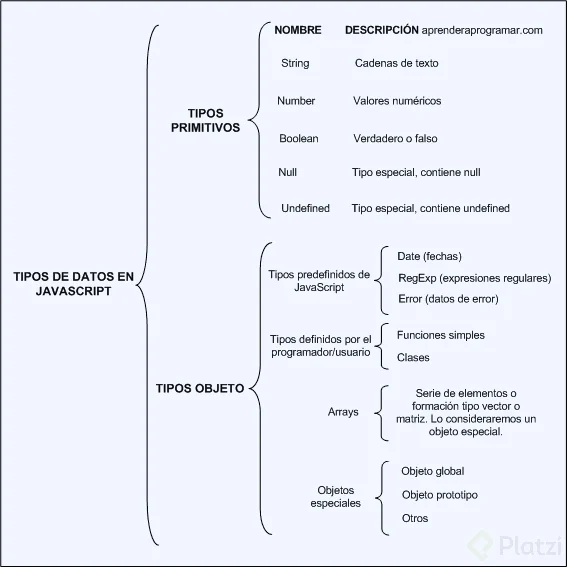
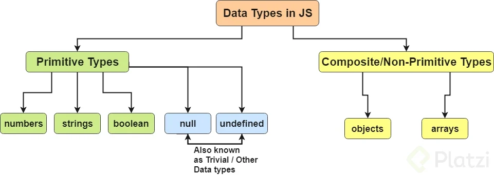
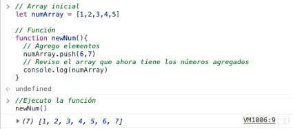
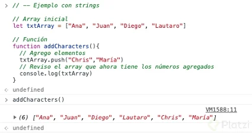
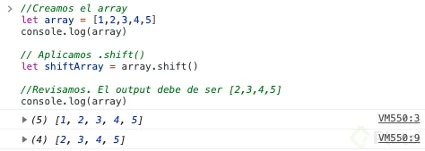
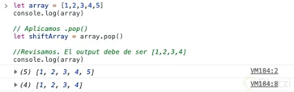

# JavaScript

[jsconsole Commands](https://jsconsole.com)

***¿Cómo nace Javascript?***
Nace con la necesidad de generar dinamismo en las páginas web y que a su vez los usuarios y las empresas pudieran interactuar unos con otros.

***¿Qué es Javascript?***
Es un lenguaje interpretado, orientado a objetos, débilmente tipado y dinámico.

***Débilmente tipado***

Se pueden hacer operaciones entre tipos distintos de datos (enteros con strings, booleanos con enteros, etc). Ejemplo:

```javascript
4 + "7"; // 47
4 * "7"; // 28
2 + true; // 3
false - 3; // -3
```


***Dinámico***
Corre directamente en la etapa de Runetime sin una etapa de compilación previa. Esto permite probar nuestro código inmediatamente; pero también es lo que hace que los errores se muestren hasta que se ejecuta el programa.

***¿Realmente es Javascript un lenguaje interpretado?***
Si, y la razón es que le navegador lee linea por linea nuestro código el cuál le indica lo que tiene que hacer, sin la necesidad de compilar. Todo esto es controlado por el motor de Javascript V8 del navegador

***Javascript es Basckwards Compatible***
Todas las funciones nuevas que salen de Javascript no dañarán el trabajo ya hecho, pero no se podrá utilizar en nuestro entorno de trabajo inmediatamente. Para solucionar esto está Babel que permite utilizar las nuevas características del lenguaje pero lo transforma a una versión que el navegador pueda entender.

***Generar diferentes cosas***

Si solo estuvieras interesado en trabajar aplicaciones web tienes muchos frameworks y librerías construidas en JavaScript que te van a ayudar a hacer proyectos de forma mucho mas rápida, eficiente y robusta (Angular, View, React,entre otros)

Si no quieres trabajar solo en aplicaciones Web puedes utilizar JavaScript con un framework que se llama React Native para poder construir aplicaciones nativas como Android y IOS.

Puedes construir aplicaciones de escritorio con JavaScript, usando un framework llamado Electron, pueden correr en Mac o Windows.

También puedes trabajar en la parte del Back-end o **IOT **(Internet Od Things) es un concepto que se refiere a una interconexion digital de objetos cotidianos con Internet. Esto con un Framework llamado NodeJS, el cual es un entorno de ejecución de JavaScript que corre directamente en el Back-end.

  ## Dos Componentes Principales

  1. Data que guradamos en memoria.

  2. Tareas (Funciones) que haremos con esa data.



  ### Editores de texto

  [Atom](https://atom.io)

  [visual Studio Code](https://code.visualstudio.com)

  [Sublime Text](https://www.sublimetext.com)

  ### Sintaxis JavaScript

  

  **Estructuras y tipos de datos**
El último estándar ECMAScript define nueve tipos:

**Seis tipos de datos primitivos, controlados por el operador typeof**
```javascript

Undefined: typeof instance === "undefined"

Boolean: typeof instance === "boolean"

Number: typeof instance === "number"

String: typeof instance === "string"

BigInt: typeof instance === "bigint"

Symbol: typeof instance === "symbol"

Null: typeof instance === “object”
```

Tipo primitivo especial que tiene un uso adicional para su valor: si el objeto no se hereda, se muestra null;

**Object:** ```typeof instance === “object”```

 Tipo estructural especial que no es de datos, pero para cualquier instancia de objeto construido que también se utiliza como estructuras de datos: _**new Object, new Array, new Map, new Set, new WeakMap, new WeakSet, new Date y casi todo lo hecho con la palabra clave new;**_

**Function:** Una estructura sin datos, aunque también responde al operador typeof: ``` typeof instance === “function” ```

Esta simplemente es una forma abreviada para funciones, aunque cada constructor de funciones se deriva del ***constructor Objec***t.

***Dentro de JavaScript tenemos tres formas de declarar una variable las cuales son: var, const y let.***

**Var:** Era la forma en que se declaraban las variables hasta ECMAScript 5. Casi ya no se usa porque es de forma global y tiene las siguientes características:

o Se puede reinicializar: osea todas las variables se inicializan, por ejemplo:
```javascript
Var pokemonType = ‘electric’ // entonces reinicializar es:
var pokemonType = ‘grass’ //osea la misma variable con diferentes datos el último dato predomina.
```
o Se puede reasignar: osea la variable ya inicializada le reasignamos otro valor por ejemplo: inicializamos la variable: 
```javascript
var pokemonType = ‘electric’ //ahora la reasignamos 
pokemonType = ‘grass’ //ya no va var
```
o Su alcance es función global: osea inicializamos la variable, pero la podemos llamar desde cualquier bloque ```(una llave abierta y una cerrada {})`` pero hay que tener mucho cuidado con ello ya que puede haber peligro, no es recomendable usar VAR.

const y let es la forma en que se declaran las variables a partir de ECMAScript 6,

const: sirve para declarar variables que nunca van a ser modificadas:
o No se puede reinicilizar: es una const única no puede haber otra inicializada con el mismo nombre.

```javascript
const pokemonType = ‘electric’ no puede haber:
const pokemonType = ‘grass’
//o No se pude re asignar: una vez que la hayamos inicializado no la podemos reasignar solo con su nombre: 
const pokemonType = ‘electric’ no puede ejecutarse:
pokemonType = ‘grass’
//o No es inmutable: osea no puede cambiar con objetos:
```

**Let:** Son variables que pueden ser modificadas, se pueden cambiar:
o No se puede reinicilizar: es una const única no puede haber otra inicializada con el mismo nombre. 

```javascript
let pokemonType = ‘electric’ no puede haber:
let pokemonType = ‘grass’
```

o Se puede reasignar: Osea la variable ya inicializada le reasignamos otro valor por ejemplo: inicializamos la variable: 

```javascript
let pokemonType = ‘electric’ ahora la reasignamos
pokemonType = ‘grass’
```
o Su contexto de es bloque: Solo funciona dentro de un bloque {}, fuera de ello no.

  ## Funciones

  Las funciones son las tareas que va a llevar a cabo el navegador. Existen 2 tipos de funciones

***1. Declarativas***

***2. De expresión***

Ambas pueden llevar parámetros, que son los datos que necesitan para ejecutarse.
Cada parámetro va separado por una coma.
Cada instrucción que tenga la función debe terminar con ; Si queremos que una función nos dé un numero o dato tenemos que usar la siguiente sintaxis: return El dato que queremos que nos dé;

Las funciones declarativas tienen la siguiente sintaxis:
```javascript
function Nombre de la funcion (Parámetros de la función) {Instrucciones}

// Un ejemplo de una función puede ser una suma:

function suma (a,b) {return a+b;}
```
Las funciones de expresión son aquellas que guardamos en una variable, por lo tanto, no es necesario nombrarlas y tienen la siguiente sintaxis:

```javascript
var Nombre de la variable = function(Parametros){Instrucciones}

// Un ejemplo de una función de expresión sería:

var suma = function(a,b){return a+b;}

// Para ejecutar las funciones debemos usar la siguiente sintaxis:

_Nombre de la funcion(Parametros función); _

// Si la función no tiene ningún parámetro, únicamente se escribe:

Nombre de la función(); 
```

  ## Función declarativa y Expresiva

  **Funciones Declarativas:**
En las funciones declarativas, utilizamos la palabra reservada function al inicio para poder declarar la función:
```javascript
function saludar(nombre) {
	console.log(`Hola ${nombre}`);
}

saludar('Diego');
```

**Expresión de función:**
En la expresión de función, la declaración se inicia con la palabra reservada var, donde se generará una variable que guardará un función anónima:
```javascript
var nombre = function(nombre){
  console.log(`Hola ${nombre}`)
}

nombre(‘Diego’);
```
En la expresión de función, la función podría o no llevar nombre, aunque es más común que se hagan anónimas.

***Diferencias:***

A las funciones declarativas se les aplica hoisting, y a la expresión de función, no. Ya que el hoisting solo se aplica en las palabras reservadas var y function.

Lo que quiere decir que con las funciones declarativas, podemos mandar llamar la función antes de que ésta sea declarada, y con la expresión de función, no, tendríamos que declararla primero, y después mandarla llamar.

# Bases de JavasScript

  ## Scope
  

  Scope Global
  ```javascript
  var  nombre = "Victor"
  
  // scope local
  function fun(){
    var apellido = "Juarez";
    return nombre + "" + apellido <- Scope local
  }

  fun(); // "Victor Juarez"

  nombre // Se ejecuta

  apellido // ReferenceError: mi Aellido is not define
  ```

  ## Hoisting

  > Una de las ventajas en JavaScript de colocar (ponerlas en memoria) las declaraciones de funciones antes de ejecutar cualquier otro segmento de código es que permite utilizar una función antes de declararla en el código - _[developer.mozilla.org](https://developer.mozilla.org/es/docs/Glossary/Hoisting)_

```javascript
function nombreDelGato(nombre) {
  console.log("El nombre de mi gato es " + nombre);
}

nombreDelGato("Maurizzio");
/*
El resultado del código es: "El nombre de mi gato es Maurizzio"
*/
```
El código escrito arriba está escrito de la manera que sería esperada para que funcione. Ahora, veamos qué sucede cuando llamamos a la función antes de escribirla:

```javascript
nombreDelGato("Dumas");

function nombreDelGato(nombre) {
  console.log("El nombre de mi gato es " + nombre);
}
/*
El resultado del código es: "El nombre de mi gato es Dumas"
*/
```
Como se puede observar, aunque primero llamamos a la función en el código, antes de que sea escrita, el código aún funciona. Esto sucede por la manera en la que el contexto de ejecución trabaja en JavaScript.


[¿Qué es el hoisting?](https://medium.com/@anamartinezaguilar/qu%C3%A9-es-el-hoisting-327870f67b36)

[Hoisting](https://developer.mozilla.org/es/docs/Glossary/Hoisting)

[¿QUÉ ES EL HOISTING en JAVASCRIPT?](https://www.youtube.com/watch?v=uI6o97A4IrI)


  ## Coerción

  Coerción es la forma en la que podemos cambiar un tipo de valor a otro, existen dos tipos de coerción:

  * **Coerción implícita** = es cuando el lenguaje nos ayuda a cambiar el tipo de valor.
  
  
   ```javascript 
   4 + "7";     // 47 -> Coercion implicita
   4 * "7";     //  28  
   2 + true;    // 3
   false - 3;   // 3
  ```

  * **Coerción explicita** = es cuando obligamos a que cambie el tipo de valor.
  ```javascript
  var a = 20;
  var b = a + "";

  console.log(b);
  // 20

  typeof b;
  // "string"

  var c = String(a);
  console.log(c);
  20

  var d = Number(c);
  typeof d
  // "number"
  ```
  ## Valores: Truthy y Falsy

  Estos valores se asignan de forma explícita mediante el constructor Boolean: ... var foo = new Boolean( 'true' ); Además de este tipo, cada elemento del lenguaje posée también un valor booleano intrínseco-primitivo (Boolean value) que conocemos como verdadero (truthy) o falso (falsy) dependiendo del mismo.

```javascript
  //Ejemplos en los que Boolean devuelve Falso:
Boolean(0); //false
Boolean(null); //false
Boolean(NaN); //false
Boolean(undefined); //false
Boolean(false); //false
Boolean(""); //false

//Ejemplos en los que Boolean devuelve verdadero:
Boolean(1); //true para 1 o cualquier número diferente de cero (0)
Boolean("a"); //true para cualquier caracter o espacio en blanco en el string
Boolean([]); //true aunque el array esté vacío
Boolean({}); //true aunque el objeto esté vacío
Boolean(function(){}); //Cualquier función es verdadera también```
```
  ## Operadores: Asignación, Comparación y Aritméticos

  [Operators](https://developer.mozilla.org/en-US/docs/Web/JavaScript/Guide/Expressions_and_Operators)

# Condicionales

  ## If | Else | else if

  [Operador condicional](https://developer.mozilla.org/es/docs/Web/JavaScript/Referencia/Operadores/Conditional_Operator)

  [reto piedra, papel o tijera](https://github.com/iamdulce/rock-paper-scissors-)

  ## Switch 

# Arrays
 ## Metodos para mutar arrays 

``` javascript
// .push();

 var masFrutas = frutas.push("Uvas"); // Esté metodo añadirá "Uvas" al final del array
 console.log(frutas);

// .pop();

 var utlimo = frutas.pop("Uvas"); // Eliminará "Uvas" del final 
 console.log(frutas);

// unshift()

var nuevaLogitud = frutas.unshift("Uvas"); // Añade "Uvas" al inicio 
console.log(frutas);

// shift()

var borrarFruta = frutas.shift("Manzana"); // Elimina "Manzana" del inico
console.log(frutas);

// .indexOf();

var posicion = frutas.indexOf("Platano"); // te dará la posición de ese item en el array
console.log(frutas);
```

  ## Loops | For y for  of

  Los bucles pueden ejecutar un bloque de código varias veces. JavaScript admite diferentes tipos de bucles:

  * ***for*** - recorre un bloque de código varias veces

  * ***for/in*** - recorre las propiedades de un objeto

  * ***for/of*** - recorre los valores de un objeto iterable

  * ***while*** - recorre un bloque de código mientras se cumple una condición específica

  * ***do/while*** - también recorre un bloque de código mientras se cumple una condición específica

  ```javascript
  var estudiantes = ["Maria", "Sergio", "Rosa", "Daniel"];

  function saludarEstudiantes(estudiante){
    console.log(`Hola, ${estudiante}`)
  }

  for(var i = 0; i < estudiantes.length; i++){
    saludarEstudiantes(estudiantes[i]);
  }
  ---------------------------------------------
  console
  Hola, Maria
  Hola, Sergio
  Hola, Rosa
  Hola, Daniel
  ---------------------------------------------

    var estudiantes = ["Maria", "Sergio", "Rosa", "Daniel"];

  function saludarEstudiantes(estudiante){
    console.log(`Hola, ${estudiante}`)
  }

  for(var estudiante of estudiantes){
    saludarEstudiantes(estudiantes[i]);
  }

  console
  Hola, Maria
  Hola, Sergio
  Hola, Rosa
  Hola, Daniel
  ```

  ## Loops While

  ```javascript
  var estudiantes = ["Maria", "Sergio", "Rosa", "Daniel"];

  function saludarEstudiantes(estudiante){
    console.log(`Hola, ${estudiante}`);
  }
  while(estudiantes.length > 0){
    console.log(estudiantes);
    var estudiante = estudiantes.shift();
    saludarEstudiantes(estudiante)
  }
    ---------------------------------------------
  console
  (4) ["Maria", "Sergio", "Rosa", "Daniel"]
  Hola, Maria
  (3) ["Sergio", "Rosa", "Daniel"]
  Hola, Sergio
  (2) ["Rosa", "Daniel"]
  Hola, Rosa
  [ "Daniel"]
  Hola, Daniel
  ---------------------------------------------
  ```
# Objects

JavasScript es un lenguaje que est&aacute; diseñado en un paradigma de objetos
```javascript
var miAuto = {
  marca: "Toyota",
  modelo: "Corolla",
  annio: "2020"
};

miAuto.marca    // Aceder a una de las propiedades de la funcion con variable.nombre-de-la-propiedad

var miAuto = {
  marca: "Toyota",
  modelo: "Corolla",
  annio: "2020",
  detalleDelAuto: function(){
    console.log(`Auto ${this.modelo} ${this.annio}`);
  }
};
miAuto.detalleDelAuto();

Console
Auto Corolla 2020
```
  ## Objects | Funcion constructora

  ```javascript
  function auto(marca, modelo, annio){
  this.marca = marca;
  this.modelo = modelo;
  this.annio =annio;
  }

  var autoNuevo = new auto("Tesla", "Model 3", 2020);
  var autoNuevo2 = new auto("Tesla", "Model X", 2018);
  var autoNuevo3 = new auto("Toyota", "Corolla", 2020);

  Console
  autoNuevo
  ```

  [jsconsole commands](https://jsconsole.com)

  ## Métodos de recorridos de Arrays

  ```javascript
  var articulos = [
    { nombre: 'Bici', costo: 3000 },
    { nombre: 'TV', costo: 2500 },
    { nombre: 'Libro', costo: 320 },
    { nombre: 'Celular', costo: 10000 },
    { nombre: 'laptop', costo: 20000 },
    { nombre: 'teclado', costo: 500 },
    { nombre: 'audifonos', costo: 1700 }
  ]

  var articulosFiltrados = articulos.filter(function(articulo){
    return articulo.costo <= 500  /* Menor o igual a 100 */ 
});

console.log(articulosFiltrados);
  ```
  ## Recorriendo Arrays con .find(), .forEach() y .some()
   
Diferencia entre find y filter:

***El método find ()*** devuelve el primer valor que coincide de la colección. Una vez que coincida con el valor en los resultados, no verificará los valores restantes en la colección de matriz.

***El método filter ()*** devuelve los valores coincidentes en una matriz de la colección. Verificará todos los valores de la colección y devolverá los valores coincidentes en una matriz.

[Array](https://developer.mozilla.org/en-US/docs/Web/JavaScript/Reference/Global_Objects/Array)

```javascript
  var articulos = [
    { nombre: 'Bici', costo: 3000 },
    { nombre: 'TV', costo: 2500 },
    { nombre: 'Libro', costo: 320 },
    { nombre: 'Celular', costo: 10000 },
    { nombre: 'laptop', costo: 20000 },
    { nombre: 'teclado', costo: 500 },
    { nombre: 'audifonos', costo: 1700 }
  ]

  // find();
  var encuentraArticulo = articulos.find(function(articulo){
    return articulo.nombre === "Lapttop"
  });

  // forEach();
  articulos.forEach(function(articulo){
    console.log(articulo.nombre);
  });

  // some();
  var articulosBaratos = articulos.some(function(articulo){
    return articulo.costo <= 700;
  });
```

  ## Eliminando elementos de un Array

  ***.push()***

El método .push() nos permite agregar uno o más elementos al final de un array.

A continuación veremos un ejemplo aplicado con un array que contiene números:



Como podemos ver, al momento de ejecutar la función se agregan los números 6 y 7 al array.

Ahora revisemos un ejemplo con strings:



Como podemos ver, agregamos dos cadenas de strings al ejecutar la función donde tenemos txtArray```.push()```. Es decir, indico el array al que voy agregar elementos, uso el método ```.push()```, y dentro de .```push()``` indico los elementos que quiero agregar al string. Finalmente, el console.log() lo uso para revisar en la consola si esto sucedió o no.

***.shift()***
Ahora pasemos a la otra cara de la moneda donde necesitamos eliminar un elemento del array. ```.shift()``` eliminar el primer elemento de un array, es decir, elimina el elemento que esté en el índice 0.



Como vemos, luego de aplicar ```.shift()``` se eliminó exitosamente el primer elemento del array. ¿Y si quisiéramos eliminar el último elemento? Pasemos al bonus track de esta clase 🙌🏼.

***Bonus Track***
Si ya entendiste cómo funciona ```.shift()``` aplicar ***```.pop()```*** te será pan comido 🍞. El método ***```.pop()```*** eliminará el último elemento de un array. En este sentido, si tenemos un array de 5 elementos, ```pop()``` eliminará el elemento en el índice 4. Usemos el mismo ejemplo pero usando este método.

