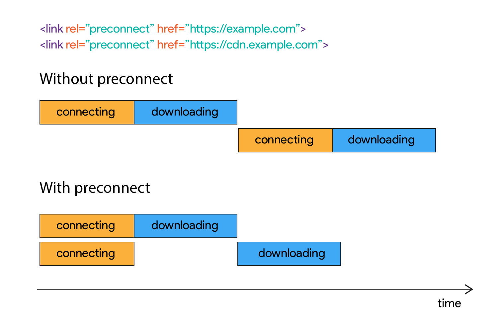
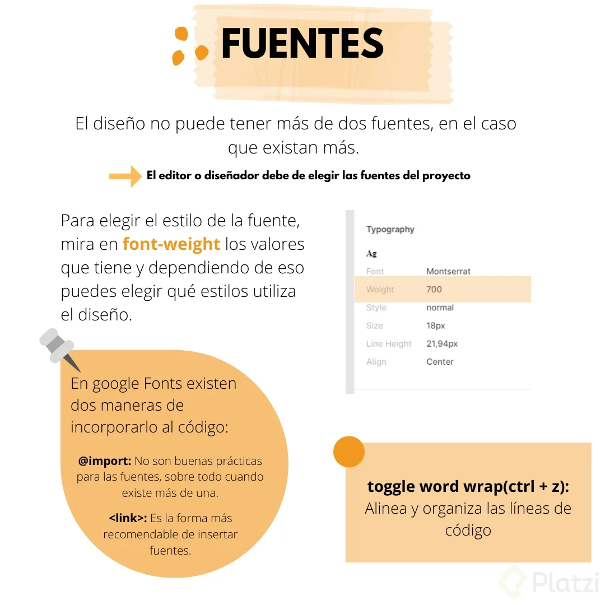

# Responsive Design: Maquetación Mobile First

### Diego Degranda

- [1. Bienvenida al curso](#1.-Bienvenida-al-curso)
  - [Introducción al curso](#Introducción-al-curso)
- [2. Setup inicial](#2.-Setup-inicial)
  - [Analizando el diseño](#Analizando-el-diseño)
  - [El valor de Mobile First](#El-valor-de-Mobile-First)
  - [Arquitectura inicial](#Arquitectura-inicial)
  - [Assets de nuestro proyecto](#Assets-de-nuestro-proyecto)
  - [Fuentes de nuestro proyecto](#Fuentes-de-nuestro-proyecto)
  - [Estilos base](#Estilos-base)
- [3. Sección de Header](#3.-Sección-de-Header)
  - [Maquetación del header](#Maquetación-del-header)
  - [Implementando BEM](#Implementando-BEM)
  - [Uso de linear-gradient](#Uso-de-linear-gradient)
  - [Uso de position para botón flotante](#Uso-de-position-para-botón-flotante)
- [4. Sección de Intercambios](#4.-Sección-de-Intercambios)
  - [Estructura base de la sección de intercambio](#Estructura-base-de-la-sección-de-intercambio)
  - [Imagen de background](#Imagen-de-background)
  - [Estructura de tabla de monedas](#Estructura-de-tabla-de-monedas)
  - [Estilos base de tabla de monedas](#Estilos-base-de-tabla-de-monedas)
  - [Detallando estilos de tabla de monedas](#Detallando-estilos-de-tabla-de-monedas)
  - [Finalizando estilos de tabla de monedas](#Finalizando-estilos-de-tabla-de-monedas)
- [5. Sección de Beneficios](#5.-Sección-de-Beneficios)
  - [Estructura base de la sección de beneficios](#Estructura-base-de-la-sección-de-beneficios)
  - [Estilos de la sección de beneficios](#Estilos-de-la-sección-de-beneficios)
  - [Maquetando tarjetas de beneficios](#Maquetando-tarjetas-de-beneficios)
- [6. Sección de Planes](#6.-Sección-de-Planes)
  - [Maquetando sección comodín](#Maquetando-sección-comodín)
  - [Estructura de sección de planes](#Estructura-de-sección-de-planes)
  - [Aplicando estilos a sección de planes](#Aplicando-estilos-a-sección-de-planes)
  - [Aplicando estilos a las tarjetas de la sección de planes](#Aplicando-estilos-a-las-tarjetas-de-la-sección-de-planes)
  - [Detallando estilos en tarjetas de planes](#Detallando-estilos-en-tarjetas-de-planes)
  - [Aplicando estilos al botón de call to action](#Aplicando-estilos-al-botón-de-call-to-action)
  - [Scroll horizontal con CSS](#Scroll-horizontal-con-CSS)
- [7. Sección de Footer](#7.-Sección-de-Footer)
  - [Footer](#Footer)
- [8. Media Queries](#8.-Media-Queries)
  - [Aplicando media queries](#Aplicando-media-queries)
- [9. Lighthouse](#9.-Lighthouse)
  - [Análisis con Lighthouse](#Análisis-con-Lighthouse)
- [10. Próximos pasos](#10.-Próximos-pasos)
  - [Cierre y próximos pasos](#Cierre-y-próximos-pasos)

***

# 1. Bienvenida al curso

  ## Introducción al curso

Bienvenido al curos de Reponsive Design  Maquetacion Mobile First

# 2. Setup inicial

  #  Analizando el diseño

**Analizando el diseño**

Al momento de iniciar a desarrollar un proyecto web es importante tomar el tiempo para analizar el diseño que recibimos por parte del equipo encargado de diseño. En esta parte lo más importante es identificar las distintas secciones en las que se divide el proyecto (header, secciones, footer); teniendo estos detalles podemos comenzar a maquetar en HTML estas secciones con sus respectivos espacios y tamaños.
Como herramienta de diseño, Figma es una excelente opción para tener una primera vista del diseño que se implementará en el proyecto.

- [Figma](https://www.figma.com)
- [Wireframe](https://webdesdecero.com/wireframes-que-son-y-como-crearlos/)
- [Que es Figma?](https://www.juanpol.com/que-es-figma/)


- [Mobil-First.pdf](https://drive.google.com/file/d/1NQ3TjPUOlk2ZmG1czXVGdZLrbHZzRrrF/view?usp=sharing)

- Extension de navegador **Responsive Viewer**

  #  El valor de Mobile First

Ya conoces la importancia del desarrollo Mobile First, ahora aprenderás el valor que entrega más allá de estar enfocado a las vistas móviles. Recuerda que en responsive design un diseño se adaptará a distintas vistas independientemente para cuál dispositivo se desarrolló primero y con este estándar primero crearemos para dispositivos móviles.

  ### ¿Quiénes se ven beneficiados?

- **Para desarrolladoras y desarrolladores: escalar es más sencillo**

Pasar un desarrollo con vista de escritorio a móvil requiere de realizar diversas consideraciones, puede tornarse complejo pues además esto implica tener que eliminar elementos de la vista y generalmente es más fácil añadirlos.

Mobile First por el contrario hace de esta experiencia algo más llevadero y a nivel del código es bastante sencillo pasar de móvil a vistas más grandes, con la oportunidad de colocar componentes adicionales en el proceso.

- **Para usuarios: menos es más y para más personas**

Sí, es cierto que cada vez es mayor la cantidad de personas navegando en dispositivos móviles y es que Mobile First no solo llega a más dispositivos por la enorme variedad de vistas disponibles en el mercado, sino también a más personas.

La simplicidad en el diseño también ayuda a que tu comunicación sea efectiva hacia tus usuarios, brindando una experiencia de navegación agradable y que junto a un diseño accesible tu alcance aumente considerablemente.

Esto también añade valor a tus usuarios con una velocidad de conexión limitada y/o dispositivos de gama baja.

- **Para negocios: mejor posicionamiento en buscadores**

Google comenzó trabajar a inicios de 2018 con un algoritmo que otorga de mayor relevancia a aquellos sitios optimizados para móviles. Esto no afectará a aquellos sitios que tengan una versión de escritorio y móvil, pero sí penalizará a los que carezcan de una alternativa móvil.

Para fines de SEO esto puede significar un menor rebote de usuarios si el contenido es lo suficientemente atractivo para retener la atención de los usuarios.

### Evolución progresiva

Así como avanza la tecnología también podemos apreciar los cambios en tendencias del desarrollo frontend que incluso llegan a convertirse en estándares, como ha sido Mobile First.

Primero desarrollamos para escritorio donde nuestro sitio web podía consumirse desde una computadora de escritorio y monitores en laptops. Después surgió la necesidad de adaptar estos sitios a dispositivos portátiles como teléfonos inteligentes y tablets.

Al aumentar el consumo de sitios en dispositivos móviles surgió la necesidad de desarrollar primero para estos y después escalar a otras pantallas más grandes. Esta evolución ha llevado al punto en que algunos servicios estén disponibles cómo mobile-only, donde la única forma de consumirlos es desde un dispositivo móvil como el caso de aplicaciones financieras, de entregas a domicilio y otras más.

### Twitter como caso de estudio

Esta popular red social ha pasado por diversas transformaciones en su diseño y una de las más importantes es su visualización desde diversos dispositivos.

Analizando estas capturas de pantalla podrás apreciar como desde la vista móvil se mantiene bastante simplificado, conforme aumenta se le añaden otros elementos y conserva otros en común.

- **Vista en móvil (iPhone X)**


- **Vista en navegador de escritorio**


- **Vista reducida en navegador de escritorio**


**Conclusión**

Ahora sabes cuál es la razón por la que este estándar es tan importante actualmente en tus conocimientos como desarrolladora o desarrollador web. Además de que estás asegurándote de que tus sitios lleguen a más dispositivos y personas, también estás haciendo que tu código sea más fácil de escalar y de hacer modificaciones en el futuro. Ahora, te invito a continuar con el curso y seguir aprendiendo más sobre Mobile First.

  #  Arquitectura inicial

La arquitectura web se puede definir como la forma en que las páginas de un sitio web están estructuradas y enlazadas entre sí (de manera lógica y coherente). Una arquitectura web ideal ayuda a los usuarios y a los motores de búsqueda a encontrar fácilmente lo que están buscando en un sitio web.

Arquitectura del proyecto:

  - **Header**
  - **4 secciones**
  - **Footer**

  ```html
  <body>
    <header></header>
    <main>
        <section></section>
        <section></section>
        <section></section>
        <section></section>
    </main>
    <footer></footer>
</body>
```

  #  Assets de nuestro proyecto

Los assets son todos los recursos estáticos que utilizaremos en nuestro proyecto, tales como:

- **Imágenes**

Logotipos/Isotipos (Si el logotipo y el nombre de la empresa/marca se encuentran en elementos separados, es preferible descargarlos agrupados)

- **Íconos**

**PRO TIP:** podemos descargar varios assets simultáneamente. Solo debemos seleccionar varios elementos, presionando CTRL + Clic sobre el elemento, y luego presionamos Export seleccionamos el formato, ¡y Listo! nuestros assets se descargaran en un archivo .zip

Clasificamos los assets según el tipo de recurso (imagen, ícono, etc…), además es recomendble que sigamos un estándar para nombrar nuestros archivos (nombre corto, desciptivo, en minúsculas, sin espacios) .
Finalmente la estructura de carpetas de nuestro proyecto debería quedar de esta forma:

```html
- assets
	- icons
	- img
		bitcon.svg
		logo.svg
	index.html
```

- [Proyecto batata-bit | GitHub](https://github.com/degranda/batata-bit)

- [Assets | drive](https://drive.google.com/file/d/1Jg6m-DyDNPlsPc6HgzJFdwmJH3-BYC-z/view)

  #  Fuentes de nuestro proyecto

El **tag de link** con el valor de atributo rel=“proconnect” permite notificarle al navegador que la página requiere establecer una conexión a otro dominio y que esta debe realizarse de la forma más rápida posible. De esta forma cuando el navegador requiera hacer uso de los recursos (en este caso los tipos de fuente), la descarga de recursos será más rápido porque la conexión ya existirá de forma previa.

Esto permite mejorar el performance de la página. Más información [aqui](https://css-tricks.com/using-relpreconnect-to-establish-network-connections-early-and-increase-performance/)





  #  Estilos base

**Configuracion Inicial del proyecto**

  - Posicionamiento --> static, absolute, relative, fixed
  - Modelo de caja (Box model) --> margin, border, padding, content
  - Tipografía --> tipos, tamaños de fuente, etc
  - Estilos visuales --> box-shadow, border-radius, gradient, etc
  - Otros --> reglas CSS y más

En el root nosotros vamos a implementar nuestras variables (color, fuente, etc)

```css
:root {
  --bitcoin-orange: #f1931a;
  --soft-orange: #ffe9d5;
  --secundary-blue: #1A9AF7;
  --soft-blue: #E7F5FF;
  --warm-black: #201E1C;
  --black: #282623;
  --grey: #bababa;
  --off-white: #FAF8F7;
  --just-white: #FFF;
}

* {
  box-sizing: border-box;
  padding: 0;
  margin: 0;
}

html {
  font-size: 62.5%;
  font-family: 'DM Sans', sans-serif;
  font-family: 'Fira Code', monospace;
}
```

# 3. Sección de Header

  ## Maquetación del header

Por buenas prácticas cualquier página, pantalla solo puede tener un h1 por temas de SEO.
El ícono lo meteremos dentro de la etiqueta span, es una etiqueta comodín que nos ayuda justo para ese tipo de textos o iconos que incluso van adentro de una etiqueta.

**Composición de header:**

  1. Logotipo
  2. Encabezado
  3. Párrafo
  4. Botón flotante

**Código de header:**

```html

<div>
    <h1></h1>
    <p></p>
    <a href=""><span></span></a>
</div>
```

  ## Implementando BEM

**¿Qué es BEM?**

**Block Element Modifier**: es un enfoque basado en componentes para el desarrollo web. La idea de esta metodología es dividir en bloques independientes nuestro layout.

- **Bloque**

Contenedor o contexto donde se encuentra un elemento. Conforma la raíz de una clase.
El nombre del bloque describe su propósito (¿Qué es?🤔) y NO su estilo (¿Cómo se ve?😎).

```html
<!-- Bloque encabezado -->
<headerclass="encabezado">
	<!-- Bloque logo anidado -->
	<divclass="logo"></div>
<!-- Bloque formulario anidado -->
	<formclass="formulario"></form>
</header>
```

- **Elemento**

Es una pieza del bloque. Se puede decir que el bloque es el todo y los elementos
son las piezas que lo conforman. No puede usarse separado de un bloque.
El nombre del elemento describe su propósito (¿Qué es?🤔) y NO su estilo (¿Cómo se ve?😎).
La estructura de un elemento es : bloque__elemento

```html
<!-- Bloque “formulario-búsqueda” -->
<formclass="formulario-busqueda">
	<!-- Elemento “input” -->
	<inputclass="formulario-busqueda__input">
	<!-- Elemento “boton” -->
	<buttonclass="formulario-busqueda__boton">
	Search
	</button>
</form>
```

- **Modificador**

Define la apariencia, estado o comportamiento de un bloque o un elemento.
El nombre del modificador describe su apariencia (“¿Qué tamaño? 📏”), su estado (activado✅/desactivado❌, enfocado📷, etc.) y su comportamiento (“¿Cómo se comporta?👨‍🔧”).

La estructura de un modificador es:

  - bloque–-modificador
  - bloque__elemento–-modificador

```html
<formclass="form-busqueda form-busqueda--focused">
	<inputclass="form-busqueda__input">
	<button class="form-busqueda__boton
form-busqueda__boton--desactivado">Search</button>
</form>
```

 [🚀 cómo utilizar BEM en nuestros proyectos Front-End](https://platzi.com/tutoriales/2030-mobile-first/8065-como-implementar-bem-en-tus-proyectos-front-end/)

[Documentacion de BEM](https://en.bem.info/methodology/quick-start/)

  ## Uso de linear-gradient

 **line-height:** NO modifica la altura de la tipografía sino la distancia entre la línea base de las palabras (cuando estas se colocan una encima de otra)

```css
linear-gradient(207.8deg, #201E1C 16.69%, #F7931A 100%);
```

**Herramienta css Gradient**

  - **[CSS Gradient](https://cssgradient.io)**
  - **[GRADIENT BACKGROUND](https://cssgradient.io/gradient-backgrounds/)**
  - **[uiGradients](https://uigradients.com/#Kyoto)**

**Documentacion linear-gradient**

  - [Documents Linear-Gradient](https://www.aprenderaprogramar.com/index.php?option=com_content&view=article&id=765:degradados-css-efecto-lineal-y-radial-linear-gradient-angulos-css-unidades-deg-grad-turn-rad-cu01060d&catid=75&Itemid=203#:~:text=CSS%20permite%20la%20especificaci%C3%B3n%20de,de%20circunferencia%20turn%20y%20radianes.)
  - [linear-gradient](https://www.aprenderaprogramar.com/index.php?option=com_content&view=article&id=765:degradados-css-efecto-lineal-y-radial-linear-gradient-angulos-css-unidades-deg-grad-turn-rad-cu01060d&catid=75&Itemid=203#:~:text=CSS%20permite%20la%20especificaci%C3%B3n%20de,de%20circunferencia%20turn%20y%20radianes.)
  - [Usando gradientes con CSS](https://developer.mozilla.org/es/docs/Web/CSS/CSS_Images/Using_CSS_gradients)

  ## Uso de position para botón flotante

**La función CSS Calc()** permite realizar operaciones con los valores de propiedades CSS.
Se puede usar para operar con medidas, frecuencias, ángulos, tiempo, porcentajes, números y enteros.

Sintaxis:

```css
/* Propiedad: calc ( expresión) */
width: calc(100% - 80px);
```

Se pueden utilizar operaciones de suma (+), resta (-), multiplicación (*) y división (/). En el caso de la suma y resta, es necesario siempre dejar espacios en blanco (whitespaces) entre los valores para que no se generen errores.

- [calc](https://developer.mozilla.org/es/docs/Web/CSS/calc())

# 4. Sección de Intercambios

## Estructura base de la sección de intercambio

la imagen de Bitcoin la va a utilizar de Background y usando div es mucho más fácil manipularlo.
También es posible con figure.

Arquitectura HTML de la primera sección:

```html
<section class="main-exchange-container">
	<div class="imgBackground"></div>
	<div class="main-exchange-container__title">
		<h2></h2>
		<p></p>
	</div>
	<section class="main-table-container">
		<div>
		</div>
	</section>
</section>
```


## Imagen de background

**background-size** sirve bastante para manejar de que manera queremos que se vea la imagen en el fondo.

Cover por ejemplo, para que la imagen cubra todo el espacio según el tamaño del contenedor.

El shorthand de la imagen de background sería:

```css
background: url('./assets/images/bitcoin.svg') center/cover no-repeat;
```

Tener en cuenta que se debe separar el background-position y el background-size por un slash (/) usando esta forma.

## Estructura de tabla de monedas

`tr` hace referencia a las filas que van a tener estas tablas y `td` que hace referencia a la información que va a tener esta fila. En este ejemplo sería una fila y dos columnas.

```html
<table>
  <tr>
    <td></td>
    <td></td>
  </tr>
</table>
```

La etiqueta `<b>` sirve para hacerle bold al texto

```html
<b>Actualizado:</b>
```

Aprender a usar <table> nos da un valor agregado bastante importante ya que esta es la forma con la cual se maquetan y diseñan los emails (Platzi tiene un curso sobre esto). De esta forma podríamos colaborar con el equipo de email marketing para crear emails atractivos. 😎

- [Documentation table](https://developer.mozilla.org/es/docs/Web/HTML/Element/table)

**Etiquetas de tablas**

```html
<!-- Etiquetas de tablas -->
<table></table> <!-- Tabla de datos tabulados -->
  <border></border> <!-- Fallback para UA limitados -->
  <sortable></sortable> <!-- Permite ordenar columnas -->
<tr></tr> <!-- Fila de la tabla (row) -->
<th></th> <!-- Cabecera de la tabla (header) -->
<caption></caption> <!-- Leyenda de la tabla -->
<thead></thead> <!-- Agrupacion de cabeceras -->
<tbody></tbody> <!-- Agrupacion de datos -->
<tfoot></tfoot> <!-- agrupacion de pie de tabla -->
<col> | <colgroup></colgroup> <!-- columna | agrupacion -->
  <span></span> <!-- aplicar a X columnas -->
```

## Estilos base de tabla de monedas


## Detallando estilos de tabla de monedas


## Finalizando estilos de tabla de monedas


# 5. Sección de Beneficios

  ## Estructura base de la sección de beneficios


  ## Estilos de la sección de beneficios

-   **left(atributo):** Alinea un elemento con referencia al lado izquierdo de nuestro contenedor.

-   **calc()(función):** Nos permite realizar cálculos para determinar valores de propiedades CSS.

-   **50%(parámetro):** Representa la mitad del ancho del contenedor(para 320px, el 50% serían = 160px), lo cual alineará nuestro elemento 160px de izquierda(left) a derecha.

-   **20px:** Representan la mitad del ancho(width) de nuestro elemento, esto se hace con la finalidad de poder posicionarlo en el centro de nuestro contenedor.

  ## Maquetando tarjetas de beneficios

Para no repetir codigo, cree una clase llamada icon-card y luego a cada icono le asignaba un background diferente.

```html
<section class="product-cards-container">
  <article class="product-detail-card">
      <span class="icon-card clock"></span>
      <h3 class="product-card-title">Tiempo real</h3>
      <p class="product-card-body">
          Nuestra API toma información minuto a minutro sobre las tareas que
          determinan el comportamiento.
      </p>
  </article>
  <article class="product-detail-card">
      <span class="icon-card eye"></span>
      <h3 class="product-card-title">No hay tasas escondidas</h3>
      <p class="product-card-body">
          Ni en la compra o al momento de exit. Barabit siempre te muestra el
          costo real de lo estás alquilando.
      </p>
  </article>
  <article class="product-detail-card">
      <span class="icon-card dollar"></span>
      <h3 class="product-card-title">Compara monedas</h3>
      <p class="product-card-body">
          No más rumores, con Batabit sabrás el valor real de cada moneda en el
          mercado actual.
      </p>
  </article>
  <article class="product-detail-card">
      <span class="icon-card circle"></span>
      <h3 class="product-card-title">Información confiable</h3>
      <p class="product-card-body">
          Nuestras fuentes están 100% verificadas y continuamos auditando su
          contenido mientras se actualizan.
      </p>
</section>
```

```css
.product-detail--card .icon-card {
    display: inline-block;
    width: 20px;
    height: 20px;
    margin-bottom: 10px;
    background-position: center;
    background-size: cover;
    background-repeat: no-repeat;
    
}

.clock {
    background-image: url('./../assets/icons/clock.svg');
}

.eye {
    background-image: url('./../assets/icons/aye.svg')
}

.dolar {
    background-image: url('./../assets/icons/dollar-sign\ 1.svg');
}

.circle{
    background-image: url('./../assets/icons/check-circle\ 1.svg');
}

.product-card-title {
    margin-bottom: 15px;
    font-size: 1.8rem;
    font-weight: bold;
    line-height: 1.8rem;
    color: var(--white);
}
.product-card-body {
    font-size: 1.4rem;
    font-weight: 500;
    line-height: 1.8rem;
    color: #808080;
}
```

# 6. Sección de Planes

## Maquetando sección comodín

Establecer la imagen de la chica, en sección comodín.

**El Viewport Height (vh)** se refiere al área visible en pantalla de un dispositivo, tomando el alto necesario según el caso donde se aplique.
Por ejemplo si se hace una sección y se quiera que ocupe la mitad de la pantalla, se colocaría un height: 50vh.

## Estructura de sección de planes

Podemos generar de manera sencilla un smooth scrolling al hacer clic en el botón del header agregando al CSS:

```css
html {
	scroll-behavior: smooth;
}
```

## Aplicando estilos a sección de planes

Se le puede aplicar al contenedor el siguiente padding:

```css
.plans-container {
    padding: 65px 0;
}
```

En lugar de darle un padding-bottom a éste contenedor y un padding-top al h2

## Aplicando estilos a las tarjetas de la sección de planes

Colocar la etiqueta de forma diagonal.

```css
<..plans__card {
    overflow: hidden;
}

plan__card--title {
    position: relative;
    z-index: 3;
}

.recommended {
    position: absolute;
    width: 14rem;
    top: 30px;
    right: -32px;
    transform: rotate(45deg);
}
```

## Detallando estilos en tarjetas de planes


## Aplicando estilos al botón de call to action


## Scroll horizontal con CSS

  - **[overflow-x](https://developer.mozilla.org/en-US/docs/Web/CSS/overflow-x)**

La propiedad de CSS overflow-x establece lo que se muestra cuando el contenido desborda los bordes izquierdo y derecho de un elemento a nivel de bloque. Puede que no sea nada, una barra de desplazamiento o el contenido adicional.

  - **[overscroll-behavior](https://developer.mozilla.org/en-US/docs/Web/CSS/overscroll-behavior)**

la propiedad de css overscroll-behabior establece lo que hace un navegador cuando alcanza el límite de un área de desplazamiento. Es una abreviatura de overscroll-behavior-x y overscroll-behavior-y.

  - **[scroll-snap-type](https://developer.mozilla.org/en-US/docs/Web/CSS/scroll-snap-type)**

La propiedad CSS scroll-snap-type establece qué tan estrictamente se aplican los puntos de snap en el contenedor de desplazamiento en caso de que haya uno

# 7. Sección de Footer

  ## Footer

# 8. Media Queries

  ## Aplicando media queries

- [Media Queries](https://css-tricks.com/snippets/css/media-queries-for-standard-devices/)

colocar las dos tablas:

```css
.main-currency-table, .main-commission-table {
    display: inline-block;
    width: 49%;
}
Para eliminar el scroll del slider, ya que queda bastante mal desde una pantalla grande que se vea una barra de scroll que encima no hace nada jajaja.

.plans-container__slider {
    justify-content: center;
    overflow-x: hidden;
}
```

# 9. Lighthouse

  ## Análisis con Lighthouse

  - [Tu proyecto es accesible para la Web](https://platzi.com/blog/accesibilidad-web/)
  
# 10. Próximos pasos

  ## Cierre y próximos pasos

