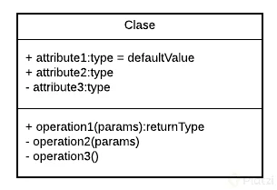
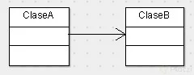

# Programación Orientada a Objetos?
#### Isis Garcia

# Tabla de contenido
- [Programación Orientado a Objetos](#Programación-Orientado-a-Objetos)
- [¿Qué resuelve la Programación Orientada a Objetos?](#¿Qué-resuelve-la-Programación-Orientada-a-Objetos?)
- [Paradigma Orientado a Objetos](#Paradigma-Orientado-a-Objetos)
- [Lenguajes Orientados a Objetos](#Lenguajes-Orientados-a-Objetos)
- [Configurar Entorno de Desarrollo](#Configurar-Entorno-de-Desarrollo)
- [Diagramas de Modelado](#Diagramas-de-Modelado)
  - [Diagramas de Modelado](#Diagramas-de-Modelado)
  - [Asignaci&oacute;n](#Asignaci&oacute;n)
  - [Herencia](#Herencia)
  - [Agregación](#Agregación)
  - [Composición](#Composición)
- [Objetos](#Objetos)
- [Abstracción y Clases](#Abstracción-y-Clases)
- [Modularidad](#Modularidad)
- [Clase](#Clase)
- [lases en UML y su sintaxis en código](#lases-en-UML-y-su-sintaxis-en-código)
- [Clase - objeto](#Clase---objeto)
- [¿Qué es la herencia?](#¿Qué-es-la-herencia?)
  - [Reto Adopci&oacute;n de Animales](#Reto-Adopci&oacute;n-de-Animales)
  - [efiniendo clases](#efiniendo-clases)
  - [Objetos, método constructor y su sintaxis en código](#Objetos,-método-constructor-y-su-sintaxis-en-código)
- [M&eacute;todo constructor](#M&eacute;todo-constructor)
- [Clases en Java y Python](#Clases-en-Java-y-Python)
- [Declarando un Método Constructor en Java y JavaScript](#Declarando-un-Método-Constructor-en-Java-y-JavaScript)
- [JavaScript orientado a objetos](#JavaScript-orientado-a-objetos)
- [Declarando un Método Constructor en Python](#Declarando-un-Método-Constructor-en-Python)
- [herencia](#herencia)
  - [Javas y PHP](#Javas-y-PHP)
  - [Otros tipos de Herencia](#Otros-tipos-de-Herencia)
- [Encapsulamiento](#Encapsulamiento)
- [Getters y Setters Python](#Getters-y-Setters-Python)
- [Generando polimorfismo en Java](#Generando-polimorfismo-en-Java)
- [El Diagrama UML de Uber](#El-Diagrama-UML-de-Uber)
  - [Asociación](#Asociación)
  - [herencia](#herencia)
  - [Composición](#Composición)

## Programación Orientado a Objetos
Vas a programar más rápido. Tener un análisis previo de lo que estás realizando te ayudará a generar código mucho más veloz

Dejas de ser Programador Jr. Podrás responder preguntas como ¿Qué es encapsulamiento?, ¿Qué es Abstracción?, ¿Qué es Herencia?, ¿Qué es Polimorfismo? en futuras entrevistas de trabajo

Dejar de Copiar y Pegar Código.

La programación orientada a objetos tiene cuatro características principales:

***Encapsulamiento.*** Quiere decir que oculta datos mediante código.

***Abstracción.*** Es como se pueden representar los objetos en modo de código.

***Herencia.*** Es donde una clase nueva se crea a partir de una clase existente.

***Polimorfismo.*** Se refiere a la propiedad por la que es posible enviar mensajes sintácticamente iguales a objetos de tipos distintos.

En este curso, los pasos a seguir será.

***Analisis***

***Plasmar***

***Programar***

La mayoría solo aprende a hacer esto en un lenguajes de programación,aquí se tiene una variabilidad. ❤️


## ¿Qué resuelve la Programación Orientada a Objetos?

La programación Orientada a Objetos nace de los problemas creados por la programación estructurada y nos ayuda a resolver cierto problemas como:

**Código muy largo:** A medida que un sistema va creciendo y se hace más robusta el código generado se vuelve muy extenso haciéndose difícil de leer, depurar, mantener.

**Si algo falla, todo se rompe:** Ya que con la programación estructurada el código se ejecuta secuencialmente al momento de que una de esas líneas fallara todo lo demás deja de funcionar.

**Difícil de mantener**.

## Paradigma Orientado a Objetos

> La Programación Orientada a Objetos viene de una filosofía o forma de pensar que es la Orientación a Objetos y esto surge a partir de los problemas que necesitamos plasmar en código.

Es analizar un problema en forma de objetos para después llevarlo a código, eso es la Orientación a Objetos.

Un paradigma es una teoría que suministra la base y modelo para resolver problemas. La paradigma de 

__Programación Orientada a Objetos se compone de 4 elementos:__

* Propiedades
* Clases
* Métodos
* Objetos

Y 4 Pilares:

* Encapsulamiento
* Abstracción
* Herencia
* Polimorfismo

## Lenguajes Orientados a Objetos
Algunos de los lenguajes de programación Orientados a Objetos son:

  * Java:

    * Orientado a Objetos naturalmente
    * Es muy útilizado en Android
    * Y es usado del lado del servidor o Server Side

  * PHP

    * Lenguaje interpretado
    * Pensado para la Web

  * Python

    * Diseñado para ser fácil de usar
    * Múltiples usos: Web, Server Side, Análisis de Datos, Machine Learning, etc

  * Javascript

    * Lenguaje interpretado
    * Orientado a Objetos pero basado en prototipos
    * Pensado para la Web

  * C#
  * Ruby
  * Kotlin

  ## Configurar Entorno de Desarrollo

  [Visual Studio Code](https://code.visualstudio.com)

  Extensiones:

  [Java](https://code.visualstudio.com/docs/languages/java)

  [Python](https://www.python.org/downloads/)

  ## Diagramas de Modelado

OMT: Object Modeling Techniques. Es una metodología para el análisis orientado a objetos.

UML: Unified Modeling Language o Lenguaje de Modelado Unificado. Tomó las bases y técnicas de OMT unificándolas. Tenemos más opciones de diagramas como lo son Clases, Casos de Uso, Objetos, Actividades, Iteración, Estados, Implementación.

Toma todas las bases y técnicas del OMT, las unifica y permite una ampliación de apicaciones, no solo objetos y clases. Sino que incluye casos de uso, actividades, iteración, estados e implementación.

Un buen desarrollador debe manejar y dominar con fluidez, conceptos de UML ya que es lo que nos van a entregar cuando empecemos a trabajar en un proyecto que se haya construido bajo la arquitectura POO.


***UML***
Unified Modeling Language |
Lenguaje de Modelado Unificado

  ### Diagramas de Modelado

Tenemos dos diagramas de modelado:

OMT, Object Modeling techniques. Es una técnica para el análisis orientado a objetos. Creado en OMT 1991. Se encuentra en desuso.
UML, Unified Modeling Language. Es un lenguaje de modelado unificado. Esta tomó todas las bases y técnicas de OMT, y las unió para generar una mejor versión de esto. Creado en 1997.

**OMT**
Esta técnica nos propone es que una vez que tenemos nuestro análisis, ya tenemos identificado objetos, sus atributos, sus métodos y ya le hemos puesto nombre a cada objeto, la técnica nos dice que debemos empezar a plasmar cada objeto en un recuadro, y pongamos los atributos y métodos en el recuadro, y con una serie de conectores vamos a definir una relación que tiene un objeto con otro.

**UML**
Con está técnica podemos tener más opciones de diagramas y podemos modelar:

* Clases
* Casos de uso 
* Objetos
* Actividades
* Iteración
* Estados
* Implementación

Una vez ya tengamos un análisis con nuestros objetos, atributos y métodos vamos terminar plasmándolo en algún diagrama.

[Lucidchart](https://www.lucidchart.com/pages/)

[StarUML](https://staruml.io/download)

[cacco](https://cacoo.com)

**UML significa Unified Modeling Language** el cual es un lenguaje estándar de modelado de sistemas orientados a objetos.

Las **clases**  se representan asi:



En la parte superior se colocan los atributos o propiedades, y debajo las opera ciones de la clase. Notarás que el primer caracter con el que empiezan es un símbolo. Este denotará la visibilidad del atributo o método, esto es un término que tiene que ver con Encapsulamiento y veremos más adelante a detalle.

Estos son los niveles de visibilidad que puedes tener:

```uml
- private
+ public
# protected
~ default
```

Una forma de representar las relaciones que tendrá un elemento con otro es a través de las flechas en UML, y aquí tenemos varios tipos, estos son los más comunes:

  ### Asignaci&oacute;n

  

  Como su nombre lo dice, notarás que cada vez que esté referenciada este tipo de flecha significará que ese elemento contiene al otro en su definición. La flecha apuntará hacia la dependencia.

  

Con esto vemos que la ClaseA está asociada y depende de la ClaseB.

  ### Herencia

  

  Siempre que veamos este tipo de flecha se estará expresando la herencia.
  La dirección de la flecha irá desde el hijo hasta el padre.

  

  Con esto vemos que la ClaseB hereda de la ClaseA

  ### Agregación

  

  Este se parece a la asociación en que un elemento dependerá del otro, pero en este caso será: Un elemento dependerá de muchos otros. Aquí tomamos como referencia la multiplicidad del elemento. Lo que comúnmente conocerías en Bases de Datos como Relaciones uno a muchos.

  

  Con esto decimos que la ClaseA contiene varios elementos de la ClaseB. Estos últimos son comúnmente representados con listas o colecciones de datos.

  ### Composición

  

  Este es similar al anterior solo que su relación es totalmente compenetrada de tal modo que conceptualmente una de estas clases no podría vivir si no existiera la otra.

  

  Con esto terminamos nuestro primer módulo. Vamos al siguiente para entender cómo podemos hacer un análisis y utilizar estos elementos para construir nuestro diagrama de clases de Uber.

  ## Objetos

Los Objetos son aquellos que tienen propiedades y comportamientos, también serán sustantivos.

* Pueden ser Físicos o Conceptuales

Las Propiedades también pueden llamarse atributos y estos también serán sustantivos. Algunos atributos o propiedades son nombre, tamaño, forma, estado, etc. Son todas las características del objeto.

Los Comportamientos serán todas las operaciones que el objeto puede hacer, suelen ser verbos o sustantivos y verbo. Algunos ejemplos pueden ser que el usuario pueda hacer login y logout.


  ## Abstracción y Clases

Una ***Clase*** es el modelo por el cual nuestros objetos se van a construir y nos van a permitir generar más objetos.

Analizamos Objetos para crear ***Clases***. Las ***Clases*** son los modelos sobres los cuales construiremos nuestros objetos.

***Abstracción*** es cuando separamos los datos de un objeto para generar un molde.

  ## Modularidad

La modularidad va muy relacionada con las clases y es un principio de la Programación Orientado a Objetos y va de la mano con el Diseño Modular que significa dividir un sistema en partes pequeñas y estas serán nuestros módulos pudiendo funcionar de manera independiente.

La modularidad de nuestro código nos va a permitir

  * Reutilizar
  * Evitar colapsos
  * Hacer nuestro código más mantenible
  * Legibilidad
  * Resolución rápida de problemas

Una buena práctica es separando las clases en archivos diferentes.

  ## Clase

  * Modularidad.
  * Divide el programa en diferentes partes o m&oacute;dulos /clases.
  * Separa las clases en archivos.

  ## Clases en UML y su sintaxis en código

**Recuerda que el proceso es:**
* Identificar el problema, y objetos
* Definir las clases
* Plasmarlas en un diagrama

**Se lo puede plasmar en UML:**
* Identidad, que será el nombre de la clase.
* Estado, que serán los atributos de la clase.
* Comportamiento, que serán las operaciones de la clase.

***Definir clases en cada lenguaje de programación:***


**Class Online Shopping**


**Nombre de las llaves**

```md
{ } llaves ( curly braces ó braces)

[ ] corchetes ( brackets ó square brackets)

( ) paréntesis (parentheses)
````

### Clase - objeto


## Modelado objeto Uber

[Principio Open/Closed ](https://devexperto.com/principio-open-closed/)


## ¿Qué es la herencia?

**Don’t repeat yourself** es una filosofía que promueve la reducción de duplicación en programación, esto nos va a inculcar que no tengamos líneas de código duplicadas.

Toda pieza de información nunca debería ser duplicada debido a que incrementa la dificultad en los cambios y evolución

La **herencia** nos permite crear nuevas clases a partir de otras, se basa en modelos y conceptos de la vida real. También tenemos una jerarquía de padre e hijo.

  > _Crear nuevas clases a partir de otras_

  > Establece una relaci&oacute;n padre e hijo

  > Superclase < subclase

* Reutilizar codigo


[Funciones-Javascript-developer.mozilla.org](https://developer.mozilla.org/es/docs/Web/JavaScript/Referencia/Funciones)

**Herenia**

**Superclases**

**Account**


**payments**


**Car**


**Diagrama**


### Reto Adopci&oacute;n de Animales


### Definiendo clases


### Objetos, método constructor y su sintaxis en código

Los **objetos** nos ayudan a crear instancia de una clase, el objeto es el resultado de lo que modelamos, de los parámetros declarados y usaremos los objetos para que nuestras clases cobren vida.

Los **métodos constructores** dan un estado inicial al objeto y podemos añadirle algunos datos al objeto mediante estos métodos. Los atributos o elementos que pasemos a través del constructor serán los datos mínimos que necesita el objeto para que pueda vivir.

  ## M&eacute;todo constructor

  * Dar un estado inicial al objeto.
  * Tiene el mismo nombre de la clase.
  * Son los par&aacute;metros n&iacute;nimos que necesita el objeto para que pueda vivir.

  ## Clases en Java y Python

  ## Declarando un Método Constructor en Java y JavaScript

  ## JavaScript orientado a objetos

  A partir de las nuevas especificaciones del EcmaScript 6 ya podemos declarar una clase con la palabra reservada class, aunque es importante aclarar que estos no dejan de ser prototipos, sino todo lo contrario.

Además tendremos una palabra clave para definir un constructor, y dentro de este estarán las propiedades de nuestra clase definidas listas para inicializarse.

Transcribamos el código JavaScript que generamos en la clase anterior a este nuevo estándar.

  ## Declarando un Método Constructor en Python 

  En Python encontrarás un concepto denominado Métodos Mágicos, estos métodos son llamados automáticamente y estrictamente bajo ciertas reglas. El método constructor en Python forma parte de esta familia de métodos y como aprendimos en la clase anterior lo declaramos usando `__init__`, aunque si nos ponemos estrictos este método no construye el objeto en sí. El encargado de hacer esto es `__new__` y el método `__init__` se encargará de personalizar la instanciación de la clase, esto significa que lo que esté dentro de `__init__` será lo primero que se ejecute cuando se cree un objeto de esta clase.

  Para nuestro proyecto tenemos la necesidad de que algunas variables se inicialicen obligatoriamente cuando ocurra la instanciación. Así que declaremos el método `__init__` en las clases de nuestro proyecto con las propiedades obligatorias.

  Para la clase Account quedaría algo así, notarás que usamos la palabra clave self, esta es muy parecida a lo que venimos trabajando a otros lenguajes con this. Y como su nombre lo dice hace referencia a los datos que componen la clase, en este caso `self.name` está llamando al atributo name que se encuentra en la línea 3 de la clase y, le está asignando el dato que se pasa en el método `__init__` de la línea 8.

# herencia

  ## Javas y PHP

  ## Otros tipos de Herencia

  A partir de ahora las clases que estén siendo heredades las llamaremos familias.

Acabamos de aplicar herencia a la familia Car. Ahora apliquémosla a la familia Payment.

En clases anteriores te mencioné que otro punto de partida que puedes tomar para aplicar herencia es del hecho de que hay clases que lógicamente deberían estar en una familia, como es el caso de Payment.


Notarás que a nivel de código parece inservible pero cuando estemos en el caso de uso Pagar un Viaje, probablemente en ese momento no sabremos cuál es el método de pago, y necesitemos ingresar un dato lo suficientemente genérico que conceptualmente nos dé la información que necesitamos, en este caso que es un Payment. Este es un tipo de Polimorfismo y uno de los principios SOLID del software que obedece a la Inyección de Dependencias. Lo veremos más adelante a detalle.

# Encapsulamiento

Es hacer que los datos sean inviolables, inalterable o hacer que se esconda, cuando se le asigne un Modificador de Acceso.

**Modificadores de Acceso:**

Public: Es el mas permisivos de todos, Accede a todo.
Protected: Podrá ser accedido por la clase, paquetes y subclases.
Default: Permite el acceso a nivel de clses de internas y paquetes (No podremos ver las herencias si ha detener (Osea subclases))
Private: Solo podrá ser modificado dentro de la clase.

Se puede encapsular: elementos o atributos, clases o incluso métodos; El encapsulamiento nos permite tener dicho elemento inalterable en la POO.

> **Encapsulamiento:** Para que un dato permanezca inviolable, inalterable, se le asigna un modificador de acceso.

**Public:** Todas las Clases.

**Protected:** En la misma Clase, paquetes, subclases.

**Default:** En la misma Clase y paquetes internos.

**Private:** Solo en la misma Clase


[How to pronounce Public](https://www.youtube.com/watch?v=9PQVbDSiaAM)

## Getters y Setters Python

En python no existen como tal las variables privadas, pero se pueden “esconder” o volver privadas con solo colocarle doble guion bajo al nombre de la variable.

# Generando polimorfismo en Java

Polimorfismo: Muchas formas. Poli = muchas, morfismo = formas. NO es Poliformismo

Es construir métodos con el mismo nombre pero con comportamiento diferente

  * Muchas formas
  * Construir m&eacute;todos con el mismo nombre pero con comportamiento diferente.

  ## El Diagrama UML de Uber

  Este es el diagrama que finalmente obtuvimos, aquí solo faltaría añadirle los atributos que posee cada clase.

  

Recopilemos todo lo que hemos aprendido para explicar los últimos detalles.

En primer lugar notarás que tenemos 3 tipos de flechas:


### Asociación


Como su nombre lo dice, notarás que cada vez que esté referenciada este tipo de flecha significará que ese elemento contiene al otro en su definición. Si recuerdas la clase Car, este contenía una instancia de Driver. La flecha apuntará hacia la dependencia.


### herencia


Siempre que veamos este tipo de flecha se estará expresando la herencia.
En nuestro diagrama tuvimos al menos tres familias conviviendo. La dirección de la flecha irá desde el hijo hasta el padre.

**Familia Car**


**Familia Account**


**Familia Payment**


### Composición


Pasemos a una de nuestras piezas claves, pues notarás en el centro del diagrama la clase Trip que está vinculada a User, Car, Route y Payment. La composición va a significar una asociación entre estas clases con la diferencia de que para que esta clase pueda vivir forzosamente necesita a las demás. Es decir que estas clases son obligatorias para que la clase Trip pueda existir, esta dependencia obligatoria podríamos expresarla en el método constructor de la clase Trip, pues para que un objeto pueda ser creado dependerá de que los demás existan.


Esta clase Trip poseerá la lógica más fuerte del negocio aquí será donde se concentrarán la mayor cantidad de clases.

Esto es todo nuestro diagrama de clases, que quedó totalmente expresado en nuestro proyecto.
