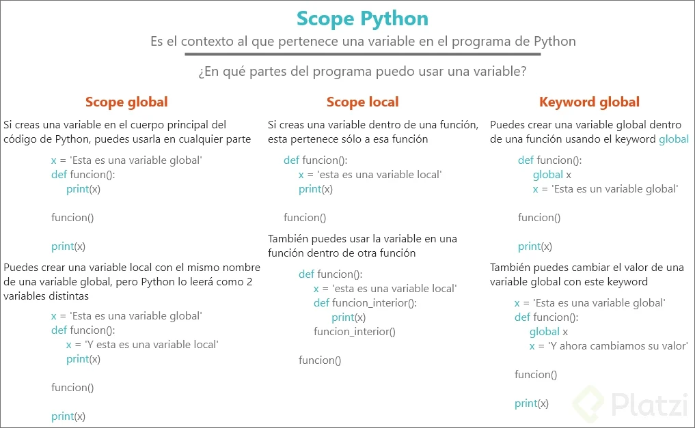

# Pensamiento Computacional con Python   
_David Aroesti_

# Tabla de Contenido
- [History](#History)
  - [C&oacute;mputo y computadoras](#C&oacute;mputo-y-computadoras)
- [Lenguajes de Programaci&oacute;n](#Lenguajes-de-Programaci&oacute;n)
  - [¿Qué es un lenguaje de programación?](#¿Qué-es-un-lenguaje-de-programación?)
  - [¿Qué tipos de lenguaje de programación existen?](#¿Qué-tipos-de-lenguaje-de-programación-existen?)
  - [Lenguaje de programación de bajo nivel](#Lenguaje-de-programación-de-bajo-nivel)
  - [Lenguaje máquina](#Lenguaje-máquina)
  - [Lenguaje ensamblador](#Lenguaje-ensamblador)
- [Lenguaje de programación de alto nivel](#Lenguaje-de-programación-de-alto-nivel)
  - [Traductor](#Traductor)
  - [Compilador](#Compilador)
- [Objetos](#Objetos)
- [Tipos](#Tipos)
- [Escalares -  No Escalares](#Escalares---No-Escalares)
- [Asignaci&oacute;n de Variables](#Asignaci&oacute;n-de-Variables)
  - [__Garbage Colletor__](#_Garbage-Colletor_)
- [Variables y Entradas](#Variables-y-Entradas)
  - [Entradas](#Entradas)
- [Programas Ramificados](#Programas-Ramificados)
  - [Iteraciones - Loops](#Iteraciones---Loops)
- [Bucles for](#Bucles-for)
  - [Representaci&oacute;n de flotantes](#Representaci&oacute;n-de-flotantes)
- [Programas Num&eacute;ricos](#Programas-Num&eacute;ricos)
  - [Enumeraci&oacute;n Exhaustiva](#Enumeraci&oacute;n-Exhaustiva)
  - [Aproximaci&oacute;n de Soluciones](#Aproximaci&oacute;n-de-Soluciones)
  - [B&uacute;squeda binaria](#B&uacute;squeda-binaria)
- [Funciones y astraci&oacute;n](#Funciones-y-astraci&oacute;n)
  - [Descomposici&oacute;n](#Descomposici&oacute;n)
  - [Scope o Alcance](#Scope-o-Alcance)
- [Especificaciones del c&oacute;digo](#Especificaciones-del-c&oacute;digo)
  - [Recursividad](#Recursividad)
  - [Factoriales](#Factoriales)
  - [Recursividad](#Recursividad)
- [Tipos estructurados, mutabilidad y funciones de alto nivel](#Tipos-estructurados,-mutabilidad-y-funciones-de-alto-nivel)
  - [Tuplas](#Tuplas)
  - [Rangos](#Rangos)
  - [Listas y mutabilidad](#Listas-y-mutabilidad)
  - [Clonaci&oacute;n](#Clonaci&oacute;n)
  - [List comprehension](#List-comprehension)
  - [Diccionarios](#Diccionarios)
- [Pruebas y debugging](#Pruebas-y-debugging)
  - [Prueba de caja negra](#Prueba-de-caja-negra)
  - [Preubas de caja de cristal](#Preubas-de-caja-de-cristal)
- [Debugging](#Debugging)
  - [Reglas generales](#Reglas-generales)
    - [Diseño de experimentos](#Diseño-de-experimentos)
    - [Errores comunes](#Errores-comunes)
- [Excepciones y afirmaciones](#Excepciones-y-afirmaciones)
  - [Manejo de excepcio](#Manejo-de-excepcio)
  - [Excepciones comunes](#Excepciones-comunes)
  - [Afirmaciones](#Afirmaciones)


## History

  “Primera computadora” creada por los griegos, calcula la posición del sol, luna y algunas constelaciones.

  En 1801, Telar de Jacquar, separa el resultado de la informacion que contiene las instrucciones.

  Siglo XIX, Motor analítico de Babbage, haciendo uso del avances en mecánica (engranajes) de su época logra separar instrucciones de calculo y realizar varios cálculos a la vez.

  Finales siglo XIX, ENIAC (Eectronic Numerical Integrator and Computer) usaba sistema decimal. creada por Alan Turing y Alonso. Esta época exigía exactitud en los cálculos que hacían que compañías dependieran de esta(Compañías Ferroviarias por ejemplo). Turing y Alonso, Descubrieron que matemáticamente todos los algoritmos podíamos reducirlos a una secuencia de soluciones matemáticas.

  En 1945, Arquitectura de Von Neumann, EDVAC (Electronic Discrete Variable Automatic Computer) usaba sistema binario. Su aporte fue el descubrimiento que dentro de los componentes electrónicos se puede usar una serie de hadward para realizar el computo y almacenar datos dentro de memoria.

  En 1950, Microchip, ejemplo Apple 1

  En siglo XX, Arquitectura de Feymann, aporta las bases matemáticas de computo cuántico.


### C&oacute;mputo y computadoras

* Las computadoras hacen dos cosas: hacen c&aacute;lculos y recuerdan el resultado de dichos c&aacute;lculos.

* Por la mayor&iacute;a de la historia humana, est&aacute;bamos limitados por la velocidad del cerebro y la mano.

* A&uacute;n con las computadoras modernas existen problemas que no podemos resolver.

## Lenguajes de Programaci&oacute;n

  ### ¿Qué es un lenguaje de programación?

* Es un lenguaje formal que, mediante una serie de instrucciones, le permite a un programador escribir un conjunto de órdenes, acciones consecutivas, datos y algoritmos para, de esa forma, crear programas que controlen el comportamiento físico y lógico de una máquina.

### ¿Qué tipos de lenguaje de programación existen?

* El lenguaje de programación es la base para construir todas las aplicaciones digitales que se utilizan en el día a día y se clasifican en dos tipos principales: lenguaje de bajo nivel y de alto nivel.

### Lenguaje de programación de bajo nivel

* Son lenguajes totalmente orientados a la máquina.

* Este lenguaje sirve de interfaz y crea un vínculo inseparable entre el hardware y el software.

* Además, ejerce un control directo sobre el equipo y su estructura física. Para aplicarlo adecuadamente es necesario que el programador conozca sólidamente el hardware. Éste se subdivide en dos tipos:

### Lenguaje máquina

* Es el más primitivo de los lenguajes y es una colección de dígitos binarios o bits (0 y 1) que la computadora lee e interpreta y son los únicos idiomas que las computadoras entienden.

  Ejemplo: `10110000 01100001`

* No entendemos muy bien lo que dice ¿verdad? Por eso, el lenguaje ensamblador nos permite entender mejor a qué se refiere éste código.

### Lenguaje ensamblador

* El lenguaje ensamblador es el primer intento de sustitución del lenguaje de máquina por uno más cercano al utilizado por los humanos.

* Un programa escrito en éste lenguaje es almacenado como texto (tal como programas de alto nivel) y consiste en una serie de instrucciones que corresponden al flujo de órdenes ejecutables por un microprocesador.

* Sin embargo, dichas máquinas no comprenden el lenguaje emsamblador, por lo que se debe convertir a lenguaje máquina mediante un programa llamado Ensamblador.

* Este genera códigos compactos, rápidos y eficientes creados por el programador que tiene el control total de la máquina.

* Ejemplo: `MOV AL, 61h (asigna el valor hexadecimal 61 al registro “AL”)`

## Lenguaje de programación de alto nivel

* Tienen como objetivo facilitar el trabajo del programador, ya que utilizan unas instrucciones más fáciles de entender.

* Además, el lenguaje de alto nivel permite escribir códigos mediante idiomas que conocemos (español, inglés, etc.) y luego, para ser ejecutados, se traduce al lenguaje de máquina mediante traductores o compiladores.

### Traductor
* Traducen programas escritos en un lenguaje de programación al lenguaje máquina de la computadora y a medida que va siendo traducida, se ejecuta.

### Compilador

Permite traducir todo un programa de una sola vez, haciendo una ejecución más rápida y puede almacenarse para usarse luego sin volver a hacer la traducción.

* **Alto Nivel** - Entenden los humanos

* **Bajo Nivel** - Solo maquinas la entienden

* **General** - 

* **Dominio Especifico** - targetiados a aplicaciones especificas

* **Interpretados** - Traduce a lenguaje maquina

* **Compilado Traduce** - antes que ejecute las maquinas

# Objetos

Valores en memoria

# Tipos

Booleans

Vector

# Escalares -  No Escalares

**Enteros o Flotantes**


# Asignaci&oacute;n de Variables

Asignaci&oacute;n 

```python 
Face inicial de un novato: 

a = 2
x = 4
z = (a * x) / 2
```

```python
Correccion de asignacion de variables:

base = 2
altura = 4
area = (base * altura) / 2
```
**Reasignar una variable**

```python
my_var = 'Hello Platzi'

> Reasignar

my_var = 3
```
### __Garbage Colletor__

Mecanismo implicito de gestion de memoria implementado en algunos lenguajes de programacion de tipo interpretado o semiinterpretado.

Recoleccion de basura informatica. El espacio de memoria se va llenando con diferentes **objetos**, tambien pueden destruirse algunos de ellos, dejando **huecos** en el espacio de memoria.

# Variables y Entradas

* len - longitud
* indexing - indexaci&oacute;n
* slincig - rebanadas ``` my_str[comienzo:fin:pasos] ```

```python
f'Yo amo a {my_str}, ' * 100
```

> En Python 3.6 se añadió (PEP 498) una nueva notación para cadenas llamada cadenas "f", que simplifica la inserción de variables y expresiones en las cadenas. Una cadena "f" contiene variables y expresiones entre llaves ({}) que se sustituyen directamente por su valor 

```python
mi_variable = f'({})'
```

### Entradas

**`input`** - para recibir datos del usuario del programa 

```python
 nombre = intput('Cual es tu nombre: ') 
 print(f'Tu nombre es {nombre}') 
 ```

# Programas Ramificados

[C&oacute;digo Fuente](https://www.codigofuente.org/operadores-en-python/)

* Operadores Aritmeticos
* Operadores Logicos

  Condicci&oacute;n
  ```python
  # Condicion if

  if condition:
    expresion
  else:
    expresion

  # condicion elif, en mas de una condicion

  if condition:
    expresion
  elif condition:
    expresion
  else:
    expresion
  ```

    * Identacion es de 4 espacios

  ## Iteraciones - Loops

    La mayoria de las tareas computacionales no se pueden lograr con ramificaciones.

  Cuando queremos que un programa haga lo mismo varias veces, utilizamos iteraciones.

  > Se puede Escribir iteraciones dentro de iteraciones.

  Podemos utilizar break para salir anticipadamente de una iteracion.

  ***Tener cuidado de iteraciones infinitas.***


# Bucles for

  Los bucles, en diversos lenguajes de programación pueden ser definidos o indefinidos. Los bucles definidos preestablecen las condiciones de la iteración por adelantado. Por su parte, los bucles indefinidos establecen la condición en la que una iteración terminará. En este último tipo de bucles existe el riesgo de que el bucle se vuelva infinito (cuando la condición de suspensión nunca se cumple).

  Los bucles definidos se implementan en Python a través del keyword ``` for.``` Por su parte, los bucles indefinidos se implementan con el keyword ``` while.```


  > ` break ` termina el bucle y permite continuar con el resto del flujo de nuestro programa. 

  > ` continue ` termina la iteración en curso y continua con el siguiente ciclo de iteración.

Python lo puede hacer por nosotros con el constructo ` for ... in .... `

## Representaci&oacute;n de flotantes

La mayoría del tiempo los números flotantes (tipo float) son una muy buena aproximación de los números que queremos calcular con nuestras computadoras.


# Programas Num&eacute;ricos

## Enumeraci&oacute;n Exhaustiva

Llamada `'Adivina y verifica'`

Las coomputadoras actuales son muy r&aacute;pidas

Algoritmos  que debes tratar

## Aproximaci&oacute;n de Soluciones

Similar a enumeraci&oacute;n exhaustiva, pero no necesita una respuesta exacta.

Podemos apromar soluciones con un margen de error que llamaremos epsilon.

  ## B&uacute;squeda binaria

  Cuando la respuesta se encuentra en un conjunto ordenado, podemos utilizar b&uacute;squeda binaria.

  Es altamenete eficiente, pues corta el espacio b&uacute;squeda en dos por cada iteraci&oacute;n

  **Métodos Numéricos**, el metodo usado en la clase es conocido como método de la bisección, es un tipo de búsqueda incremental en el que el intervalo se divide siempre a la mitad.

  Existen diversos métodos que tiene una mejor convergencia para la aproximación a la solución, el mas conocido es el metodo newtoh raphson.

  Pueden revisar este libro si les interesa aprender mas sobre Métodos Numéricos

# Funciones y astraci&oacute;n

  ### Descomposici&oacute;n

  Permite dividir el c&oacute;digo en componentes que colaboran con un fin en com&uacute;n.

  Se puede pensar como mini programas dentro de un programa mayor.

**Definici&oacute;n de funciones**

  ```python
    def <nombre>(<parametros>):
      <cuerpo>
      return <expresion>

    def suma(a, b):
      total = a + b
      return total
    
    suma(2, 3)
  ```
  ## Scope o Alcance

  

  ```python
  def func1(un_arg, una_fuc)"
    def func2(otro_arg):
      return   otro_arg * 2
    
    volor = func2(un_arg)
    return una_func(valor)

  un_arg = 1

  def cual_func(cualquier_arg)
  return cualquiera_arg  + 5


  func(un_arg, cualquier_fuc)

  ```

  # Especificaciones del c&oacute;digo

  ```python
  def suma(a, b):
    """Suma dos valores a y b.

    param int a cualquier entero
    param int b cualquier entero
    returns la sumatoria de a y b
    """

  total = a + b
  return total
  ```
El `docstring` o la documentación está dividido en tres partes importantes que son las siguientes:

Primero se da una descripción clara y concisa de la función y su funcionamiento

En medio se agrega la descripción de los diferentes parámetros, su tipo, su nombre y que es lo que se espera de esos parámetros

Por ultimo se agrega que es lo que devuelve nuestra función

> Como escribir documentaci&oacute;n en python

  ## Recursividad
  * Algor&iacute;tmica
  
   Una forma de crear soluciones utilizando el principio de "divide y vencer&aacute;s."

  * Program&aacute;tica

  Una t&eacute;nica program&aacute;tica mediante la cual una funci&oacute;n se llama a s&iacute; misma.

  ## Factoriales

  ## Recursividad
  
  “El límite por omisión es de 1000 llamadas recursivas. Es posible modificar el tamaño máximo de la pila de recursión mediante la instrucción `sys.setrecursionlimit(n)`. Sin embargo, si se está alcanzando este límite suele ser una buena idea pensar si realmente el algoritmo recursivo es el que mejor resuelve el problema.”
  [uniwebsidad](https://uniwebsidad.com/libros/algoritmos-python/capitulo-18/limitaciones)

  # Tipos estructurados, mutabilidad y funciones de alto nivel
  ## Tuplas

  * son secuencias inmutables de objetos.
  * A diferencia de las cadenas pueden contener cualquier tipo de objeto.
  * Puede utilizarse para devolver varios valores en una funci&oacute;n.

_Las tuplas al igual que las listas en Python son secuencias pero las tuplas son secuencias inmutables (eso significa que no se pueden modificar) de objetos._

Las tuplas, el contenido debe ir “empaquetado” mediante paréntesis `“()”`, mientras que para las listas, se empaquetan en corchetes `“[]”`.

## Rangos

- Representa una secuencia de enteros.
- `range(comienzo,fin, pasos)`
- Al igual que las cadenas y las tuplas, los rangos son inmutables.
- Muy eficientes en uso de memoria y normalmente utilizados en for loops.

## Listas y mutabilidad

Los nuevos que encontré además de los de la clase:

```python
lista.extend(iterable) #extiende la lista con valores dentro de un iterable como un range()

lista.insert(i, ‘valor’) #Agrega un valor en la posición i y recorre todos los demás. No borra nada.

lista.pop(i) #Elimina valor en la posición i de la lista.

lista.remove(‘valor’) #Elimina el primer elemento con ese valor.

lista.clear() #Borra elementos en la lista.

lista.index(‘valor’) #Retorna posición del primer elemento con el valor.

lista.index(‘valor’, start, end) #Retorna posición del elemento con el valor dentro de los elementos desde posición start hasta posición end)

lista.count(‘valor’) #Cuenta cuántas veces esta ese valor en la lista.

lista.sort() #Ordena los elementos de mayor a menor.

lista.sort(reverse = True) #Ordena los elementos de menor a mayor.

lista.reverse() #Invierte los elementos

lista.copy() #Genera una copia de la lista. También útil para clonar listas.
```

[Data Structures](https://docs.python.org/3/tutorial/datastructures.html#more-on-lists)

  ## Clonaci&oacute;n

  * Casi siempre es mejor clonar una lista en vez de mutarla.
  * Para clonar una lista podemos utilizar rebanadas `(slices)` o la funci&oacute;n **`list`**.

  ## List comprehension
  * Es una forma concisa de aplicar operaciones a los valores de una secuencia.
  * Tambi&eacute;n se pueden aplicar condiciones para filtar.
  
  ## Diccionarios

  Son como listas, pero en lugar de usar &iacute;ndices utilizan llaves.

  * No tienen orden interno.
  * Los diccionarios son mutables.
  * Pueden iterarse.

[Python Dictionary Comprehension Tutorial](https://www.datacamp.com/community/tutorials/python-dictionary-comprehension)

****Qué es una función Hash?**** Una función hash es método para generar claves o llaves que representen de manera unívoca a un documento o conjunto de datos. Es una operación matemática que se realiza sobre este conjunto de datos de cualquier longitud, y su salida es una huella digital, de tamaño fijo e independiente de la dimensión del documento original. El contenido es ilegible.

# Pruebas y debugging

  ## Prueba de caja negra

  - Se basan en la especificaci&oacute;n de la funci&oacute;n o el programa.
  - Prueba inputs y valida outputs.
  - unit testing o integration testing.

[Qu&eacute; es y c&oacute;como funciona TDD](https://platzi.com/blog/que-es-y-como-funciona-tdd/)

  ## Preubas de caja de cristal

  * Se basan en el flujo del programa.
  * Prueba todos los caminos posibles de una funci&oacute;. Ramificaciones, bucles for y while, recursi&oacute;n
  * Regression testing o mocks.

El testing tambien es un campo interesante,
Aqui la lista de los **7 principios de Testing** de acuerdo al libro de ISTQB.

***1. Las pruebas muestran la presencia de defectos***

Significa que las pruebas pueden demostrar que EXISTEN problemas, pero no que los problemas NO EXISTEN.
El objetivo principal de llevar a cabo una prueba es para detectar defectos. Trabajando bajo la premisa de que cada producto contiene defectos de algún tipo, una prueba que revela los errores es generalmente mejor que una que no lo hace. Todas las pruebas por lo tanto, deben ser diseñados para revelar tantos errores como sea posible

***2. Las pruebas exhaustivas son imposibles***

Las pruebas exhaustivas tratan de cubrir todas las combinaciones posibles de datos en el software, a fin de garantizar que ninguna situación puede surgir, una vez probado el software se ha liberado. Excepto en aplicaciones muy simples, el número de combinaciones posibles de datos es demasiado alta, es más eficaz y eficiente que los ingenieros de pruebas se centren en las funcionalidades de acuerdo a riesgos y prioridades.

***3. Pruebas tempranas.***

Un producto (incluyendo los documentos, tales como la especificación del producto) se puede probar tan pronto como se ha creado. ISTQB recomienda probar un producto tan pronto como sea posible, corregir los errores más rápidamente posible. Los estudios han demostrado que los errores identificados al final del proceso de desarrollo por lo general cuestan más para resolver.
Por ejemplo: un error encontrado en las especificaciones puede ser bastante sencillo de solucionar. Sin embargo, si ese error se transfiere a la codificación de software, una vez descubierto el error puede ser muy costoso y consume tiempo.

***4. Agrupamiento de Defectos***

Los estudios sugieren que los problemas en un elemento de software tienden a agruparse en torno a un conjunto limitado de módulos o áreas. Una vez que estas áreas han sido identificadas, los administradores eficientes de prueba son capaces de enfocar las pruebas en las zonas sensibles, mientras que siguen buscando a los errores en los módulos de software restantes. Me recuerda al 80/20.

***5. La paradoja del “Pesticida”***

Al igual que el sobre uso de un pesticida, un conjunto de pruebas que se utilizan repetidamente en el disminuirá en su eficacia. Usando una variedad de pruebas y técnicas expondrá una serie de defectos a través de las diferentes áreas del producto.

***6. La prueba es dependiente del contexto***

Las mismas pruebas no se deben aplicar en todos los ámbitos. Distintos productos de software tienen diferentes requisitos, funciones y propósitos. Una prueba diseñada para realizarse en un sitio web, por ejemplo, puede ser menos eficaz cuando se aplica a una aplicación de intranet. Una prueba diseñada para una forma de pago con tarjeta de crédito puede ser innecesariamente rigurosa si se realiza en un foro de discusión.
En general, cuanto mayor es la probabilidad y el impacto de los daños causados ​​por el software fallado, mayor es la inversión en la realización de pruebas de software.

***7. La falacia de ausencia de errores***

Declarar que una prueba no ha descubierto ningún error no es lo mismo que declarar que el software es “libre de errores”. Con el fin de garantizar que los procedimientos adecuados de software de prueba se lleva a cabo en todas las situaciones, los evaluadores deben asumir que todo el software contiene algunos (aunque disimulada) errores.

## Debugging

  #### Reglas generales

  * No temolestes con el debugger. Aprende a utilizar el ***print statement***.
   
  * Estudia los datos disponibles.
  
  * Utiliza los datos para crear hip&oacute;tesis y experimentos. ***M&eacute;todo Cient&iacute;fico***
  
  * Ten una mente abierta. Si entendieras el programa, probablemente no habr&iacute;an bugs.
  
  * Lleva un registro de lo que has tratado, preferentemente en la forma de tests.

  #### Diseño de experimentos

  * Degugear es un proceso de b&uacute;squeda. Cada prueba debe acotar el espacio de b&uacute;squeda.

  * B&uacute;squeda binaria con print statements.

  #### Errores comunes

  * Encuentra a los sospechosos comunes.
  * En lugar de preguntarte por qu&eacute; un programa no funciona, preg&uacute;ntate por qu&eacute; est&aacute; funcionando de esta manera.
  * Es posible que el bug no se encuentre donde crees que est&aacute;.
  * Expl&iacute;cale el problema a otra persona. De preferencia que no tenga contexto.
  * Lleva un registro de lo que has tratado, preferentemente en la forma de tests.
  * Vete a dormir.

# Excepciones y afirmaciones

  ## Manejo de excepcio

Los manejos de excepciones son muy comunes en la programación, no tienen nada de excepcional. 

Las excepciones de Python normalmente se relacionan con errores de semántica, también podemos crear nuestras propias excepciones, pero cuando una excepción no se maneja `(unhandled exception)`, el programa termina en error.

Las excepciones se manejan con los `keywords: try, except, finally`. Se pueden utilizar también para ramificar programas.

No deben manejarse de manera silenciosa `(por ejemplo, con print statements)`. Para crear tu propia excepción utiliza el keyword raise.

 ## Excepciones comunes

***`ImportError`*** : una importación falla.

***`IndexError`*** : una lista se indexa con un número fuera de rango.

***`NameError`*** : se usa una variable desconocida.

***`SyntaxError`*** : el código no se puede analizar correctamente.

***`TypeError`*** : se llama a una función en un valor de un tipo inapropiado.

***`ValueError`*** : se llama a una función en un valor del tipo correcto, pero con un valor inapropiado.

  ## Afirmaciones

  * Progrmaci&oacute;n defensiva.
  * Pueden utilizarse para verificar que los tipos sean correctos en una funci&oacute;n.
  * Tambi&eacute;n sirven para debuguear.